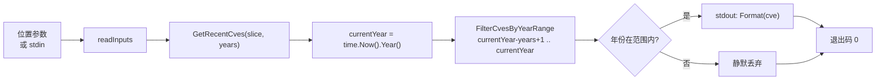

# cve filter recent 最近N年

:::tip 📂 查看源码
[`cmd/filter.go:75`](https://github.com/scagogogo/cve-skills/blob/main/cmd/filter.go#L75-L97) — 在 GitHub 上查看 cobra 命令定义（第 75–97 行）。
:::

只保留年份落在最近 N 年滚动窗口内的 CVE 编号 —— 窗口以当前日历年为锚点 —— 并以标准化大写形式逐行输出存活项。

:::tip 🖥️ 适用场景
- 从混合列表中生成"近期漏洞"视图而无需硬编码年份边界 —— 窗口会随时间自动推进。
- 在上报前把导入的 CVE 源裁剪到最近几年，让十年前的陈旧条目永远不到达仪表盘。
- 在 `compare sort` 或 `filter dedup` 之前做时间预过滤，让下游阶段只处理时间有界的子集。
:::

## 命令语法

```bash
cve filter recent --years [n] [cve-id...]
```

当提供位置参数 `cve-id` 时直接使用它们；当不提供参数且 stdin 有管道输入时，改为按行读取非空行作为输入。`--years` 标志为必填。

## 参数与选项

- `[cve-id...]`（位置参数，可重复）：一个或多个 CVE 编号，每个作为独立参数传入。与部分列表型子命令不同，参数**不会**按逗号拆分 —— `"CVE-2022-1,CVE-2023-2"` 会被当作单条非法输入，因此请以独立参数或 stdin 方式传入。
- stdin 回退：当未提供位置参数且 stdin 有管道输入时，每个非空行被视为一条输入。
- `--years, -n`（整数，必填）：要保留的最近年数，当前年份计为第一年。例如 `--years 2` 保留当前年与上一年。值为 `0` 会被拒绝并提示"required"。
- 全局 `-q, --quiet` 标志继承自根命令。

## 使用示例

保留最近 2 年的 CVE —— 2026 年时窗口为 2025–2026，因此 2023 的条目被丢弃：

```bash
$ cve filter recent --years 2 CVE-2020-1111 CVE-2022-2222 CVE-2023-3333 CVE-2025-4444
CVE-2025-4444
```

使用短标志 `-n` 与 3 年窗口 —— 2026 年时窗口为 2024–2026：

```bash
$ cve filter recent -n 3 CVE-2021-1111 CVE-2024-2222 CVE-2026-3333
CVE-2024-2222
CVE-2026-3333
```

小写输入会被规范化为大写输出，且输入顺序被保留：

```bash
$ cve filter recent --years 1 cve-2026-0001 CVE-2024-9999
CVE-2026-0001
```

从 stdin 传入列表，过滤另一条命令的输出：

```bash
$ printf 'CVE-2020-1111\nCVE-2026-3333\nCVE-2025-4444\n' | cve filter recent --years 2
CVE-2026-3333
CVE-2025-4444
```

省略 `--years` 会立即失败并输出用法错误，stdout 不打印任何内容：

```bash
$ cve filter recent CVE-2026-3333
error: --years is required
```

## 工作流程



## 对应 Go API

本命令是 [`GetRecentCves`](/api/functions/get-recent-cves) 的轻量封装，后者将窗口计算为 `(currentYear - years + 1)` 到 `currentYear`，并委托给 `FilterCvesByYearRange`。每个 CVE 经 `Format` 转为大写，当其提取出的年份落在闭区间内时予以保留。全部时间逻辑 —— 运行时求值的 `time.Now().Year()` —— 以及大写规范化都在库中实现。当你在代码中需要过滤后的切片而非纯文本输出时，请直接使用该 Go 函数。

## 退出码与输出

- 退出码 `0`：命令正常结束。超出窗口的 CVE **被丢弃而非视为错误** —— 即便没有任何条目匹配，退出码仍为 `0` 且不输出任何内容。
- 退出码 `1`：要么未提供 `--years`（或为 `0`），向 stderr 输出 `error: --years is required`；要么未提供任何输入（既无位置参数，也无管道 stdin），此时不输出任何内容。
- stdout：每个存活的 CVE 一行，顺序与首次出现一致。每行均为标准化大写形式 `CVE-YYYY-NNNNN`。
- stderr：仅输出上述用法错误。被丢弃的条目不会产生任何 stderr 噪声。

## 注意事项

- 窗口以**当前日历年**为锚点（通过 `time.Now().Year()` 求值），因此 `--years 2` 始终表示"今年与去年"并自动推进 —— 无需每年一月去更新标志。
- `--years` 为包含计数：`--years 1` 仅保留当前年，`--years 2` 保留当前年与上一年，依此类推。下界为 `currentYear - years + 1`。
- 未来年份（超过 `currentYear`）的 CVE 永远不会被保留 —— 上界是当前年，而非未来某年。
- 重复项**不会**被合并，顺序也**不会**被排序 —— 如需去重或排序，请管道传递给 `cve filter dedup` 或 `cve compare sort`。
- 参数不按逗号拆分；请将每个 CVE 作为独立参数或 stdin 每行一个传入。
- 列表中的非法编号不会被显式校验剔除 —— 其年份在 `Format` 之后提取，若提取结果为 `0` 则落在窗口之外被静默丢弃。如需严格校验，请先执行 `cve filter-valid`。

## 内部实现

`filterRecentCmd` cobra 命令（`cmd/filter.go:75`）在其 `Run` 闭包内执行一条简短的线性流水线：

- **标志解析**：`years, _ := cmd.Flags().GetInt("years")` 读取在 `init()` 中（`cmd/filter.go:158`）注册的必填 `-n/--years` 整数标志。返回的错误被有意丢弃；缺失或为零的值由下方显式的 `if years == 0` 守卫捕获。
- **必填标志守卫**：当 `years == 0` 时，命令通过 `fmt.Fprintln(os.Stderr, ...)` 向 stderr 写入 `error: --years is required` 并立即调用 `os.Exit(1)` —— 不做后续处理，stdout 无任何输出。
- **输入收集**：`inputs := readInputs(args)`（辅助函数位于 `cmd/helpers.go:11`）当位置参数 `args` 非空时原样返回该切片；否则当 stdin 有管道输入（非字符设备，经 `os.Stdin.Stat()` 判定）时按行扫描并收集每个非空行。空的 `inputs` 切片会触发 `os.Exit(1)` 且无任何输出。
- **库调用与输出**：`filtered := cvepkg.GetRecentCves(inputs, years)` 计算滚动窗口 `(currentYear - years + 1)` .. `currentYear`（在 `filter.go:187` 内部使用 `time.Now().Year()`），并委托给 `FilterCvesByYearRange`，后者将每个条目经 `Format` 转为大写并保留其提取年份落在闭区间内的项。随后循环 `for _, c := range filtered { fmt.Println(c) }` 将每个存活项逐行打印到 stdout。命令不排序、不去重；输出顺序与首次出现的输入顺序一致。

## 参数流

```text
+-------------------+     +-----------------------------+     +-------------------------------+
| 命令行调用        |     | cobra 标志解析              |     | 必填标志守卫                   |
| cve filter recent | --> | years = GetInt("years")    | --> | if years == 0:                |
| --years N [ids..] |     | (错误被丢弃)                |     |   stderr "error: --years ..." |
+-------------------+     +-----------------------------+     |   os.Exit(1)                  |
                                                              +---------------+---------------+
                                                                              | years != 0
                                                                              v
                                            +-----------------------------------+-------------------------------+
                                            | readInputs(args)  (cmd/helpers.go:11)                         |
                                            |  args 非空? -> 返回 args                                      |
                                            |  否则 stdin 有管道(非 TTY)? -> 扫描非空行                     |
                                            |  否则 -> 返回 nil                                             |
                                            +-------------------------------+-------------------------------+
                                                                            | inputs
                                                                            v
                                            +-------------------------------+-------------------------------+
                                            | if len(inputs) == 0: os.Exit(1) (无输出)                     |
                                            +-------------------------------+-------------------------------+
                                                                            | inputs
                                                                            v
                  +---------------------------------------------------------+-------------------------------+
                  | cvepkg.GetRecentCves(inputs, years)   (filter.go:187)                                  |
                  |   currentYear = time.Now().Year()                                                     |
                  |   return FilterCvesByYearRange(inputs, currentYear-years+1, currentYear)              |
                  +---------------------------------------------------------+-------------------------------+
                                                                            |
                                                                            v
                  +---------------------------------------------------------+-------------------------------+
                  | FilterCvesByYearRange  (filter.go:139)                                                 |
                  |   对每个 cve:                                                                          |
                  |     formattedCve = Format(cve)            (base.go:45, ToUpper+TrimSpace)             |
                  |     yearInt = ExtractCveYearAsInt(formattedCve)        (extract.go:183)               |
                  |     当 startYear <= yearInt <= endYear 时保留                                          |
                  +---------------------------------------------------------+-------------------------------+
                                                                            |
                                                                            v
                  +---------------------------------------------------------+-------------------------------+
                  | for _, c := range filtered { fmt.Println(c) }   -> stdout, 每行一条                    |
                  | 从 main 返回 -> 退出码 0                                                              |
                  +---------------------------------------------------------------------------------------+
```

## 边界情形

| 输入 | 行为 | 退出码 / 输出 |
| --- | --- | --- |
| 未给 `--years` 标志（或 `--years 0`） | 必填标志守卫在读入任何输入前触发 | 退出 `1`；stderr 输出 `error: --years is required`；stdout 为空 |
| 给定 `--years`，无位置参数，stdin 为 TTY（交互式，无管道） | `readInputs` 因 `os.Stdin.Stat()` 报告为字符设备而返回 `nil` | 退出 `1`；stdout、stderr 均无输出 |
| 给定 `--years`，无位置参数，stdin 有管道但为空（如 `printf ''`） | `readInputs` 扫描到零个非空行，返回空切片 | 退出 `1`；stdout、stderr 均无输出 |
| 给定 `--years`，有参数但无一落在窗口内 | `GetRecentCves` 返回空切片；打印循环不输出任何内容 | 退出 `0`；stdout 为空 |
| 给定 `--years`，所有参数都落在窗口内 | 每个格式化后的 CVE 按首次出现顺序打印 | 退出 `0`；stdout 每条 CVE 一行 |
| 小写或带空白填充的输入（如 `  cve-2026-1  `） | `Format` 在提取年份前先转大写并去空白 | 退出 `0`；若落在窗口内则打印为 `CVE-2026-1` |
| 逗号拼接的伪列表（如 `"CVE-2026-1,CVE-2025-2"`） | 被当作单个位置参数；`Format` 无法将其规范化，年份提取得到 `0`，落在窗口之外 | 退出 `0`；除非其他参数匹配，否则被静默丢弃 |
| 未来年份的 CVE（年份 > currentYear） | 超出闭区间上界 `currentYear` | 退出 `0`；被静默丢弃 |
| 非法编号（如 `CVE-2026-` 或 `not-a-cve`） | `Format` 基本原样保留；`ExtractCveYearAsInt` 返回 `0`；`0` 低于下界 | 退出 `0`；被静默丢弃 |
| 负的 `--years`（如 `-n -1`） | `years != 0` 通过守卫；窗口变为 `currentYear-(-1)+1 = currentYear+2` .. `currentYear`，一个空/反转区间 | 退出 `0`；全部被丢弃（没有条目的年份既 `<= currentYear` 又 `>= currentYear+2`） |

## 退出码

- **退出 `0`** —— 成功路径。当 `--years` 非零且至少提供一条输入（位置参数或管道）时到达。命令从 `Run` 正常返回；cobra 随后以 `0` 退出。注意"无匹配"**并非**失败：空的 `filtered` 切片仍会循环零次并以 `0` 退出、stdout 为空。没有显式的成功消息 —— 存活项是 stdout 的唯一内容。
- **退出 `1`** —— 失败路径，由 `Run` 中两处显式的 `os.Exit(1)` 调用触发：
  1. `--years` 缺失或为 `0`：向 **stderr** 打印 `error: --years is required\n`（经 `fmt.Fprintln(os.Stderr, ...)`）并在读入任何输入前以 `1` 退出。
  2. 输入为空（`len(inputs) == 0`，即无位置参数且无管道 stdin）：以 `1` 退出，**两个流均无输出** —— 不打印任何诊断信息，进程仅以退出码 `1` 终止。
- **stderr** —— 仅可能写入上面那行 `error: --years is required`。被丢弃、超出窗口或非法的条目不会产生任何 stderr 噪声；它们仅从 stdout 中被静默略去。
- 命令不返回 `RunE` 错误，因此 cobra 自身的错误/用法打印并不介入；所有非零退出均来自显式的 `os.Exit(1)` 调用。

## 相关命令

- [cve filter by-year](/cli/commands/filter-by-year) —— 单个固定年份，而非滚动窗口。
- [cve filter by-year-range](/cli/commands/filter-by-year-range) —— 需要非滚动范围时使用显式 `--start`/`--end` 边界。
- [cve filter dedup](/cli/commands/filter-dedup) —— 去除重复项，常在 `filter recent` 之后串联使用。
- [cve filter-valid](/cli/commands/filter-valid) —— 在按年份过滤前剔除格式非法的条目。
- [CLI 参考](/cli) —— 完整命令树与 I/O 约定。
