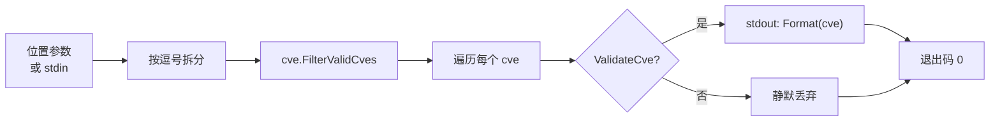

# cve filter-valid 过滤有效

:::tip 📂 查看源码
[`cmd/validate_batch.go:36`](https://github.com/scagogogo/cve-skills/blob/main/cmd/validate_batch.go#L36-L55) — 在 GitHub 上查看 cobra 命令定义（第 36–55 行）。
:::

从一组 CVE 编号中**只保留合法的那些**，静默丢弃所有格式错误或超出年份范围的条目，并以标准化大写形式逐行输出存活项。

:::tip 🖥️ 适用场景
- 在导入数据库或漏洞跟踪系统之前清洗噪声列表 —— 异常行被直接丢弃，无需手写过滤循环。
- 修剪提取管道的输出（`extract` → `filter-valid`），让下游阶段只接收格式良好的 CVE。
- 在校验的同时把大小写混合的输入（`cve-2022-1`、`CVE-2022-1`）统一规整为单一规范形式。
:::

## 命令语法

```bash
cve filter-valid <cve-list>
```

`<cve-list>` 采用所有列表型子命令共用的灵活输入形式：多个位置参数、每个参数内部以逗号分隔，或者 —— 当不提供参数时 —— 从 stdin 按行读取。

## 参数与选项

- `<cve-list>`（位置参数，可重复）：一个或多个 CVE 编号。每个参数会再按逗号拆分，因此 `"CVE-2022-1,CVE-2022-2"` 等价于两个独立参数。
- stdin 回退：当未提供位置参数且 stdin 有管道输入时，每个非空行被视为一条输入（行内逗号仍会拆分）。
- 本命令自身**不定义任何 flag**。全局 `-q, --quiet` 标志继承自根命令。

## 使用示例

过滤一个逗号分隔的列表 —— 只有合法编号存活，并标准化为大写：

```bash
$ cve filter-valid "CVE-2022-12345,bad,CVE-2021-44228"
CVE-2022-12345
CVE-2021-44228
```

以独立参数传入，结果与逗号形式完全一致：

```bash
$ cve filter-valid CVE-2022-12345 bad CVE-2021-44228
CVE-2022-12345
CVE-2021-44228
```

小写与带前导零的条目都是合法的，输出时会被规范化为大写：

```bash
$ cve filter-valid "cve-2022-0001"
CVE-2022-0001
```

超出年份范围与序列号非法的条目会被静默丢弃 —— 不会像 `validate-batch` 那样输出失败原因行：

```bash
$ cve filter-valid "CVE-1998-1,CVE-2099-1,CVE-2022-ABC,CVE-2022-12345"
CVE-2022-12345
```

从 stdin 传入列表，清洗另一条命令的输出：

```bash
$ printf 'CVE-2021-44228\nnot-a-cve\ncve-2022-0\n' | cve filter-valid
CVE-2021-44228
```

## 工作流程



## 对应 Go API

本命令是 [`FilterValidCves`](/api/functions/filter-valid-cves) 的轻量封装，后者遍历切片，用 `ValidateCve` 逐条测试，并通过每条的 `Format(cve)` 追加到结果。全部校验逻辑 —— 格式检查、年份范围 `1999..当前年份`、正序列号 —— 以及大写规范化都在库中实现。当你在代码中需要过滤后的切片而非纯文本输出时，请直接使用该 Go 函数。

## 退出码与输出

- 退出码 `0`：命令正常结束。非法 CVE **被丢弃而非视为错误** —— 即便列表中没有任何合法条目，退出码仍为 `0` 且不输出任何内容。
- 退出码 `1`：未提供任何输入（既无位置参数，也无管道 stdin）。此时向 stderr 输出错误 `requires at least 1 argument (CVE list)`。
- stdout：每个存活（合法）的 CVE 一行，顺序与首次出现一致。每行均为标准化大写形式 —— `CVE-YYYY-NNNNN`，两侧空白已去除。
- stderr：仅输出上述用法错误。被丢弃的条目不会产生任何 stderr 噪声。

## 注意事项

- 与 `validate-batch` 不同，本命令会**规范化**存活项：`cve-2022-1` 会输出为 `CVE-2022-1`。若需要原样保留输入，请改用 `validate-batch`。
- 条目只有在通过完整校验时才会被保留：格式 `CVE-YYYY-NNNNN`（大小写不敏感）、年份在 `1999..当前年份` 范围内、序列号为正整数。
- 年份上界为运行时求值的 `time.Now().Year()`，因此明年日期的 CVE 今天会被丢弃、明年会被保留。
- 重复项**不会**被合并 —— `cve-2022-1` 与 `CVE-2022-1` 都会通过校验并都输出为 `CVE-2022-1`。如需去重，请在之后执行 `cve filter dedup`。
- 顺序按首次出现保留；本命令不排序。如需升序，请管道传递给 `cve compare sort`。

## 内部实现

cobra 命令 `filterValidCmd`（定义于 `cmd/validate_batch.go:36-L55`）的 `RunE` 分四步：

- **通过 `readInputs(args)` 接收参数** —— 位置参数切片 `args` 交给 `readInputs`，该共享助手在未提供参数时还会回退到按行读取 stdin。返回的 `inputs` 切片会被检查是否为空，若无任何输入，则以 `fmt.Errorf("requires at least 1 argument (CVE list)")` 中止运行。
- **按逗号扁平化** —— 对 `inputs` 的每个元素用 `strings.Split` 按 `,` 拆分，并追加到单一的 `cveList []string`，因此 `"CVE-2022-1,CVE-2022-2"` 与两个裸参数得到的切片完全一致。
- **调用库函数 `cve.FilterValidCves(cveList)`** —— 全部校验与规范化逻辑都在库中，而非命令里。该函数返回 `result`，一个仅包含通过 `ValidateCve` 的、已标准化为大写的 CVE 字符串切片。
- **stdout 输出** —— 命令以 `for _, v := range result` 循环，对每个存活项调用 `fmt.Println(v)`，每行一个。命令不处理 flag、不做格式化分支，成功路径也不写 stderr。

## 参数流

```text
+-------------------+     +-------------------+     +-------------------------+
| CLI 参数 / stdin  | --> | readInputs(args)  | --> | inputs []string         |
+-------------------+     +-------------------+     +-------------------------+
                                                              |
                                                              v
                                                  +-----------------------------+
                                                  | len(inputs) == 0 ?          |
| 否 -->                          是 ----------> | return error:               |
|                                                 | "requires at least 1 arg"  |
|                                                 +-----------------------------+
|                                                              |
|                                                              v 否
|                               +-------------------------------+
|                               | for _, input := range inputs: |
|                               |   cveList = append(cveList,   |
|                               |     strings.Split(input,",")  |
|                               |           ...)                |
|                               +-------------------------------+
|                                              |
|                                              v
|                               +-------------------------------+
|                               | cve.FilterValidCves(cveList)  |
|                               | -> result []string            |
|                               |   (大写，仅含合法项)          |
|                               +-------------------------------+
|                                              |
|                                              v
|                               +-------------------------------+
|                               | for _, v := range result:     |
|                               |   fmt.Println(v)   // stdout  |
|                               +-------------------------------+
|                                              |
|                                              v
|                                        return nil  (退出码 0)
```

## 边界情形

| 输入 | 行为 | 退出码/输出 |
|---|---|---|
| 无参数，且无管道 stdin | `readInputs` 返回空切片；`RunE` 返回错误 | 退出码 `1`；stderr：`requires at least 1 argument (CVE list)` |
| 有参数但全部非法（如 `bad,CVE-2099-1`） | `FilterValidCves` 返回空切片；循环体不执行 | 退出码 `0`；stdout 为空 |
| 单个逗号分隔参数 `"CVE-2022-1,CVE-2022-2"` | `strings.Split` 扁平化为两元素 `cveList` | 退出码 `0`；两条存活项均输出 |
| 小写输入 `cve-2022-1` | `ValidateCve` 大小写不敏感；存活项经 `Format` 规范化 | 退出码 `0`；stdout 输出 `CVE-2022-1` |
| 仅大小写不同的重复项（`cve-2022-1`、`CVE-2022-1`） | 两条都通过校验；均出现在 `result` 中 | 退出码 `0`；`CVE-2022-1` 输出两次 |
| stdin 含空行 | `readInputs` 跳过空行；非空行按逗号拆分 | 退出码 `0`；存活项按首次出现顺序输出 |
| 合法与非法混合 | 非法项在 `result` 中静默缺席；合法项照常输出 | 退出码 `0`；被丢弃项不产生 stderr 噪声 |

## 退出码

- **退出码 `0`** —— `RunE` 在打印存活项后返回 `nil`。即便没有任何合法条目，仍返回 `nil` 并以 `0` 退出，因为非法 CVE 是被丢弃而非被视为错误。
- **退出码 `1`** —— 唯一的失败路径：`len(inputs) == 0`，此时 `RunE` 返回 `fmt.Errorf("requires at least 1 argument (CVE list)")`。cobra 将此消息输出到 stderr 并以非零码退出。
- **stderr** —— 仅在无输入的失败路径上写入（cobra 渲染返回的错误）。被丢弃的非法项不会在 stderr 产生任何输出；所有存活项输出都经 `fmt.Println` 走 stdout。

## 相关命令

- [cve validate-batch](/cli/commands/validate-batch) —— 逐条判定并给出失败原因，输入原样保留。
- [cve validate](/cli/commands/validate) —— 逐条输出 `formatted-cve<TAB>bool`，不丢弃任何条目。
- [cve filter dedup](/cli/commands/filter-dedup) —— 去除重复项，常在 `filter-valid` 之后串联使用。
- [CLI 参考](/cli) —— 完整命令树与 I/O 约定。
