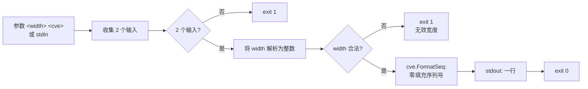

# cve format-seq 定宽

:::tip 📂 查看源码
[`cmd/pattern.go:34`](https://github.com/scagogogo/cve-skills/blob/main/cmd/pattern.go#L34-L51) — 在 GitHub 上查看 cobra 命令定义（第 34–51 行）。
:::

将 CVE 的序列号以零填充到固定宽度 —— `CVE-2022-123` 在宽度 6 下变为 `CVE-2022-000123`。

:::tip 🖥️ 适用场景
- 在入库或生成报表前，将序列号统一到固定宽度，保证存储格式一致。
- 对齐表格与差异对比中的 CVE 列，使长短不一的序列号逐位对齐。
- 将从安全公告抓取的、长度不一的 CVE 输入转换为可按字典序排序的定宽标识符。
:::

## 命令语法

```bash
cve format-seq <width> <cve>
```

第一个位置参数为目标宽度；第二个为待格式化的 CVE 编号。当未提供参数且 stdin 为管道输入时，第一行非空内容作为宽度、第二行作为 CVE 读取。

## 参数与选项

- `<width>`（位置参数，必填）：序列号的目标宽度，按整数解析。原序列较短时补前导零；已达到或超过该宽度时序列号保持不变。
- `<cve>`（位置参数，必填）：待零填充序列号的 CVE 编号。仅格式化第二个输入 —— 本命令**不会**遍历多个 CVE。
- stdin 回退：当未提供位置参数且 stdin 为管道输入时，每一非空行视为一个输入；空行会被跳过。
- 本命令**自定义 flags 为空**，仅继承根命令的全局 `-q, --quiet` flag。

## 使用示例

将短序列填充到宽度 6，使其可按字典序排序：

```bash
$ cve format-seq 6 CVE-2022-123
CVE-2022-000123
```

宽度 4 将 `CVE-2022-42` 填充为四位 —— 已是四位数的序列号原样通过：

```bash
$ cve format-seq 4 CVE-2022-42
CVE-2022-0042
$ cve format-seq 4 CVE-2022-1234
CVE-2022-1234
```

宽度小于现有序列号时保持不变 —— 不会截断：

```bash
$ cve format-seq 2 CVE-2022-12345
CVE-2022-12345
```

通过管道从 stdin 传入宽度和 CVE —— 五位序列号 `44228` 填充至六位：

```bash
$ printf '6\nCVE-2021-44228\n' | cve format-seq
CVE-2021-044228
```

无效的 CVE 原样返回 —— `FormatSeq` 仅格式化通过 `IsCve` 的输入：

```bash
$ cve format-seq 6 not-a-cve
not-a-cve
```

## 工作流程



## 对应 Go API

本命令是对 [`FormatSeq`](/zh/api/functions/format-seq) 的薄封装。该库函数先检查 `IsCve`；若输入不是有效 CVE，则原样返回。否则将 CVE 拆分为年份与序列号，将序列号解析为整数，并以 `fmt.Sprintf("CVE-%s-%0*d", year, width, seqInt)` 重新格式化。CLI 仅解析宽度参数并打印单个结果。当你在代码中需要定宽 CVE 字符串而非打印文本时，请直接使用该 Go 函数。

## 退出码与输出

- 退出码 `0`：已提供宽度与 CVE，且结果已打印。
- 退出码 `1`：输入少于两个，或宽度参数无法解析为整数。错误信息写入 stderr。
- stdout：恰好一行 —— 格式化后的 CVE（若非有效 CVE 则原样返回）。
- stderr：宽度非法或输入缺失时输出错误信息；成功时无输出。

## 注意事项

- 仅格式化 `inputs[1]` —— 本命令处理**单个** CVE，而非列表。若需格式化多个 CVE，请在 shell 中循环，或结合 `cve format` 使用。
- CVE 必须通过 `IsCve` 才会被重新格式化；无效输入原样返回，因此需要正确性时应配合 `cve validate` 或 `cve filter-valid`。
- 宽度仅作用于序列号 —— 年份与 `CVE-` 前缀永远不会被修改。
- 当原序列号已有至少 `width` 位时，保持不变（不截断、不额外填充）。
- 当 stdin 为终端（非管道）且未提供参数时，命令立即以 `1` 退出，而不会阻塞等待交互输入。

## 内部实现

`formatSeqCmd` 这个 cobra 命令定义于 `cmd/pattern.go:34-51`，`Use` 为 `"format-seq <width> <cve>"`，使用 `RunE` 处理函数。其执行流程如下：

- **输入收集**：`RunE` 接收原始的 `args []string`，立即传给 `readInputs(args)`（定义于 `cmd/helpers.go:11`）。当 `args` 非空时原样返回；否则函数检查 `os.Stdin.Stat()`，若 stdin 不是字符设备（即管道输入），则按行扫描，将每个非空行收集到返回切片中。当 stdin 为终端且无参数时，`readInputs` 返回 `nil`，故 `inputs` 为空。
- **参数数量检查**：`if len(inputs) < 2` 返回 `fmt.Errorf("requires width and CVE identifier")`。由于处理函数为 `RunE`，cobra 会将该错误写入 stderr 并以退出码 `1` 退出；此过程不查询任何 flag。
- **宽度解析**：`strconv.Atoi(strings.TrimSpace(inputs[0]))` 先去除首个输入首尾空白再解析为整数。解析失败返回 `fmt.Errorf("invalid width: %s", inputs[0])`，同样经 `RunE` 体现为退出码 `1` 的错误。
- **库函数调用与输出**：以第二个输入与解析所得宽度调用 `cve.FormatSeq(inputs[1], width)`，返回的单个字符串经 `fmt.Println(result)` 写入 stdout。本命令不定义任何自有 flag，也不循环 —— 每次调用仅格式化一个 CVE。

## 参数流

```text
+-----------------------+   +-------------------------+   +-----------------------+
| argv: <width> <cve>   |   | stdin（管道，按行）      |   | stdin = 终端，无 argv |
+-----------+-----------+   +-----------+-------------+   +-----------+-----------+
            |                           |                             |
            v                           v                             v
   +---------------------+     +---------------------+       +---------------------+
   | readInputs(args)    |     | readInputs(args)    |       | readInputs(args)    |
   | 原样返回 args        |     | 扫描非空 stdin 行    |       | 返回 nil            |
   |                     |     |                     |       | (ModeCharDevice 置位)|
+-> inputs []string      |   +-> inputs []string     |     +-> inputs = nil        |
   +----------+----------+     +----------+----------+       +----------+----------+
              |                           |                             |
              +-----------+---------------+-------------+---------------+
                          |                             |
                          v                             v
               +--------------------+       +---------------------------+
               | len(inputs) < 2 ?  | 是    | 返回错误                  |
               |                    |-----> | "requires width and CVE   |
               +---------+----------+       |  identifier" -> exit 1    |
                         | 否                +---------------------------+
                         v
            +---------------------------+   否   +--------------------------------+
            | strconv.Atoi(TrimSpace    |------> | 返回错误                       |
            |   (inputs[0]))            |       | "invalid width: <inputs[0]>"   |
            +-----------+---------------+       | -> exit 1                      |
                        | 是                    +--------------------------------+
                        v
         +------------------------------+
         | cve.FormatSeq(inputs[1],     |
        >   width)                      |
         +--------------+---------------+
                        |
                        v
         +------------------------------+
         | fmt.Println(result) -> stdout|
         | return nil -> exit 0         |
         +------------------------------+
```

## 边界情形

| 输入 | 行为 | 退出码 / 输出 |
| --- | --- | --- |
| 无参数且 stdin 为终端 | `readInputs` 返回 `nil`；`len(inputs) < 2` 触发参数数量错误 | 退出 `1`；stderr：`requires width and CVE identifier` |
| 无参数且 stdin 为管道但为空（或仅空行） | 所有行被跳过；`inputs` 为空 | 退出 `1`；stderr：`requires width and CVE identifier` |
| 仅一个输入（如 `cve format-seq 6`） | `readInputs` 后 `len(inputs) < 2` | 退出 `1`；stderr：`requires width and CVE identifier` |
| 宽度非整数（如 `cve format-seq abc CVE-2022-1`） | `strconv.Atoi` 对 `"abc"` 解析失败 | 退出 `1`；stderr：`invalid width: abc` |
| 宽度带首尾空白（如 `cve format-seq " 6 " CVE-2022-1`） | `strings.TrimSpace` 先去除空白再解析 | 退出 `0`；stdout：填充后的 CVE |
| CVE 非法（如 `cve format-seq 6 not-a-cve`） | `FormatSeq` 中 `IsCve` 不通过，原样返回该字符串 | 退出 `0`；stdout：`not-a-cve` |
| 宽度小于序列号长度（如 `cve format-seq 2 CVE-2022-12345`） | `FormatSeq` 不截断，保留原序列号 | 退出 `0`；stdout：`CVE-2022-12345` |
| 多余位置参数（如 `cve format-seq 6 CVE-2022-1 extra`） | 仅使用 `inputs[0]` 与 `inputs[1]`，多余参数被忽略 | 退出 `0`；stdout：填充后的 CVE |
| stdin 含逗号分隔的行 | 本命令的 `readInputs` 不按逗号拆分（与 `filter-pattern` 不同），每行视为一个输入 | 非空行少于 2 行则退出 `1`，否则退出 `0` |

## 退出码

- **退出 `0`**：`readInputs` 返回至少两个输入，`strconv.Atoi` 成功解析宽度，`cve.FormatSeq` 返回的字符串已写入 stdout。处理函数返回 `nil`，故 cobra 以 `0` 退出。
- **退出 `1`**：当 `RunE` 返回非 nil 错误时由 cobra 返回。源码中显式处理两种情况：输入缺失（`"requires width and CVE identifier"`）与宽度无法解析（`"invalid width: <值>"`）。两种情况下 cobra 都会将错误信息写入 stderr。
- **成功时的 stderr**：不写入任何内容；处理函数返回 `nil`，不向 stderr 输出。
- **无显式 `os.Exit` 调用**：本命令完全依赖 cobra 的 `RunE` 语义 —— 返回错误会传播为非零进程退出码，返回 `nil` 则得退出码 `0`。`formatSeqCmd` 未配置 `SilenceErrors`/`SilenceUsage`，因此 cobra 可能会在错误信息之外附带打印用法说明。

## 相关命令

- [cve format](/zh/cli/commands/format) —— 归一化大小写与空白，不改变序列号宽度。
- [cve extract seq](/zh/cli/commands/extract-seq) —— 在填充前提取原始序列号片段。
- [cve validate](/zh/cli/commands/validate) —— 在格式化前进行完整校验（格式 + 年份 + 序列号）。
- [CLI 参考](/zh/cli) —— 完整命令树与 I/O 约定。
