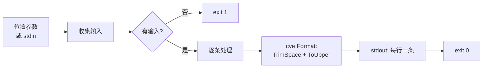

# cve format 格式化

:::tip 📂 查看源码
[`cmd/format.go:11`](https://github.com/scagogogo/cve-skills/blob/main/cmd/format.go#L11-L31) — 在 GitHub 上查看 cobra 命令定义（第 11–31 行）。
:::

将 CVE 编号规范化为标准大写形式 —— 去除两侧空白并将 `CVE` 前缀转为大写 —— 每行一个编号。

:::tip 🖥️ 适用场景
- 在入库前，清理从安全公告、工单或电子表格中抓取的、大小写混杂或带空白的 CVE 编号。
- 为对大小写敏感的下游工具准备输入，使其获得统一的 `CVE-YYYY-NNNNN` 形态。
- 作为流水线（`extract` → `format` → `validate`）中可幂等的归一化步骤，让后续阶段看到一致的大小写。
:::

## 命令语法

```bash
cve format [cve-id...]
```

当提供位置参数时，从参数读取输入；否则从 stdin 按行读取 CVE 编号。

## 参数与选项

- `[cve-id...]`（位置参数，可重复，可选）：一个或多个待格式化的 CVE 编号。每个参数归一化后独占一行输出。
- stdin 回退：当未提供位置参数且 stdin 为管道输入时，每一非空行视为一个输入；空行会被跳过。
- 本命令**自定义 flags 为空**，仅继承根命令的全局 `-q, --quiet` flag。

## 使用示例

一次调用中归一化一个小写编号和一个带空白的编号：

```bash
$ cve format cve-2022-12345 " CVE-2021-44228 "
CVE-2022-12345
CVE-2021-44228
```

大小写混杂的输入会被转为大写；数字部分保持不变：

```bash
$ cve format Cve-2022-1 cVe-2022-2
CVE-2022-1
CVE-2022-2
```

从 stdin 传入编号，以归一化另一条命令的输出：

```bash
$ printf 'cve-2021-44228\n cve-2022-12345 \n' | cve format
CVE-2021-44228
CVE-2022-12345
```

归一化是幂等的 —— 已是规范形式的编号原样输出：

```bash
$ cve format CVE-2022-12345
CVE-2022-12345
```

本命令不校验 CVE —— 任何非空字符串都会被去空白并转大写：

```bash
$ cve format " not-a-cve "
NOT-A-CVE
```

## 工作流程



## 对应 Go API

本命令是对 [`Format`](/api/functions/format) 的薄封装，该函数返回 `strings.ToUpper(strings.TrimSpace(cve))`。CLI 仅遍历输入并为每条打印格式化结果。所有转换逻辑位于库中 —— 当你在代码中需要归一化字符串而非打印文本时，请直接使用该 Go 函数。注意 `Format` **不做任何校验**：它对任意字符串（无论是否为有效 CVE）都进行格式化。

## 退出码与输出

- 退出码 `0`：至少提供了一条输入，且每一行均已打印。
- 退出码 `1`：未提供任何输入 —— 既无位置参数，也无非空的管道 stdin。不打印任何消息。
- stdout：每条输入对应一行格式化后的 CVE，保持输入顺序。
- stderr：无输出。本命令仅写入 stdout。

## 注意事项

- `Format` 去除首尾空白并将整个字符串转为大写，但**不校验**格式、年份或序列号 —— 需要正确性时应配合 `cve validate` 或 `cve filter-valid`。
- 输入不去重；每条输入行恰好产生一行输出。
- 当 stdin 为终端（非管道）且未提供参数时，命令立即以 `1` 退出，而不会阻塞等待交互输入。
- 若需将序列号零填充到固定宽度，请改用 `cve format-seq`。

## 内部实现

`formatCmd` cobra 命令（定义于 `cmd/format.go:11-L31`）经过一条简短、无 flag 的流水线：

- **参数接入**：`Run` 直接从 cobra 的位置参数解析接收 `args []string` —— 本命令未注册任何 flag，`cmd` 仅作接收器。随后立即委托 `readInputs(args)`（`cmd/helpers.go:11`）：当 `args` 非空时原样返回；否则逐行扫描管道 stdin（跳过空行），当 stdin 为终端（`os.ModeCharDevice`）时返回 `nil`。
- **空输入守卫**：`if len(inputs) == 0 { os.Exit(1) }` 在任何格式化之前短路。此处不打印用法说明 —— 进程直接以 `1` 退出。
- **库函数调用**：对每条输入执行 `fmt.Println(cvepkg.Format(input))`，调用 `github.com/scagogogo/cve-skills.Format`，该函数返回 `strings.ToUpper(strings.TrimSpace(cve))`。CLI 自身不持有任何转换逻辑。
- **输出格式**：通过 `fmt.Println` 在 stdout 上每行打印一条格式化字符串，保持输入顺序。从不写入 stderr，也不打印末尾汇总。

## 参数流

```text
+--------------------------+        +--------------------------+
| 位置参数                 |        | 管道 stdin               |
| cve format A B " C "     |        | echo ... | cve format    |
+------------+-------------+        +------------+-------------+
             |                                   |
             v                                   v
      +------+------------------------------------+------+
      | readInputs(args)            cmd/helpers.go:11    |
      |  args 非空? -> 原样返回 args                      |
      |  否则若 stdin 为管道? -> 扫描行，丢弃 ""          |
      |  否则（终端）         -> 返回 nil                 |
      +----------------------+---------------------------+
                             |
                             v
                  inputs []string
                             |
                  +----------+----------+
                  | len==0?  |          |
                  +----------+----------+
                  yes|              no|
                     v                v
              os.Exit(1)     for _, input := range inputs
                                  |
                                  v
                         cvepkg.Format(input)
                         = ToUpper(TrimSpace(input))
                                  |
                                  v
                         fmt.Println -> stdout
                                  |
                                  v
                       exit 0（默认）
```

## 边界情形

| 输入 | 行为 | 退出码/输出 |
| --- | --- | --- |
| 无参数且 stdin 为终端（交互） | `readInputs` 检测到 `os.ModeCharDevice` 返回 `nil`；空输入守卫触发 | 退出 `1`，无 stdout，无 stderr |
| 无参数且管道 stdin 为空（`printf '' \| cve format`） | 扫描器未产出任何非空行；`inputs` 为 `nil` | 退出 `1`，无输出 |
| 无参数且管道 stdin 全为空行 | 每行均为 `""` 被跳过；`inputs` 最终为 `nil` | 退出 `1`，无输出 |
| 仅含空白的输入（`"   "`） | 在 `Format` 内部经 `TrimSpace` 后为 `""`；`readInputs` 保留原始参数，`Format` 将其裁剪为 `""` 并打印空行 | 退出 `0`，stdout 一行空行 |
| 无效 CVE 字符串（`" not-a-cve "`） | `Format` 不做校验；去空白并转大写 | 退出 `0`，打印 `NOT-A-CVE` |
| 大小写混杂的数字（`"cVe-2022-007"`） | 整串转大写，数字不受影响 | 退出 `0`，打印 `CVE-2022-007` |
| 重复输入（`CVE-2022-1 CVE-2022-1`） | 不去重；每条输入各产出一行 | 退出 `0`，两行相同内容 |
| 已是规范形式的输入（`CVE-2022-12345`） | `Format` 幂等 | 退出 `0`，打印 `CVE-2022-12345` |
| 过长的 stdin 行（>64 KiB） | 超出 `bufio.Scanner` 默认 token 上限 | 扫描循环中止，结果可能部分缺失；无显式错误，若已打印过任何行则退出 `0` |

## 退出码

- **成功 —— 退出 `0`**：当至少一条输入进入 `for` 循环时，`fmt.Println` 打印每条格式化行，`Run` 正常返回；cobra 默认行为随后以码 `0` 退出进程。
- **无输入 —— 退出 `1`**：当 `len(inputs) == 0`（既无位置参数也无非空管道 stdin）时显式调用 `os.Exit(1)`。这是源码中唯一的显式退出码分支。
- **stderr**：两条路径下命令都不写入 stderr。失败仅以非零退出码标识 —— 既无错误消息，也无用法提示。
- **扫描错误**：`readInputs` 忽略 `bufio.Scanner` 的错误状态，因此中断或超大的 stdin 读取不会以独立退出码呈现；其结果被并入 `inputs` 实际触发的分支。

## 相关命令

- [cve format-seq](/zh/cli/commands/format-seq) —— 将序列号零填充到固定宽度。
- [cve validate](/zh/cli/commands/validate) —— 完整校验（格式 + 年份 + 序列号），输出 `formatted-cve<TAB>bool`。
- [cve filter-valid](/zh/cli/commands/filter-valid) —— 仅保留列表中有效的 CVE。
- [CLI 参考](/zh/cli) —— 完整命令树与 I/O 约定。
