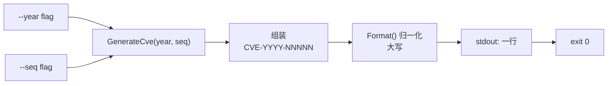

# cve generate cve 生成

:::tip 📂 查看源码
[`cmd/generate.go:19`](https://github.com/scagogogo/cve-skills/blob/main/cmd/generate.go#L19-L35) — 在 GitHub 上查看 cobra 命令定义（第 19–35 行）。
:::

根据显式的年份与序列号组装一个规范的 `CVE-YYYY-NNNNN` 编号 —— 这是一个确定性生成器，每次调用打印恰好一个规范化的 CVE 字符串。

:::tip 🖥️ 适用场景
- 从你已持有的组件（年份 + 序列号）构造 CVE 编号，用于报告、脚本或流水线。
- 将用户提供的年份/序列号对归一化为官方大写 `CVE-YYYY-NNNNN` 形式。
- 构建确定性测试夹具，要求相同输入始终产出相同 CVE 字符串。
:::

## 命令语法

```bash
cve generate cve --year [year] --seq [sequence]
```

两个 flag 均为必填。可使用短别名 `-y` 与 `-s` 分别替代 `--year` 与 `--seq`。本命令不接受位置参数。

## 参数与选项

- `--year, -y`（整数，必填）：CVE 年份，如 `2022`。无默认值 —— 省略它（或保持为 `0`）将触发必填 flag 错误。
- `--seq, -s`（整数，必填）：CVE 序列号，如 `12345`。无默认值；保持为 `0` 将触发同样的错误。
- 本命令继承根命令的全局 `-q, --quiet` flag，但除此之外不定义其他选项。
- 不接受位置参数；年份与序列号仅从这两个 flag 读取。

## 使用示例

生成一个知名的历史 CVE：

```bash
$ cve generate cve --year 2021 --seq 44228
CVE-2021-44228
```

使用短 flag 别名以简化输入：

```bash
$ cve generate cve -y 2022 -s 12345
CVE-2022-12345
```

省略必填 flag 会打印错误且不生成 CVE：

```bash
$ cve generate cve --year 2022
error: --year and --seq are required
```

通过将命令与遍历序列号的 shell 循环组合，生成一串 CVE：

```bash
$ for s in 100 101 102; do cve generate cve -y 2023 -s "$s"; done
CVE-2023-100
CVE-2023-101
CVE-2023-102
```

将生成的编号直接管道传入另一子命令，构成确定性流水线：

```bash
$ cve generate cve -y 2022 -s 12345 | cve filter-valid
CVE-2022-12345	true
```

## 工作流程



## 对应 Go API

本命令是对 [`GenerateCve`](/zh/api/functions/generate-cve) 的薄封装，该函数接收 `year int` 与 `seq int` 并返回 `string`。库函数通过 `fmt.Sprintf` 构造字面量 `CVE-<year>-<seq>`，再交给 `Format()` 将结果归一化为规范大写形式。CLI 读取这两个 flag，校验二者均非零，然后打印返回的字符串。当你在代码中需要将 CVE 作为字符串值使用而非打印输出时，请直接调用该 Go 函数 —— 它不涉及任何 I/O 假设，可安全地与其他库函数组合使用。

## 退出码与输出

- 退出码 `0`：本命令成功并打印了一个编号。
- 若省略 `--year` 或 `--seq`（或保持默认值 `0`），命令将向 stdout 打印 `error: --year and --seq are required` 并直接返回、不生成 CVE —— 注意该路径仍以 `0` 退出，因为错误是内联处理而非经由 `cobra` 的错误机制。
- stdout：恰好一行 —— 要么是生成的 `CVE-YYYY-NNNNN` 编号，要么是上述错误信息。
- stderr：无输出。本命令仅写入 stdout。

## 注意事项

- ⚠️ 生成器除零值检查外**不做任何校验**：既不验证年份是否落在 CVE 计划的历史范围（1999 年起）内，也不限制序列号的位数。任意整数都会被原样接受并格式化。
- 序列号不做零填充 —— `--seq 100` 产出 `CVE-2023-100`，而非 `CVE-2023-00100`。CVE 序列号并非定宽。
- 无论 flag 以何种形式提供，输出始终为大写（`CVE-`），因为结果会经过 `Format()` 处理。
- 若需要使用当前年份与随机序列号的非确定性占位 CVE，请改用 `cve generate fake`。

## 内部实现

`generateCveCmd` 这个 cobra 命令（定义于 `cmd/generate.go:19-35`）将其 `Run` 函数直接接到库函数 —— 中间没有服务层。其行为可归纳为四点：

- **通过 flag 而非位置参数取值**：`Run` 完全忽略 `args []string` 切片。它通过 `cmd.Flags().GetInt("year")` 与 `cmd.Flags().GetInt("seq")`（第 27-28 行）从 cobra flag 集中取出年份与序列号。在 `init()`（第 56-57 行）注册的默认值 `0` 即为驱动校验的哨兵值。
- **内联零值校验**：`Run` 并未使用 cobra 内置的 `required` 标记，而是直接判断 `if year == 0 || seq == 0`（第 29 行）。当二者任一为零时，通过 `fmt.Println` 打印 `error: --year and --seq are required` 并提前 `return` —— 既不生成 CVE，也绕过了 cobra 的错误机制。
- **委托给库函数**：在正常路径上，`Run` 调用 `cvepkg.GenerateCve(year, seq)`（第 33 行），即导入的 `github.com/scagogogo/cve-skills` 包。该函数通过 `fmt.Sprintf` 拼接字面量 `CVE-<year>-<seq>`，再经 `Format()` 归一化后返回 `string`。
- **输出格式**：返回的字符串由 `fmt.Println`（第 33 行）写入 stdout —— 仅一个尾随换行，无任何装饰或日志。该路径全程不触碰 stderr。

## 参数流

```text
+------------------+     +------------------------+     +-----------------------------+
| 命令行调用       |     | cobra flag 解析        |     | Run(cmd, args)              |
| cve generate cve | --> | --year/-y -> int year  | --> | year, _ := GetInt("year")   |
| --year 2022      |     | --seq/-s  -> int seq   |     | seq, _  := GetInt("seq")    |
| --seq 12345      |     | （默认值：0）          |     |                             |
+------------------+     +------------------------+     +--------------+--------------+
                                                                        |
                                                                        v
                                                          +-------------+--------------+
                                                          | if year == 0 || seq == 0   |
                                                          +----+----------------+------+
                                                               | 是             | 否
                                                               v                v
                                          +--------------------+   +-----------+----------------+
                                          | fmt.Println(error) |   | cvepkg.GenerateCve(year,seq)|
                                          | return（不生成 CVE)|   |  -> fmt.Sprintf CVE-...-.. |
                                          +--------------------+   |  -> Format() 大写归一化    |
                                                                   +-----------+----------------+
                                                                               |
                                                                               v
                                                                   +-----------+-----------+
                                                                   | fmt.Println(cve 字符串)|
                                                                   | stdout: CVE-YYYY-NNNNN |
                                                                   +-----------------------+
```

## 边界情形

| 输入 | 行为 | 退出码 / 输出 |
| --- | --- | --- |
| 两个 flag 均省略（`cve generate cve`） | `year` 与 `seq` 取默认 `0`；零值检查触发 | stdout：`error: --year and --seq are required`；退出 `0`（内联返回，非 cobra 错误） |
| 仅提供 `--year` | `seq` 保持 `0`；零值检查因 `seq` 触发 | stdout：`error: --year and --seq are required`；退出 `0` |
| 仅提供 `--seq` | `year` 保持 `0`；零值检查因 `year` 触发 | stdout：`error: --year and --seq are required`；退出 `0` |
| `--year 0 --seq 12345` | 显式零值与省略无法区分 | stdout：`error: --year and --seq are required`；退出 `0` |
| `--year 2022 --seq 12345` | 正常路径，调用库函数 | stdout：`CVE-2022-12345`；退出 `0` |
| 负值（如 `--year -1 --seq 5`） | 非零，故零值检查通过；由 `GenerateCve` 原样格式化 | stdout：`CVE--1-5`；退出 `0`（无范围校验） |
| 额外位置参数（`cve generate cve foo`） | `args` 被 `Run` 忽略；输出仍由 flag 决定 | 取决于 flag；`foo` 无任何影响 |
| 管道传入 stdin | 不读取 —— 命令不消费 stdin | stdin 被完全忽略 |
| 空结果 | 不可能发生 —— 零值检查通过时 `GenerateCve` 必返回非空字符串 | stdout 始终有一行 |

## 退出码

- **成功（退出 `0`）**：当 `--year` 与 `--seq` 均非零时，`Run` 调用 `cvepkg.GenerateCve` 并将所得 `CVE-YYYY-NNNNN` 打印到 stdout。进程以 `0` 退出，因为 `Run` 正常返回且 cobra 未报告任何错误。
- **缺失 flag 路径（同样退出 `0`）**：当零值检查触发时，`Run` 通过 `fmt.Println` 将 `error: --year and --seq are required` 打印到 **stdout**（注意：不是 stderr）并提前返回。由于错误是内联处理的，并未经由 `cmd.RunE` 或 `cobra` 的错误处理链传播，cobra 视为正常返回，进程仍以 `0` 退出。该命令源码中不存在非零退出码路径。
- **stderr 输出**：无。命令在两个分支中都只写入 stdout；由于没有向框架返回错误，`cobra` 的默认错误打印也从未被触发。

## 相关命令

- [cve generate fake](/zh/cli/commands/generate-fake) —— 用系统年份生成随机假 CVE（非确定性）。
- [cve format](/zh/cli/commands/format) —— 将既有 CVE 字符串归一化为规范形式。
- [cve extract-seq](/zh/cli/commands/extract-seq) —— 从 CVE 中提取序列号，用作此处的 `--seq`。
- [cve validate](/zh/cli/commands/validate) —— 对任意 CVE 做完整校验（格式 + 年份 + 序列号）。
- [CLI 参考](/zh/cli) —— 完整命令树与 I/O 约定。
