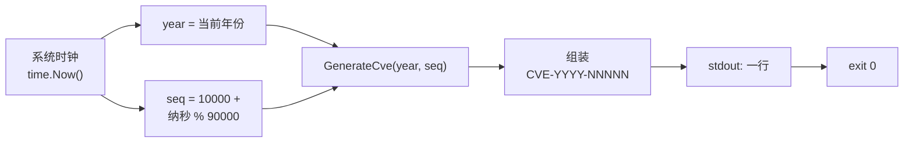

# cve generate fake 生成假CVE

:::tip 📂 查看源码
[`cmd/generate.go:37`](https://github.com/scagogogo/cve-skills/blob/main/cmd/generate.go#L37-L49) — 在 GitHub 上查看 cobra 命令定义（第 37–49 行）。
:::

使用当前系统年份与随机序列号生成一个假 CVE 编号 —— 输出为单个规范的 `CVE-YYYY-NNNNN` 字符串，无需任何 flag 或参数。

:::tip 🖥️ 适用场景
- 为单元测试、模拟数据集或演示脚本生成占位 CVE 编号。
- 在开发期为示例数据填充逼真的 CVE，而无需真实分配记录。
- 在文档示例或临时调试中快速生成一个 CVE。
:::

## 命令语法

```bash
cve generate fake
```

本命令不接受任何参数与 flag —— 仅读取系统时钟，每次调用打印一个编号。

## 参数与选项

- 本命令**自定义 flag 为空**，且**不接受位置参数**，仅继承根命令的全局 `-q, --quiet` flag。
- 年份取自系统时钟（`time.Now().Year()`）；序列号由 `10000 + (纳秒 % 90000)` 随机生成，得到一个 `10000`–`99999` 范围内的五位序列号。

## 使用示例

生成一个假 CVE —— 输出不确定，每次运行结果不同：

```bash
$ cve generate fake
CVE-2026-47193
```

循环生成多个编号用于示例数据：

```bash
$ for i in $(seq 1 3); do cve generate fake; done
CVE-2026-12804
CVE-2026-80251
CVE-2026-30577
```

将假编号捕获到 shell 变量中供测试使用：

```bash
$ FAKE=$(cve generate fake) && echo "using $FAKE as placeholder"
using CVE-2026-47193 as placeholder
```

将多个假编号管道传入另一命令，做一次端到端流水线测试：

```bash
$ for i in $(seq 1 2); do cve generate fake; done | cve filter-valid
CVE-2026-12804	true
CVE-2026-80251	true
```

由于年份跟随系统时钟，在不同日历年运行会改变年份段：

```bash
# 在 2027 年运行
$ cve generate fake
CVE-2027-21938
```

## 工作流程



## 对应 Go API

本命令是对 [`GenerateFakeCve`](/zh/api/functions/generate-fake-cve) 的薄封装，该函数无参数并返回 `string`。库函数从 `time.Now().Year()` 读取当前年份，由 `time.Now().Nanosecond()` 派生一个随机五位序列号，再委托 [`GenerateCve`](/zh/api/functions/generate-cve) 组装最终编号。CLI 仅打印返回的字符串。当你在代码中需要将假 CVE 作为字符串值使用而非打印输出时，请直接调用该 Go 函数。

## 退出码与输出

- 退出码 `0`：本命令始终成功 —— 没有失败路径。
- stdout：恰好一行，即生成的 `CVE-YYYY-NNNNN` 编号。
- stderr：无输出。本命令仅写入 stdout。

## 注意事项

- ⚠️ 生成的编号是**假的** —— 它不对应任何真实 CVE 记录，绝不可在生产数据、安全公告或报告中作为真实引用使用。
- 序列号派生自 `time.Now().Nanosecond()`，**非密码学随机**，且跨进程无种子；不要依赖其唯一性或不可预测性。在高性能硬件上快速连续调用可能发生碰撞。
- 年份段跟随系统时钟，因此输出会随日历年变化，并依赖运行环境。
- 若需要固定年份与序列号的确定性编号，请改用 `cve generate cve --year [year] --seq [sequence]`。

## 内部实现

`fake` 子命令定义为一个 `cobra.Command`，`Use: "fake"`，并在 `init()` 中注册到 `generateCmd` 下（见 `cmd/generate.go:37` 与 `cmd/generate.go:54`）。其 `Run` 函数极为精简：

- **不解析参数与 flag** —— `Run` 签名虽接收 `cmd *cobra.Command, args []string`，但两者均未读取；命令行上传入的任何位置参数都会被静默忽略。
- **单次库调用** —— 调用 `cvepkg.GenerateFakeCve()`（即 `github.com/scagogogo/cve-skills` 的别名），该函数返回一个 `string`，内容为组装好的 `CVE-YYYY-NNNNN` 编号。
- **输出到 stdout** —— 返回的字符串经 `fmt.Println(...)` 写出，追加一个换行符，因此每次调用恰好在 stdout 上产出一行。
- **无返回值处理** —— 由于 `GenerateFakeCve` 仅返回 `string`（无 error），`Run` 函数没有错误分支，也从不调用 `os.Exit` 设置非零退出码。

## 参数流

```text
+--------------------------+
| 命令行：                 |
|   cve generate fake      |
|   （多余参数被忽略）     |
+------------+-------------+
             |
             v
+--------------------------+
| cobra 分发至             |
| generateFakeCmd.Run      |
| （cmd、args 均未使用）   |
+------------+-------------+
             |
             v
+--------------------------+
| cvepkg.GenerateFakeCve() |
|   year  = time.Now().Year()
|   seq   = 10000 +         |
|     (纳秒 % 90000)        |
|   -> GenerateCve(year,seq)
+------------+-------------+
             |
             v
+--------------------------+
| fmt.Println(result)      |
|   一行输出到 stdout      |
+------------+-------------+
             |
             v
+--------------------------+
| 进程以 0 退出            |
+--------------------------+
```

## 边界情形

| 输入 | 行为 | 退出码 / 输出 |
| --- | --- | --- |
| `cve generate fake`（无参数） | 名义路径 —— 调用 `GenerateFakeCve()` 并打印一个编号。 | 退出 `0`；stdout：`CVE-YYYY-NNNNN`。 |
| `cve generate fake extra args` | 位置参数 `args` 由 `Run` 接收但从不读取，被静默忽略。 | 退出 `0`；stdout：一行 `CVE-YYYY-NNNNN`。 |
| `cve generate fake --year 2024` | `--year` 并非 `generateFakeCmd` 注册的 flag；cobra 的 flag 解析器会在 `Run` 执行前拒绝它。 | 非零退出（`1`）；stderr：cobra "unknown flag" 错误及用法。 |
| `cve generate fake --quiet` | 继承的全局 `-q, --quiet` flag 会被解析，但 `Run` 不查询它，因此输出不变。 | 退出 `0`；stdout：一行 `CVE-YYYY-NNNNN`。 |
| 管道传入 stdin（`echo foo \| cve generate fake`） | 命令从不读取 stdin；管道输入被忽略。 | 退出 `0`；stdout：一行 `CVE-YYYY-NNNNN`。 |
| 快速连续两次调用 | 两者都从 `time.Now().Nanosecond()` 派生序列号；在高性能硬件上可能得到相同或相近的序列号。 | 各自退出 `0`；stdout 行可能重复。 |

## 退出码

- **成功（退出 `0`）**：唯一可达的结局。`Run` 调用 `fmt.Println(cvepkg.GenerateFakeCve())` 后正常返回，cobra 随后以退出码 `0` 退出。
- **失败（非零）**：`Run` 内没有显式失败路径 —— 它不做任何校验，且 `GenerateFakeCve` 仅返回 `string`。非零退出只能源自 cobra 自身的参数解析器（例如未知 flag），此时 cobra 会向 **stderr** 打印用法错误并以 `1` 退出，发生在 `Run` 执行之前。
- **成功时的 stderr**：无任何输出。该命令仅通过 `fmt.Println` 写入 stdout。

## 相关命令

- [cve generate cve](/zh/cli/commands/generate-cve) —— 用显式的 `--year` 与 `--seq` 生成 CVE（确定性）。
- [cve validate](/zh/cli/commands/validate) —— 对任意 CVE 做完整校验（格式 + 年份 + 序列号）。
- [cve filter-valid](/zh/cli/commands/filter-valid) —— 仅保留列表中有效的 CVE。
- [CLI 参考](/zh/cli) —— 完整命令树与 I/O 约定。
