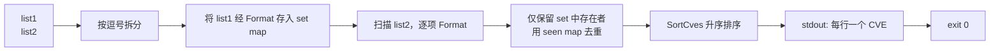

# cve intersect 交集

:::tip 📂 查看源码
[`cmd/set.go:11`](https://github.com/scagogogo/cve-skills/blob/main/cmd/set.go#L11-L28) — 在 GitHub 上查看 cobra 命令定义（第 11–28 行）。
:::

仅保留**同时**出现在两个输入列表中的 CVE——交集结果已升序排序并去重，每个共有标识符只输出一次。

:::tip 🖥️ 适用场景
- 找出**同时**被内部扫描器与厂商安全通告标记的 CVE，让团队优先处理这部分重叠项。
- 对齐两个情报源，确认哪些标识符被多方互相印证。
- 将经过多次独立过滤后仍然存活的 CVE 整理成短名单，作为下游命令（如 `cve count-by-year`）的干净输入。
:::

## 命令语法

```bash
cve intersect <list1> <list2>
```

`<list1>` 与 `<list2>` 均为逗号分隔的 CVE 列表。两个参数在执行集合运算前都会按逗号拆分，因此 `"CVE-2021-1,CVE-2022-2"` 与分别传入这两个标识符效果完全相同。

## 参数与选项

- `<list1>`（位置参数，必填）：第一个 CVE 列表。参数内的逗号会被视为分隔符，因此每个参数可承载一个或多个 CVE。
- `<list2>`（位置参数，必填）：第二个 CVE 列表，解析方式与 `<list1>` 一致。
- stdin 回退：当未提供位置参数且 stdin 通过管道输入时，每一非空行均视为一个输入。由于交集运算需要**两个**列表，stdin 必须至少提供两行——第一行为 `<list1>`，第二行为 `<list2>`。
- 本命令**未定义任何自身 flags**。全局 `-q, --quiet` flag 继承自根命令。

## 使用示例

求两个逗号分隔列表的共有 CVE，只有重叠的标识符会保留：

```bash
$ cve intersect "CVE-2021-1,CVE-2022-2" "CVE-2022-2,CVE-2023-3"
CVE-2022-2
```

大小写差异会被规范化消除——`Format` 在比较前将 `CVE` 前缀大写，因此一个列表中的小写项仍能匹配另一个列表中的大写项：

```bash
$ cve intersect "cve-2022-1,CVE-2022-2" "CVE-2022-1,CVE-2022-3"
CVE-2022-1
```

当两个列表有多个共有 CVE 时，结果按升序排列（先年份、再序号）；即使 list2 内部存在重复，每个共有 CVE 也只输出一次：

```bash
$ cve intersect "CVE-2024-1,CVE-2021-9,CVE-2022-5" "CVE-2022-5,CVE-2021-9,CVE-2021-9"
CVE-2021-9
CVE-2022-5
```

通过 stdin 同时提供两个列表（第一行为 list1，第二行为 list2），对两条上游命令的输出求交集：

```bash
$ printf 'CVE-2021-1,CVE-2022-2\nCVE-2022-2,CVE-2023-3\n' | cve intersect
CVE-2022-2
```

当第二个列表为空（或两列表完全没有交集）时，结果为空，仍返回退出码 `0`：

```bash
$ cve intersect "CVE-2022-3,CVE-2022-1" ""
$ echo "exit=$?"
exit=0
```

## 工作流程



## 对应 Go API

本命令是 [`IntersectCves`](/api/functions/intersect-cves) 的薄封装。该函数接收两个 `[]string` 切片，返回去重且排序后的交集 `[]string`。内部会先将 list1 的每个标识符经 `Format` 处理后存入 `set` map；随后扫描 list2，对每个经 `Format` 处理后的项，仅当其存在于 `set` 中时才保留，并用第二个 `seen` map 保证 list2 内部的重复项只输出一次。最后再经 `SortCves` 排序，确保输出始终按"年份再序号"升序排列。当你在代码中需要直接拿到共有切片而非打印文本时，请使用该 Go 函数。

## 退出码与输出

- 退出码 `0`：交集已计算并输出。当两列表无交集、或任一列表为空时，不输出任何内容，仍返回 `0`。
- 退出码 `1`：提供的输入少于两个（既未给出两个位置参数，也未通过 stdin 提供两行）。stderr 输出错误信息 `requires exactly 2 arguments (two CVE lists)`。
- stdout：每行一个 CVE，升序排列，已去重。两列表无共有 CVE 时无输出。
- stderr：仅输出上述用法错误。结果行不会进入 stderr。

## 注意事项

- 每个输入在集合运算前都会经 `Format` 规范化，因此 `cve-2022-1`、`CVE-2022-1` 与 `  CVE-2022-1 ` 会被视为同一个 CVE。
- 输出**始终是排序的**（先年份、再序号）——本命令不保留原始输入顺序，即使 list2 的扫描顺序会影响收集次序。
- 非法或格式错误的 token 不会被过滤——它们会按原样格式化并参与比较。若希望交集中只包含格式合法的 CVE，请先运行 `cve filter-valid`。
- 与 `cve union`（取**并集**）和 `cve diff`（取 list1 **减** list2 的差集）相比，`cve intersect` 是三种集合运算中最严格的一个——其结果数量永远不会超过较小输入列表的长度。

## 内部实现

`intersectCmd` 是一个 `cobra.Command`，其 `RunE` 负责驱动整个运算过程（`cmd/set.go:15-27`）：

- **参数接收**：`RunE` 从 cobra 接收 `args []string`，随后立即转交给 `readInputs(args)`（`cmd/helpers.go:11`）。若存在位置参数则原样返回；否则 `readInputs` 用 `os.ModeCharDevice` 探测 `os.Stdin`，当 stdin 为管道输入时，用 `bufio.Scanner` 逐行扫描，仅收集非空行。
- **不读 flag**：本命令未定义任何自身 flag，也不读取 flag。两个 CVE 列表只来自位置参数或 stdin——`RunE` 全程不调用 `cmd.Flags()`。
- **参数数校验**：若 `len(inputs) < 2`，`RunE` 直接返回 `fmt.Errorf("requires exactly 2 arguments (two CVE lists)")`，不做任何后续处理。
- **库函数调用与输出**：分别对 `inputs[0]` 与 `inputs[1]` 调用 `strings.Split(..., ",")` 得到 `list1` 与 `list2`，随后调用 `cve.IntersectCves(list1, list2)`。返回的 `[]string` 通过 `fmt.Println(v)` 逐行输出（每行一个 CVE），并返回 `nil`，进程退出码为 `0`。

## 参数流

```text
+----------------------+    readInputs(args)
| 位置参数 CLI args    |------------------------+
|  <list1>   <list2>   |                        |
+----------------------+                        |
                                                v
+----------------------+                +----------------------+
| stdin（无位置参数）  |  逐行扫描      | inputs []string      |
|  第1行 -> list1      |--------------->|  inputs[0]=list1     |
|  第2行 -> list2      |  仅非空行      |  inputs[1]=list2     |
+----------------------+                +----------------------+
                                                |
                                  len(inputs) < 2 ?  ---> error
                                                |             |
                                                v             v
                       strings.Split(",", -)    |   +----------------+
                                +---------------+   | return error   |
                                                |   | "requires ...  |
                                                v   +----------------+
                                  +-------------------+         |
                                  | cve.IntersectCves |         |
                                  | (Format+set+seen  |         |
                                  |  +SortCves)       |         |
                                  +-------------------+         |
                                                |               |
                                                v               v
                                  +-------------------+   os.Exit(1)
                                  | fmt.Println 逐行  |
                                  |  输出 result      |
                                  +-------------------+
                                                |
                                                v
                                         exit 0 (stdout)
```

## 边界情形

| 输入 | 行为 | 退出码 / 输出 |
|---|---|---|
| 无位置参数，且 stdin 是 TTY（非管道） | `readInputs` 探测到字符设备并返回 `nil`；`len(inputs) < 2` 触发参数数错误 | 退出码 `1`；stderr：`requires exactly 2 arguments (two CVE lists)` |
| 无位置参数，stdin 管道仅输入一个非空行 | `inputs` 长度为 1，故 `len(inputs) < 2` | 退出码 `1`；stderr：`requires exactly 2 arguments (two CVE lists)` |
| 无位置参数，stdin 管道输入 3 行及以上非空行 | 仅使用 `inputs[0]` 与 `inputs[1]`，多余的行被静默忽略 | 退出码 `0`；stdout：前两行的交集 |
| 空列表参数（如 `cve intersect "CVE-2021-1" ""`） | `strings.Split("", ",")` 得到 `[""]`；`IntersectCves` 对空 token 做 `Format` 后在 set 中找不到匹配 | 退出码 `0`；stdout：无输出 |
| 两个列表无任何共有 CVE | `IntersectCves` 返回空 `[]string`；`for` 循环不打印任何内容 | 退出码 `0`；stdout：无输出 |
| 小写或带空白的 token（如 `cve-2022-1`、`  CVE-2022-1 `） | `Format` 在集合比较前统一大小写并去除首尾空白，因此各种写法仍能匹配 | 退出码 `0`；stdout：规范化后的交集 |
| list2 内部存在重复 | `IntersectCves` 内部的 `seen` map 保证每个共有 CVE 只输出一次 | 退出码 `0`；stdout：已去重、已排序 |
| 格式错误的 token（非真实 CVE） | 不被过滤——`Format` 原样处理并参与比较 | 退出码 `0`；stdout：包含恰好匹配上的格式错误 token |

## 退出码

- **退出码 `0`**：`RunE` 返回 `nil`。涵盖一切成功计算的情形，包括结果为空（无交集、或列表参数为空）时 stdout 仅为空的情况。
- **退出码 `1`**：`RunE` 返回错误 `requires exactly 2 arguments (two CVE lists)`。由于根命令设置了 `SilenceErrors: true` 与 `SilenceUsage: true`（`cmd/root.go:20-21`），cobra 既不打印错误也不打印用法；`Execute` 包装函数（`cmd/root.go:24-28`）改为通过 `fmt.Fprintln(os.Stderr, err)` 将错误写入 stderr，再调用 `os.Exit(1)`。stderr 不会写入任何结果行。
- **stdout 与 stderr**：结果 CVE 仅写入 stdout（通过 `fmt.Println` 每行一个）；stderr 仅接收上述参数数错误信息。

## 相关命令

- [cve union](/cli/commands/union) — 保留出现在任一列表中的所有 CVE。
- [cve diff](/cli/commands/diff) — 保留在 list1 中但不在 list2 中的 CVE。
- [cve filter dedup](/cli/commands/filter-dedup) — 对单个列表去重，保留首次出现的顺序。
- [cve compare sort](/cli/commands/compare-sort) — 对单个列表升序排序。
- [CLI 总览](/cli) — 完整命令树与输入输出约定。
