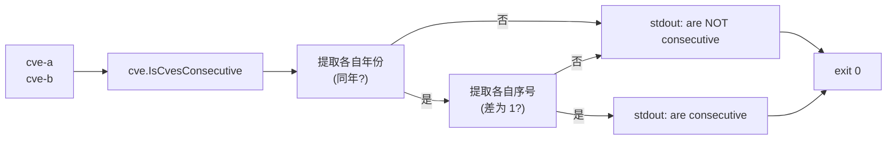

# cve is-consecutive 连续判断

:::tip 📂 查看源码
[`cmd/range.go:32`](https://github.com/scagogogo/cve-skills/blob/main/cmd/range.go#L32-L49) — 在 GitHub 上查看 cobra 命令定义（第 32–49 行）。
:::

判断两个 CVE 标识符是否连续——即同年份且序号相差恰好为 1。

:::tip 🖥️ 适用场景
- 在调用 `cve parse-range` 之前，判断一对 CVE 能否合并为单个 `to` / `..` 区间表达式。
- 在已排序的 CVE 列表中识别相邻标识符，发现连续编号段。
- 在用 CVE 对构造区间字符串前，校验两者确为相邻（而不仅是同年）。
:::

## 命令语法

```bash
cve is-consecutive <cve-a> <cve-b>
```

该命令接收恰好两个位置参数 CVE 标识符，输出一行人类可读的结论，说明二者是否连续。本命令不定义任何自身 flags；全局 `-q, --quiet` flag 继承自根命令。

## 参数与选项

- `<cve-a>`（位置参数，必填）：第一个 CVE 标识符，如 `CVE-2022-12345`。
- `<cve-b>`（位置参数，必填）：第二个 CVE 标识符，如 `CVE-2022-12346`。
- stdin 回退：当未提供位置参数且 stdin 通过管道输入时，每一非空行均视为一个输入。由于本命令需要**恰好两个** CVE，stdin 必须至少提供两行——第一行为 `<cve-a>`，第二行为 `<cve-b>`。
- 本命令**未定义任何自身 flags**。全局 `-q, --quiet` flag 继承自根命令。

## 使用示例

同年份且序号相邻的两个 CVE 为连续：

```bash
$ cve is-consecutive CVE-2022-12345 CVE-2022-12346
CVE-2022-12345 and CVE-2022-12346 are consecutive
```

参数顺序不影响结果——`is-consecutive` 是对称的：

```bash
$ cve is-consecutive CVE-2022-12346 CVE-2022-12345
CVE-2022-12346 and CVE-2022-12345 are consecutive
```

同年份但序号相差超过 1——不连续：

```bash
$ cve is-consecutive CVE-2022-12345 CVE-2022-12347
CVE-2022-12345 and CVE-2022-12347 are NOT consecutive
```

不同年份，即使序号相同——不连续：

```bash
$ cve is-consecutive CVE-2022-12345 CVE-2023-12345
CVE-2022-12345 and CVE-2023-12345 are NOT consecutive
```

相同的 CVE 或无法解析的输入绝不会判定为连续（一个 CVE 与自身不相邻，且格式错误的输入会直接短路为 false）：

```bash
$ cve is-consecutive CVE-2022-12345 CVE-2022-12345
CVE-2022-12345 and CVE-2022-12345 are NOT consecutive
$ cve is-consecutive CVE-2022-12345 not-a-cve
CVE-2022-12345 and not-a-cve are NOT consecutive
```

## 工作流程



## 对应 Go API

本命令是 [`IsCvesConsecutive`](/api/functions/is-cves-consecutive) 的薄封装。该函数接收两个 CVE 字符串，返回 `bool`。内部通过 `ExtractCveYearAsInt` 提取各自年份，若任一年份为 `0`（无法解析）或两年份不同则直接返回 `false`；否则通过 `ExtractCveSeqAsInt` 提取序号，仅当二者之差恰好为 `1` 或 `-1` 时才返回 `true`——因此对参数顺序对称。当你在代码中需要直接拿到布尔结果而非打印文本时，请使用该 Go 函数。

## 退出码与输出

- 退出码 `0`：检查已完成并输出一行结论——无论结论是"连续"还是"不连续"。否定结论属于正常结果，并非错误。
- 退出码 `1`：提供的输入少于两个（既未给出两个位置参数，也未通过 stdin 提供两行）。stderr 输出错误信息 `requires exactly 2 CVE identifiers`。
- stdout：恰好一行——`<cve-a> and <cve-b> are consecutive` 或 `<cve-a> and <cve-b> are NOT consecutive`。
- stderr：仅输出上述用法错误。结论行不会进入 stderr。

## 注意事项

- "连续"指**相邻**：同年且序号相差恰好为 1。仅同年并不足够——`CVE-2022-12345` 与 `CVE-2022-12347` 不连续。
- 一个 CVE 与自身不连续：`IsCvesConsecutive("CVE-2022-12345", "CVE-2022-12345")` 返回 false（差为 0）。
- 该判断是对称的——交换两个参数结果不变，因为序号之差按 `1` 或 `-1` 判定。
- 非法或格式错误的输入不会引发错误或非零退出码；它们会短路为"不连续"，因为年份/序号提取返回 `0`。
- 若要展开**超过两个** CVE 的区间，请改用 `cve parse-range`——`is-consecutive` 只回答两两相邻的问题。

## 内部实现

cobra 命令 `isConsecutiveCmd`（`cmd/range.go:32-49`）使用 `RunE` 而非 `Run` 定义，因此可返回错误，由 cobra 传播为非零退出码。其 `Run` 逻辑是对库函数的薄封装：

- **输入收集**——`inputs := readInputs(args)` 先收集位置参数；未提供参数时回退到从 stdin 读取的非空行。命令本身不定义任何 flags，因此仅继承的根命令 flags 生效。
- **参数数量守卫**——`if len(inputs) < 2 { return fmt.Errorf("requires exactly 2 CVE identifiers") }`。注意该守卫判据为 `< 2`，因此第二个之后的多余参数会被静默忽略；只消费 `inputs[0]` 与 `inputs[1]`。
- **库函数调用**——`result := cve.IsCvesConsecutive(inputs[0], inputs[1])` 执行年份/序号检查，返回普通 `bool`。库函数不返回错误；格式错误的输入会短路为 `false`，而非抛出错误。
- **输出格式化**——根据布尔值用单个 `fmt.Printf` 在 `"%s and %s are consecutive\n"` 与 `"%s and %s are NOT consecutive\n"` 之间选择，写入 stdout。随后 `return nil`，因此只要参数数量守卫通过，cobra 便以 `0` 退出。

## 参数流

```text
+---------------------+      +---------------------+      +---------------------------------+
| CLI: cve is-        |      | readInputs(args)    |      | len(inputs) < 2 ?               |
| consecutive A B     | ---> | - 位置参数优先       | ---> |   是 -> error                  |
| (args = [A, B])     |      | - 否则回退 stdin 行  |      |   否 -> 继续                   |
+---------------------+      +---------------------+      +---------------------------------+
                                                                    |
                                                                    v
                                                +---------------------------------+
                                                | cve.IsCvesConsecutive(          |
                                                |   inputs[0], inputs[1]) -> bool |
                                                +---------------------------------+
                                                                    |
                                              +---------------------+--------------+
                                              |                                    |
                                          true                                  false
                                              |                                    |
                                              v                                    v
                          +------------------------+              +---------------------------+
                          | stdout:                |              | stdout:                   |
                          | "A and B are           |              | "A and B are NOT          |
                          |  consecutive"          |              |  consecutive"             |
                          +------------------------+              +---------------------------+
                                              |                                    |
                                              +-----------------+------------------+
                                                                |
                                                                v
                                                        return nil -> exit 0
```

## 边界情形

| 输入 | 行为 | 退出码/输出 |
|---|---|---|
| 无参数且无 stdin | `len(inputs) < 2` 触发参数数量守卫 | 退出 1；stderr `requires exactly 2 CVE identifiers` |
| 仅一个位置参数 | 参数数量守卫失败 | 退出 1；stderr `requires exactly 2 CVE identifiers` |
| 两个合法、同年、序号差 1 | `IsCvesConsecutive` 返回 `true` | 退出 0；stdout `<a> and <b> are consecutive` |
| 两个合法、同年、序号差 > 1 | 返回 `false` | 退出 0；stdout `<a> and <b> are NOT consecutive` |
| 两个合法、不同年份 | 返回 `false` | 退出 0；stdout `<a> and <b> are NOT consecutive` |
| 相同 CVE（`A A`） | 差为 0，返回 `false` | 退出 0；stdout `<a> and <a> are NOT consecutive` |
| 第二个参数格式错误（`A not-a-cve`） | 提取结果为 0，返回 `false` | 退出 0；stdout `<a> and not-a-cve are NOT consecutive` |
| 超过两个参数（`A B C`） | 只用 `inputs[0]`、`inputs[1]`；`C` 被忽略 | 退出 0；结果依 `A`、`B` 而定 |
| stdin 仅一行 | `len(inputs) < 2` | 退出 1；stderr `requires exactly 2 CVE identifiers` |
| stdin 两行 | 第一行为 `cve-a`，第二行为 `cve-b` | 退出 0；stdout 输出结论行 |

## 退出码

- **成功（退出 0）：** 只要至少提供两个输入，命令便从 `RunE` 返回 `nil`。无论结论是"连续"还是"不连续"均如此——否定结论属于正常结果而非失败，结论行仅写入 stdout。
- **失败（退出 1）：** 唯一的显式错误路径是参数数量守卫返回 `fmt.Errorf("requires exactly 2 CVE identifiers")`。cobra 将该错误打印到 stderr 并以非零码退出。
- **stderr：** 上述错误信息是 stderr 的唯一输出。格式错误或非 CVE 的输入不会产生 stderr——它们在库内部短路为 `false`，并以正常的 stdout 结论行呈现。

## 相关命令

- [cve parse-range](/cli/commands/parse-range) — 将 `to` / `..` / `-` 区间表达式展开为区间内的全部 CVE。
- [cve compare sort](/cli/commands/compare-sort) — 对列表升序排序，这是在序列中发现相邻关系的前提。
- [cve validate-batch](/cli/commands/validate-batch) — 在判断连续性前，校验输入是否为格式合法的 CVE。
- [CLI 总览](/zh/cli) — 完整命令树与输入输出约定。
