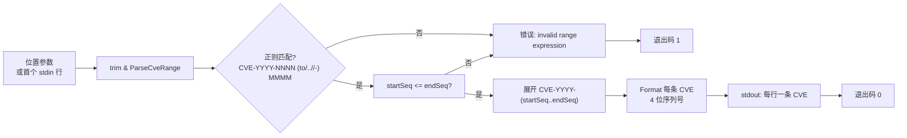

# cve parse-range 范围解析

:::tip 📂 查看源码
[`cmd/range.go:11`](https://github.com/scagogogo/cve-skills/blob/main/cmd/range.go#L11-L30) — 在 GitHub 上查看 cobra 命令定义（第 11–30 行）。
:::

解析一个 CVE **范围表达式**，将其展开为该范围内的所有 CVE 编号，逐行输出。

:::tip 🖥️ 适用场景
- 把 `CVE-2021-1000 to CVE-2021-1003` 这样的紧凑范围展开为它所覆盖的显式 CVE 列表。
- 从使用 `..` 或 `-` 简写的版本说明或公告中，还原出一个连续 CVE 块。
- 将展开后的范围喂给下游管道（校验、过滤、按年分组），这些管道期望每行一条 CVE。
:::

## 命令语法

```bash
cve parse-range <range-expr>
```

唯一的参数是范围表达式，支持三种语法：`CVE-YYYY-NNNN to CVE-YYYY-MMMM`、`CVE-YYYY-NNNN..MMMM` 或 `CVE-YYYY-NNNN - MMMM`。当未提供参数且 stdin 有管道输入时，读取第一个非空行作为表达式。

## 参数与选项

- `<range-expr>`（位置参数，必填）：一个 CVE 范围表达式。起始 CVE 提供年份；结束端以裸序列号给出（或在 `to` 形式中以完整 CVE 给出）。起始序列号必须小于或等于结束序列号。
- stdin 回退：当未提供位置参数且 stdin 有管道输入时，**第一个非空行**被当作范围表达式。其余行被忽略。
- 支持的语法：
  - `CVE-YYYY-NNNN to CVE-YYYY-MMMM` —— `to` 分隔符，结束端以完整 CVE 给出（结束 CVE 中的年份不被使用，整段范围都采用起始 CVE 的年份）。
  - `CVE-YYYY-NNNN..MMMM` —— `..` 分隔符，结束端以裸序列号给出。
  - `CVE-YYYY-NNNN - MMMM` —— `-` 分隔符（两侧需有空格），结束端以裸序列号给出。
- 本命令自身**不定义任何 flag**。全局 `-q, --quiet` 标志继承自根命令。

## 使用示例

将 `to` 范围展开为显式 CVE：

```bash
$ cve parse-range "CVE-2021-1000 to CVE-2021-1003"
CVE-2021-1000
CVE-2021-1001
CVE-2021-1002
CVE-2021-1003
```

使用 `..` 简写 —— 结束端是与起始同年的裸序列号：

```bash
$ cve parse-range "CVE-2022-10..15"
CVE-2022-0010
CVE-2022-0011
CVE-2022-0012
CVE-2022-0013
CVE-2022-0014
CVE-2022-0015
```

使用 `-` 分隔符（注意两侧的空格，否则连字符会与数字粘连）：

```bash
$ cve parse-range "CVE-2023-100 - 102"
CVE-2023-0100
CVE-2023-0101
CVE-2023-0102
```

从 stdin 传入范围表达式：

```bash
$ printf 'CVE-2021-44228..44230\n' | cve parse-range
CVE-2021-44228
CVE-2021-44229
CVE-2021-44230
```

起始序列号大于结束序列号的范围是非法的，不产生任何输出：

```bash
$ cve parse-range "CVE-2021-1005 to CVE-2021-1002"
# 退出码 1，stderr：invalid range expression
```

## 工作流程



## 对应 Go API

本命令是 [`ParseCveRange`](/api/functions/parse-cve-range) 的轻量封装，后者用一条锚定正则匹配表达式，校验起始序列号不大于结束序列号，并返回跨越该范围的已格式化 CVE 字符串切片。CLI 只调用一次 `ParseCveRange` 并逐元素打印。当你在代码中需要展开后的切片而非纯文本输出时，请直接使用该 Go 函数。

## 退出码与输出

- 退出码 `0`：范围表达式解析成功，范围内的每条 CVE 已逐行输出。
- 退出码 `1`：未提供任何输入；或表达式不符合支持的语法；或起始序列号大于结束序列号。错误信息写入 stderr。
- stdout：每行一条已格式化的 CVE，按序列号升序排列，全部共享起始 CVE 的年份。
- stderr：解析失败时输出 `invalid range expression` 信息。

## 注意事项

- ⚠️ 整段范围共享**起始 CVE 的年份** —— 不做跨年展开。`CVE-2021-99999 to CVE-2022-00001` 不是合法范围，会被拒绝。
- ⚠️ 起始序列号必须**小于或等于**结束序列号；反向范围会报错，而非返回空列表。
- 只有**第一个**非空 stdin 行被当作表达式；其余行被忽略。要展开多个范围，请在循环中多次调用本命令。
- 输出 CVE 经过 `Format` 归一化，因此序列号至少补零到 4 位（`CVE-2022-10` 变为 `CVE-2022-0010`）。
- `-` 分隔符两侧必须有空格；否则连字符会被当作下一个 token 的一部分，表达式将无法匹配。
- 输入大小写不敏感，并容忍两侧空白，与底层正则行为一致。

## 内部实现

`parseRangeCmd` cobra 命令（`cmd/range.go:11`–`30`）用 `RunE` 对 `cve` 包做了一层薄封装。要点直接取自源码：

- **参数接入**：`RunE` 接收 `args []string`，立即交给共享的 `readInputs(args)` 辅助函数。该函数将位置参数与 stdin 回退（无位置参数时取首个非空行）合并，返回一个 `[]string`。本命令只消费 `inputs[0]`。
- **空输入守卫**：`if len(inputs) == 0` 返回 `fmt.Errorf("requires at least 1 argument (range expression)")`，在任何解析之前给出明确错误。命令自身不定义任何 flag。
- **库函数调用**：去空白后的表达式交给 `cve.ParseCveRange(rangeExpr)`。返回 `nil` 被视为解析/校验失败，转成 `fmt.Errorf("invalid range expression: %s", rangeExpr)`。CLI 自身不做任何正则工作 —— 匹配、序列号顺序校验、格式化全部位于库中。
- **输出格式化**：成功时对返回的 `[]string` 执行 `for _, v := range result { fmt.Println(v) }`，逐行把已格式化的 CVE 打印到 stdout。没有分隔符、表头或汇总行；切片按库给出的顺序原样输出。

## 参数流

```text
+--------------------------+      +-----------------------+      +----------------------------+
| argv: <range-expr>       |      | readInputs(args)      |      | inputs[0]                  |
| (或管道传入的 stdin 行)  |---> | 合并位置参数 +        |---> | strings.TrimSpace(expr)    |
+--------------------------+      | 首个非空 stdin 行     |      +----------------------------+
                                  +-----------------------+                  |
                                                                             v
                                                  +-------------------------------+
                                                  | cve.ParseCveRange(rangeExpr)  |
                                                  | - 锚定正则匹配                |
                                                  | - startSeq <= endSeq 校验     |
                                                  | - Format 每条 CVE（4 位）     |
                                                  +---------------+---------------+
                                                                  |
                                                      nil <-------+-------> []string
                                                                  |          |
                                                                  v          v
                                              +---------------------+   +---------------------+
                                              | 错误: "invalid      |   | for _, v := range   |
                                              | range expression"   |   | result {            |
                                              +----------+----------+   |   fmt.Println(v)    |
                                                         |              | }                   |
                                                         v              +----------+----------+
                                              +---------------------+              |
                                              | RunE 返回 error     |              v
                                              | -> cobra 打印到     |   +---------------------+
                                              |    stderr，退出码 1 |   | stdout: 每行一条    |
                                              +---------------------+   | CVE，升序           |
                                                                        +----------+----------+
                                                                                   |
                                                                                   v
                                                                        +---------------------+
                                                                        | 退出码 0            |
                                                                        +---------------------+
```

## 边界情形

| 输入 | 行为 | 退出码 / 输出 |
| --- | --- | --- |
| 无参数且 stdin 是 TTY（无管道） | `readInputs` 返回空切片；触发 `len(inputs) == 0` 守卫 | 退出码 `1`；stderr：`requires at least 1 argument (range expression)` |
| 无参数，stdin 管道传入首个非空行 | 首个非空行成为 `inputs[0]`；其余行被忽略 | 退出码 `0`（若合法）；stdout：展开后的 CVE |
| 空位置参数（`""`） | `strings.TrimSpace` 得到 `""`；`ParseCveRange` 返回 `nil` | 退出码 `1`；stderr：`invalid range expression: ` |
| 表达式不符合支持的语法 | `ParseCveRange` 返回 `nil` | 退出码 `1`；stderr：`invalid range expression: <表达式>` |
| 反向范围（`startSeq > endSeq`） | `ParseCveRange` 返回 `nil` | 退出码 `1`；stderr：`invalid range expression: <表达式>` |
| 跨年范围（结束 CVE 带不同年份） | 仅使用起始 CVE 的年份；按序列号比较处理 | 序列号违反顺序时退出码 `1`；否则退出码 `0` 且输出起始年份的 CVE |
| `-` 分隔符两侧无空格（`CVE-2023-100-102`） | 正则无法匹配预期的 token 形态 | 退出码 `1`；stderr：`invalid range expression: <表达式>` |
| 合法范围仅解析出单条 CVE（`startSeq == endSeq`） | `ParseCveRange` 返回单元素切片 | 退出码 `0`；stdout：恰好一行 CVE |
| 合法范围解析出多条 CVE | 切片逐元素 `fmt.Println` 打印 | 退出码 `0`；stdout：N 行 CVE，无表头/汇总 |

## 退出码

本命令依赖 cobra 由 `RunE` 返回值驱动的默认退出处理；`cmd/range.go` 中没有任何显式的 `os.Exit` 调用。

- **成功（退出码 `0`）**：`ParseCveRange` 返回非空切片且每个元素已通过 `fmt.Println` 打印后，`RunE` 返回 `nil`。输出写入 stdout。
- **失败（退出码 `1`）**：`RunE` 在两种情况下返回 error —— 空输入守卫（`requires at least 1 argument (range expression)`）或 `ParseCveRange` 返回 `nil`（`invalid range expression: <表达式>`）。cobra 将返回的 error 打印到 stderr 并以退出码 `1` 退出。
- **仅失败时写 stderr**：成功路径不向 stderr 写任何内容；失败路径写入 `RunE` 内部生成的错误信息。两条路径都不会向 stderr 输出调试或进度信息。

## 相关命令

- [cve generate-fake](/cli/commands/generate-fake) —— 生成一条或多条随机 CVE 编号用于测试，与展开已知范围是互补的需求。
- [cve filter-valid](/cli/commands/filter-valid) —— 对展开后的 CVE 做批量校验。
- [cve filter-group-by-year](/cli/commands/filter-group-by-year) —— 将展开后的列表按年份分组。
- [cve format](/cli/commands/format) —— 把原始 CVE 字符串归一化为此处应用的规范形式。
- [CLI 参考](/cli) —— 完整命令树与 I/O 约定。
