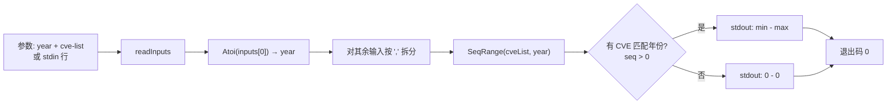

# cve seq-range 序列号范围

:::tip 📂 查看源码
[`cmd/stats.go:52`](https://github.com/scagogogo/cve-skills/blob/main/cmd/stats.go#L52-L73) — 在 GitHub 上查看 cobra 命令定义（第 52–73 行）。
:::

获取属于指定年份的 CVE 编号中**最小与最大的序列号**，以 `min - max` 形式输出范围。

:::tip 🖥️ 适用场景
- 查看某一年 CVE 编号分配推进到了哪一步 —— 最大序列号可粗略反映分配量。
- 在按序列号切片或采样之前，先用范围界定该年份 CVE 的上下界。
- 对 CVE 列表做健全性检查：最大值远低于已知下限、或最小值远大于 1，可能提示输入有缺口或被过滤。
:::

## 命令语法

```bash
cve seq-range <year> <cve-list...>
```

**第一个位置参数是年份**；其后的每个参数都被视为 CVE 列表并按逗号拆分。当未提供参数且 stdin 有管道输入时，第一个非空 stdin 行为年份，其余行为 CVE 输入。

## 参数与选项

- `<year>`（位置参数，必填）：要限定的 CVE 年份，经 `strconv.Atoi` 解析并去除两侧空白（如 `2022`）。非数值会被视为错误拒绝。
- `<cve-list...>`（位置参数，年份之后至少一个，必填）：一个或多个 CVE 编号或逗号分隔列表。每个参数按 `,` 拆分，因此 `CVE-2022-1,CVE-2022-2` 与两个独立参数等价。
- stdin 回退：当未提供位置参数且 stdin 有管道输入时，每个非空行对应一条输入 —— 第一行为年份，其余为 CVE。空行会被跳过。
- 本命令自身**不定义任何 flag**。全局 `-q, --quiet` 标志继承自根命令。

## 使用示例

为某一年在若干 CVE 中求序列号范围：

```bash
$ cve seq-range 2022 CVE-2022-12345 CVE-2022-44228 CVE-2022-9
Year 2022 sequence range: 9 - 44228
```

在单个参数中传入逗号分隔列表 —— 逗号会被拆分，结果与上例一致：

```bash
$ cve seq-range 2022 CVE-2022-12345,CVE-2022-44228,CVE-2022-9
Year 2022 sequence range: 9 - 44228
```

其他年份的 CVE 会被忽略 —— 只有匹配年份的序列号参与范围计算：

```bash
$ cve seq-range 2022 CVE-2021-44228 CVE-2022-9 CVE-2023-50000 CVE-2022-44228
Year 2022 sequence range: 9 - 44228
```

从 stdin 传入年份与 CVE，在管道中计算范围：

```bash
$ printf '2022\nCVE-2022-9\nCVE-2022-44228\n' | cve seq-range
Year 2022 sequence range: 9 - 44228
```

当列表中没有任何 CVE 匹配给定年份时，两端均回退为 `0`：

```bash
$ cve seq-range 2099 CVE-2022-12345
Year 2099 sequence range: 0 - 0
```

## 工作流程



## 对应 Go API

本命令是 [`SeqRange`](/api/functions/seq-range) 的轻量封装，后者遍历 CVE 切片，跳过年份（经 `ExtractCveYearAsInt`）不等于目标年份、或序列号（经 `ExtractCveSeqAsInt`）`<= 0` 的条目，并跟踪运行时的最小与最大值。当没有 CVE 匹配时，函数返回 `(0, 0)`。CLI 解析年份、对其余输入按逗号拆分、调用 `SeqRange`，并打印 `Year <year> sequence range: <min> - <max>`。当你在代码中需要以整数形式获取上下界而非纯文本输出时，请直接使用该 Go 函数。

## 退出码与输出

- 退出码 `0`：命令成功解析年份并计算出范围（包括没有 CVE 匹配时回退的 `0 - 0`）。
- 退出码 `1`：提供的输入少于两条（缺少年份 + CVE 列表），或年份参数无法解析为整数。此时不输出任何内容。
- stdout：单行，`Year <year> sequence range: <min> - <max>`。
- stderr：当年份缺失或非数值时的错误信息。

## 注意事项

- ⚠️ **第一个参数是年份**，不是 CVE。把裸 CVE 放在首位（如 `cve seq-range CVE-2022-9 CVE-2022-44228`）会以 `invalid year: CVE-2022-9` 失败。
- ⚠️ 年份与目标不同的 CVE 会被**静默跳过** —— 既不报错，也不影响范围。若只想要某一年份的集合，请先用 [`cve filter-by-year-range`](/cli/commands/filter-by-year-range) 预过滤。
- 序列号 `0` 及以下会被忽略，因此格式异常或零序列号的 CVE 不会把最小值拉低到 `0`。
- 没有匹配年份时结果为 `0 - 0`（并非错误）。请把 `0 - 0` 理解为"该年份无数据"，而非"范围从零开始"。
- 输入大小写不敏感，并容忍两侧空白，与底层 `ExtractCve*` 助手函数行为一致。
- 此处**会做逗号拆分** —— `CVE-2022-1,CVE-2022-2` 会被视为两个 CVE。若要把含逗号的字符串当作单条字面量，请加引号或预处理输入。

## 内部实现

`seqRangeCmd` 是一个 cobra 命令，其 `RunE` 负责编排解析、拆分与打印：

- **输入收集**：`inputs := readInputs(args)` 将位置参数与非空 stdin 行合并（仅在未提供参数时才使用 stdin）。守卫 `if len(inputs) < 2 { return fmt.Errorf("requires year and CVE list") }` 强制要求同时存在年份与至少一条 CVE 输入。
- **年份解析**：`strconv.Atoi(strings.TrimSpace(inputs[0]))` 将第一条输入转为 int；解析失败时返回 `fmt.Errorf("invalid year: %s", inputs[0])`。
- **列表组装**：循环 `for _, input := range inputs[1:]` 用 `strings.Split(input, ",")` 对其余每条输入按逗号拆分，并将片段追加到 `cveList`。
- **计算与输出**：`min, max := cve.SeqRange(cveList, year)` 计算上下界，随后 `fmt.Printf("Year %d sequence range: %d - %d\n", year, min, max)` 打印单行结果。本命令不定义任何 flag，成功时返回 `nil`。

## 参数流

```text
+--------------------------+      +--------------------------+
| 命令行参数               |      | stdin（仅当无参数时）    |
| [year] [cve ...]         |      | 第 1 行: year            |
|                          |      | 第 2 行起: cve 输入      |
+-----------+--------------+      +-----------+--------------+
            |                               |
            +---------------+---------------+
                            |
                            v
                  +-----------------------+
                  | readInputs(args)      |
                  | -> inputs []string    |
                  +-----------+-----------+
                              |
                  len(inputs) < 2 ?  --是-->  错误:
                              |              "requires year and CVE list"
                              | 否
                              v
                  +-----------------------+
                  | strconv.Atoi(         |
                  |   TrimSpace(inputs[0]))|
                  | -> year, err          |
                  +-----------+-----------+
                              |
                      err != nil ? --是-->  错误:
                              |             "invalid year: <x>"
                              | 否
                              v
                  +-----------------------+
                  | for input in inputs[1:]:
                  |   strings.Split(",",  |
                  |     input) -> cveList |
                  +-----------+-----------+
                              |
                              v
                  +-----------------------+
                  | cve.SeqRange(cveList, |
                  |   year) -> min, max   |
                  +-----------+-----------+
                              |
                              v
                  +-----------------------+
                  | fmt.Printf(           |
                  |   "Year %d ... %d-%d")|
                  | -> stdout            |
                  +-----------------------+
```

## 边界情形

| 输入 | 行为 | 退出码/输出 |
| --- | --- | --- |
| 无参数且无 stdin | `readInputs` 返回空切片；`len < 2` 触发错误 | 退出 1；stderr `requires year and CVE list`；无 stdout |
| 仅有年份、无 CVE 输入 | `len(inputs) == 1`，故 `len < 2` 触发错误 | 退出 1；stderr `requires year and CVE list`；无 stdout |
| 年份非数值（如 `abc`） | `strconv.Atoi` 失败 | 退出 1；stderr `invalid year: abc`；无 stdout |
| 首位是 CVE（如 `CVE-2022-9`） | `Atoi` 解析 CVE 字符串失败 | 退出 1；stderr `invalid year: CVE-2022-9`；无 stdout |
| 年份带两侧空白（如 ` 2022 `） | `TrimSpace` 先去空白再 `Atoi` | 退出 0；stdout `Year 2022 sequence range: <min> - <max>` |
| 单参数内含逗号分隔列表 | `strings.Split` 按 `,` 展开为多个 CVE | 退出 0；正常范围输出 |
| 仅有其他年份的 CVE | `SeqRange` 跳过不匹配年份；返回 `(0, 0)` | 退出 0；stdout `Year <year> sequence range: 0 - 0` |
| stdin 空行/空白行 | `readInputs` 跳过空行 | 视同这些输入不存在 |
| 有 stdin 但无匹配的年份行 | 第一个非空 stdin 行被当作年份 | 无匹配时退出 0 输出 `0 - 0`，非空行不足 2 条时退出 1 |

## 退出码

- **成功（退出 0）**：`RunE` 无错误返回时达成。年份解析成功且 `SeqRange` 已执行；stdout 收到单行 `Year <year> sequence range: <min> - <max>`。这包括无 CVE 匹配年份时回退的 `0 - 0` —— 空结果属于合法成功，而非失败。
- **失败（退出 1）**：cobra 将 `RunE` 返回的错误上抛并设置退出码 1。有两条失败路径：输入少于两条（`requires year and CVE list`）与年份非整数（`invalid year: <input>`）。失败时不向 stdout 写入任何内容；错误信息经由 cobra 默认错误处理写入 stderr。
- **失败时的 stderr**：cobra 将返回的错误（默认带 `Error:` 前缀）打印到 stderr。命令本身并不直接写 stderr —— 它只是返回错误值。

## 相关命令

- [cve year-range](/cli/commands/year-range) —— 年份层面的对应命令：跨 CVE 列表的最早与最晚年份。
- [cve count-by-year](/cli/commands/count-by-year) —— 同一份列表的逐年计数，与逐年序列号范围搭配使用。
- [cve extract-seq](/cli/commands/extract-seq) —— 逐条输出每个 CVE 的序列号，而非折叠为一个范围。
- [cve filter-by-year-range](/cli/commands/filter-by-year-range) —— 在计算序列号范围之前，将列表收窄到某一年份窗口。
- [CLI 参考](/cli) —— 完整命令树与 I/O 约定。
