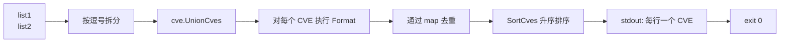

# cve union 并集

:::tip 📂 查看源码
[`cmd/set.go:30`](https://github.com/scagogogo/cve-skills/blob/main/cmd/set.go#L30-L47) — 在 GitHub 上查看 cobra 命令定义（第 30–47 行）。
:::

将两个 CVE 列表合并为一个去重且升序排序的集合——出现在**任一**输入列表中的 CVE 都只输出一次，按升序排列。

:::tip 🖥️ 适用场景
- 将来自多个安全通告、扫描器或情报源的 CVE 列表合并为一份总清单。
- 在不保留重复项的前提下，把"内部已标记"与"厂商已公告"两份清单对齐汇总。
- 为下游命令（如 `cve count-by-year`、`cve compare sort`）准备一份干净、去重的输入。
:::

## 命令语法

```bash
cve union <list1> <list2>
```

`<list1>` 与 `<list2>` 均为逗号分隔的 CVE 列表。两个参数在执行集合运算前都会按逗号拆分，因此 `"CVE-2021-1,CVE-2022-2"` 与分别传入这两个标识符效果完全相同。

## 参数与选项

- `<list1>`（位置参数，必填）：第一个 CVE 列表。参数内的逗号会被视为分隔符，因此每个参数可承载一个或多个 CVE。
- `<list2>`（位置参数，必填）：第二个 CVE 列表，解析方式与 `<list1>` 一致。
- stdin 回退：当未提供位置参数且 stdin 通过管道输入时，每一非空行均视为一个输入。由于并集运算需要**两个**列表，stdin 必须至少提供两行——第一行为 `<list1>`，第二行为 `<list2>`。
- 本命令**未定义任何自身 flags**。全局 `-q, --quiet` flag 继承自根命令。

## 使用示例

合并两个逗号分隔的列表，重复的 CVE 只出现一次，结果按升序排列：

```bash
$ cve union "CVE-2021-1,CVE-2022-2" "CVE-2022-2,CVE-2023-3"
CVE-2021-1
CVE-2022-2
CVE-2023-3
```

大小写差异会被规范化消除——`Format` 在比较前将 `CVE` 前缀大写，因此小写的重复项会被丢弃：

```bash
$ cve union "cve-2022-1,CVE-2022-2" "CVE-2022-1,CVE-2022-3"
CVE-2022-1
CVE-2022-2
CVE-2022-3
```

将两个列表作为独立参数（而非逗号打包的字符串）传入，结果完全一致：

```bash
$ cve union "CVE-2020-5,CVE-2021-9" "CVE-2021-9,CVE-2024-1"
CVE-2020-5
CVE-2021-9
CVE-2024-1
```

通过 stdin 同时提供两个列表（第一行为 list1，第二行为 list2），对两条上游命令的输出求并集：

```bash
$ printf 'CVE-2021-1,CVE-2022-2\nCVE-2022-2,CVE-2023-3\n' | cve union
CVE-2021-1
CVE-2022-2
CVE-2023-3
```

当第二个列表为空时，结果仍为第一个列表（去重并排序）：

```bash
$ cve union "CVE-2022-3,CVE-2022-1" ""
CVE-2022-1
CVE-2022-3
```

## 工作流程



## 对应 Go API

本命令是 [`UnionCves`](/api/functions/union-cves) 的薄封装。该函数接收两个 `[]string` 切片，返回去重且排序后的并集 `[]string`。内部会先对每个标识符执行 `Format`（因此在比较前已统一大小写并去除首尾空白），用 map 跟踪重复项，最后再经 `SortCves` 排序，确保输出始终按"年份再序号"升序排列。当你在代码中需要直接拿到合并后的切片而非打印文本时，请使用该 Go 函数。

## 退出码与输出

- 退出码 `0`：并集已计算并输出。当两个输入列表均为空时，不输出任何内容，仍返回 `0`。
- 退出码 `1`：提供的输入少于两个（既未给出两个位置参数，也未通过 stdin 提供两行）。stderr 输出错误信息 `requires exactly 2 arguments (two CVE lists)`。
- stdout：每行一个 CVE，升序排列，已去重。两个列表均为空时无输出。
- stderr：仅输出上述用法错误。结果行不会进入 stderr。

## 注意事项

- 每个输入在集合运算前都会经 `Format` 规范化，因此 `cve-2022-1`、`CVE-2022-1` 与 `  CVE-2022-1 ` 会被视为同一个 CVE。
- 输出**始终是排序的**（先年份、再序号）——本命令不保留原始输入顺序。若需要保留输入顺序，请改用 `cve filter dedup` 处理单个拼接后的列表。
- 非法或格式错误的 token 不会被过滤——它们会按原样格式化并保留。若希望并集中只包含格式合法的 CVE，请先运行 `cve filter-valid`。
- 与 `cve intersect`（取**交集**）和 `cve diff`（取 list1 **减** list2 的差集）相比，`cve union` 是三种集合运算中范围最广的一个。

## 内部实现

本命令是 cobra 的薄封装，`RunE` 直接完成全部工作——没有自身 flags，除 `readInputs` 外不依赖任何辅助函数：

- **参数获取** — `RunE` 接收 `cmd *cobra.Command`（未使用）与 `args []string`，将 `args` 直接传给 `readInputs(args)`（`cmd/helpers.go:11`）。该函数在有位置参数时原样返回 args；否则回退为按行扫描 stdin（跳过空行）。
- **参数数量校验** — `if len(inputs) < 2` 返回 `fmt.Errorf("requires exactly 2 arguments (two CVE lists)")`；cobra 将其输出到 stderr 并以非零码退出。
- **列表拆分** — 两个输入分别用 `strings.Split(inputs[0], ",")` 与 `strings.Split(inputs[1], ",")` 按逗号拆分，因此 `"CVE-2021-1,CVE-2022-2"` 与分别传入两个 token 会得到相同的 `[]string`。
- **库函数调用与输出** — `result := cve.UnionCves(list1, list2)` 返回去重且排序后的 `[]string`；随后 `for _, v := range result { fmt.Println(v) }` 逐行写入 stdout。命令本身不做额外格式化——规范化与排序都在 `UnionCves` 内部完成。

## 参数流

```text
+--------------------------+
| CLI: cve union <list1>   |
|            <list2>       |
+-----------+--------------+
            |
            v
+--------------------------+    是否有位置参数?
| readInputs(args)         +----是------> 返回 args []string
| (cmd/helpers.go:11)      |
+-----------+--------------+
            | 否
            v
+--------------------------+
| os.Stdin.Stat() 是否管道?|
| ModeCharDevice == 0      |
+-----------+--------------+
            | 是
            v
+--------------------------+
| bufio.Scanner 逐行读取   |
| 跳过空行                  |
+-----------+--------------+
            |
            v
   inputs []string
            |
            v
   len(inputs) < 2 ? --是--> error: "requires exactly 2 arguments"
            | 否
            v
+--------------------------+
| strings.Split(inputs[0], |
|   ",")  -> list1 []string|
| strings.Split(inputs[1], |
|   ",")  -> list2 []string|
+-----------+--------------+
            |
            v
+--------------------------+
| cve.UnionCves(list1,     |
|   list2) -> result       |
| (Format + map 去重 +     |
|   SortCves 升序排序)     |
+-----------+--------------+
            |
            v
+--------------------------+
| for _, v := range result |
|   fmt.Println(v)         |
+--------------------------+
            |
            v
   stdout: 每行一个 CVE
            |
            v
        exit 0
```

## 边界情形

| 输入 | 行为 | 退出码 / 输出 |
| --- | --- | --- |
| 无位置参数，stdin 为 TTY（非管道） | `readInputs` 返回 `nil`；`len(inputs) < 2` 触发参数数量错误 | 退出码 `1`；stderr 输出 `Error: requires exactly 2 arguments (two CVE lists)` 及 cobra 用法 |
| 无位置参数，stdin 管道输入但仅一行非空 | `inputs` 长度为 1；参数数量校验失败 | 退出码 `1`；stderr 错误同上 |
| 无位置参数，stdin 管道输入两行非空 | 第一行 → `list1`，第二行 → `list2`；均按逗号拆分 | 退出码 `0`；stdout 输出合并结果 |
| 某个参数为空字符串，如 `cve union "" "CVE-2021-1"` | `strings.Split("", ",")` 得到 `[""]`（单个空 token）；传入 `UnionCves` | 退出码 `0`；空 token 按原样规范化/格式化，与另一列表去重 |
| 两个列表均为空（`cve union "" ""`） | 各自拆分得到 `[""]`；`UnionCves` 返回空结果 | 退出码 `0`；stdout 无输出 |
| 非法 token（`cve union "FOO-1" "BAR-2"`） | 此处不校验 token；直接经过 `Format`/去重/排序 | 退出码 `0`；token 按原样逐行输出 |
| 超过两个位置参数（`cve union a b c`） | `readInputs` 返回全部 args；仅消费 `inputs[0]` 与 `inputs[1]`，`inputs[2]` 被忽略 | 退出码 `0`；取前两个列表的并集，多余参数静默丢弃 |

## 退出码

- **退出码 `0`** — `RunE` 返回 `nil`。只要能取到两个及以上输入即发生，包括两个列表均为空的退化情形（结果为空、不打印任何内容，进程仍以 `0` 退出）。
- **退出码非零（`1`）** — `RunE` 返回错误 `requires exactly 2 arguments (two CVE lists)`。cobra 在 stderr 打印 `Error: <message>` 及命令用法，进程以 `1` 退出。源码中不存在其他显式错误路径：`strings.Split` 不会报错，`UnionCves` 返回切片（可能为空）而非 error。
- **stdout** — 仅并集结果，每行一个 CVE。两个输入均为空时无输出。
- **stderr** — 仅参数数量错误与 cobra 用法横幅。结果行不会进入 stderr。

## 相关命令

- [cve intersect](/cli/commands/intersect) — 仅保留两个列表中都存在的 CVE。
- [cve diff](/cli/commands/diff) — 保留在 list1 中但不在 list2 中的 CVE。
- [cve filter dedup](/cli/commands/filter-dedup) — 对单个列表去重，保留首次出现的顺序。
- [cve compare sort](/cli/commands/compare-sort) — 对单个列表升序排序。
- [CLI 总览](/cli) — 完整命令树与输入输出约定。
