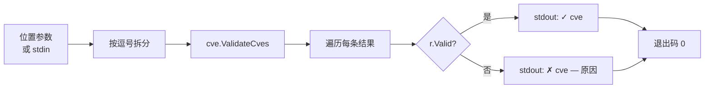

# cve validate-batch 批量验证

:::tip 📂 查看源码
[`cmd/validate_batch.go:11`](https://github.com/scagogogo/cve-skills/blob/main/cmd/validate_batch.go#L11-L34) — 在 GitHub 上查看 cobra 命令定义（第 11–34 行）。
:::

一次性验证一组 CVE 编号，并逐条输出判定结果 —— 对每一条失败记录都给出可读的失败原因。

:::tip 🖥️ 适用场景
- 在 CVE 列表导入数据库或漏洞跟踪系统之前做审计。
- 生成数据质量报告，既记录哪些 CVE 失败，也记录为什么失败。
- 校验管道输出（`extract` → `validate-batch`），不会静默丢弃异常行。
:::

## 命令语法

```bash
cve validate-batch <cve-list>
```

`<cve-list>` 采用所有列表型子命令共用的灵活输入形式：多个位置参数、每个参数内部以逗号分隔，或者 —— 当不提供参数时 —— 从 stdin 按行读取。

## 参数与选项

- `<cve-list>`（位置参数，可重复）：一个或多个 CVE 编号。每个参数会再按逗号拆分，因此 `"CVE-2022-1,CVE-2022-2"` 等价于两个独立参数。
- stdin 回退：当未提供位置参数且 stdin 有管道输入时，每个非空行被视为一条输入（行内逗号仍会拆分）。
- 本命令自身**不定义任何 flag**。全局 `-q, --quiet` 标志继承自根命令。

## 使用示例

校验一个逗号分隔的列表，查看逐条判定结果：

```bash
$ cve validate-batch "CVE-2022-12345,CVE-1998-1,not-a-cve"
✓ CVE-2022-12345
✗ CVE-1998-1 — year 1998 is before 1999
✗ not-a-cve — invalid CVE format
```

以独立参数传入，结果与逗号形式完全一致：

```bash
$ cve validate-batch CVE-2022-12345 CVE-1998-1 not-a-cve
✓ CVE-2022-12345
✗ CVE-1998-1 — year 1998 is before 1999
✗ not-a-cve — invalid CVE format
```

从 stdin 传入列表，校验另一条命令的输出：

```bash
$ printf 'CVE-2021-44228\nCVE-2022-0\ncve-2022-abc\n' | cve validate-batch
✓ CVE-2021-44228
✗ CVE-2022-0 — sequence number must be positive
✗ cve-2022-abc — sequence number is not a valid number
```

超出当前年份的条目会按运行时的当前年份被拒绝：

```bash
$ cve validate-batch "CVE-2099-1"
✗ CVE-2099-1 — year 2099 is after current year 2026
```

小写与带前导零的序列号都是合法的；判定行原样回显输入：

```bash
$ cve validate-batch "cve-2022-0001"
✓ cve-2022-0001
```

## 工作流程



## 对应 Go API

本命令是 [`ValidateCves`](/api/functions/validate-cves) 的轻量封装，后者返回 `[]CveValidationResult`，每条结果包含原始编号、`Valid` 标志和失败 `Reason`。CLI 仅遍历结果并打印 `✓`/`✗` 行；全部校验逻辑 —— 格式检查、年份范围 `1999..当前年份`、正序列号 —— 都在库中实现。当你在代码中需要结构化结果而非纯文本输出时，请直接使用该 Go 函数。

## 退出码与输出

- 退出码 `0`：命令正常结束。注意**非法 CVE 不会导致非零退出码** —— 每条都会被报告（无论合法与否），因此可安全地串联到下游命令。
- 退出码 `1`：未提供任何输入（既无位置参数，也无管道 stdin）。此时向 stderr 输出错误 `requires at least 1 argument (CVE list)`。
- stdout：每条输入一行，顺序与输入一致。合法项输出 `✓ <cve>`；非法项输出 `✗ <cve> — <reason>`。
- stderr：仅输出上述用法错误。判定行绝不写入 stderr。

## 注意事项

- 判定行**原样**保留输入，包括两侧空白与原始大小写 —— 不会被规范化为大写。如需标准化输出，请先执行 `cve format`。
- 可能的失败原因：`invalid CVE format`、`year is not a valid number`、`sequence number is not a valid number`、`year %d is before 1999`、`year %d is after current year %d`、`sequence number must be positive`。
- 年份上界为运行时求值的 `time.Now().Year()`，因此明年日期的 CVE 今天会被拒绝、明年会被接受。
- 重复项不会被合并 —— 每条输入恰好产生一行输出。
- 若只需保留合法项（不要原因），`cve filter-valid` 更简洁。

## 内部实现

该命令定义为一个 `cobra.Command`（`validateBatchCmd`），所有逻辑都在 `RunE` 中完成 —— 它自身不声明任何 flag，依赖位置参数与共用的 stdin 辅助函数。

- **输入收集**：`RunE` 调用 `readInputs(args)`（位于 `cmd/helpers.go`），当 `args` 非空时原样返回，否则逐行扫描 stdin 并丢弃空行。当 stdin 是字符设备（无管道的 TTY）时返回 `nil`。
- **逗号扁平化**：对每个返回的输入用 `strings.Split(input, ",")` 拆分并追加到单个 `cveList []string`，因此 `"CVE-2021-1,CVE-2021-2"` 与两个独立参数会生成相同的切片。
- **库函数调用**：扁平化后的切片传给 `cve.ValidateCves(cveList)`，返回 `[]CveValidationResult` —— 每条结果包含原始 `Cve` 字符串、`Valid` 布尔值与 `Reason`。全部格式与范围校验逻辑都在库中实现，而非 CLI 内。
- **输出格式化**：命令遍历结果，合法项打印 `fmt.Printf("✓ %s\n", r.Cve)`，非法项打印 `fmt.Printf("✗ %s — %s\n", r.Cve, r.Reason)`，原样保留输入。成功时 `RunE` 始终返回 `nil`，因此唯一的非零退出路径就是显式抛出的 "requires at least 1 argument" 错误。

## 参数流

```text
+--------------------------+      +-------------------------+
| 位置参数                 |----->| readInputs(args)        |
| （或管道 stdin 各行）    |      | - args 非空? ->         |
+--------------------------+      |   原样返回 args         |
                                  | - 否则逐行扫描 stdin，  |
                                  |   跳过空行              |
                                  | - 无管道的 TTY? ->      |
                                  |   返回 nil              |
                                  +-----------+-------------+
                                              |
                                              v
                                  +-------------------------+
                                  | 遍历每个 input:         |
                                  |   strings.Split(",", -1)|
                                  |   追加到 cveList        |
                                  +-----------+-------------+
                                              |
                                              v
                                  +-------------------------+
                                  | cve.ValidateCves(cveList)|
                                  | -> []CveValidationResult|
                                  +-----------+-------------+
                                              |
                                              v
                                  +-------------------------+
                                  | 遍历每条结果 r:         |
                                  |   r.Valid? -> stdout    |
                                  |     "✓ %s\n", r.Cve     |
                                  |   否则 -> stdout        |
                                  |     "✗ %s — %s\n",      |
                                  |     r.Cve, r.Reason     |
                                  +-------------------------+
```

## 边界情形

| 输入 | 行为 | 退出码 / 输出 |
| --- | --- | --- |
| 无参数，stdin 是 TTY（无管道） | `readInputs` 返回 `nil`；`RunE` 返回错误 | 退出 `1`；stderr：`requires at least 1 argument (CVE list)` |
| 无参数，stdin 有管道但为空（如 `printf '' \| cve ...`） | `readInputs` 返回 `nil`（所有行均为空/不存在） | 退出 `1`；stderr：`requires at least 1 argument (CVE list)` |
| 无参数，stdin 仅有空行 | 空行被 `readInputs` 跳过；结果为 `nil` | 退出 `1`；stderr：`requires at least 1 argument (CVE list)` |
| 参数含逗号（`"CVE-2021-1,CVE-2021-2"`） | 每个参数按逗号拆分；扁平化为一个列表 | 退出 `0`；每个拆分项一行判定 |
| 合法与非法 CVE 混合 | 每条仍各产生一行；非法项不会中止流程 | 退出 `0`；stdout 混合 `✓` 与 `✗` 行 |
| 输入含重复 CVE | 不去重 —— 每次出现各产生一行 | 退出 `0`；stdout 出现重复行 |
| 空白/大小写被保留 | 原样回显，不规范化为大写 | 退出 `0`；stdout 回显原始字符串 |
| 所有项均非法 | `RunE` 仍返回 `nil`，正常退出 | 退出 `0`；stdout 全为 `✗` 行 |
| `RunE` 返回参数错误 | cobra 打印错误与用法 | 退出 `1`；stderr 含错误信息 |

## 退出码

- **退出 `0`** —— `RunE` 在打印完判定后返回 `nil`。即使所有 CVE 均非法也成立：校验失败在 stdout 报告，不视为命令错误，因此可安全串联下游。
- **退出 `1`** —— 当 `len(inputs) == 0` 时，`RunE` 返回 `fmt.Errorf("requires at least 1 argument (CVE list)")`。cobra 将该错误信息（及用法帮助）输出到 stderr 并以非零码退出。源码未显式调用 `os.Exit`；退出码是 cobra 对返回错误的默认行为。
- **stderr** —— 仅出现 "requires at least 1 argument" 错误（及 cobra 的用法文本）。所有 `✓`/`✗` 判定行均通过 `fmt.Printf` 写入 stdout，绝不写入 stderr。

## 相关命令

- [cve filter-valid](/cli/commands/filter-valid) —— 仅保留合法 CVE，静默丢弃其余项。
- [cve validate](/cli/commands/validate) —— 逐条输出 `formatted-cve<TAB>bool`，不带原因。
- [cve validate is-cve](/cli/commands/validate-is-cve) —— 严格判断“文本是否恰好是一个 CVE”。
- [CLI 参考](/cli) —— 完整命令树与 I/O 约定。
