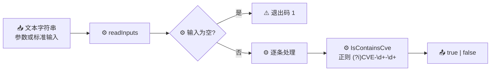

# cve validate contains-cve 包含判断

:::tip 📂 查看源码
[`cmd/validate.go:56`](https://github.com/scagogogo/cve-skills/blob/main/cmd/validate.go#L56-L74) — 在 GitHub 上查看 cobra 命令定义（第 56–74 行）。
:::

逐条检查输入文本是否至少包含一个 CVE 编号（对模式 `CVE-<数字>-<数字>` 做大小写不敏感的子串匹配），并按行输出单个 `true`/`false` 判定结果。

:::tip 🖥️ 适用场景
- 对安全公告、提交信息或日志行做分诊，决定是否值得跑一次 CVE 提取。
- 在 Shell 管道中作为廉价预过滤，先筛出含 CVE 的文本再交给 `cve extract`。
- 无关语义的把关："这段文本是否提到了任何 CVE？"而不在乎具体是哪一个。
:::

## 命令语法

```bash
cve validate contains-cve [text...]
```

当未提供位置参数时，命令从标准输入按行读取待测文本，每行一条。

## 参数与选项

- `text...`（位置参数，可重复）：一个或多个待测文本字符串。每个参数视为一条输入，整体参与匹配——空格、标点和上下文散文均可。省略时从标准输入按行读取（空行会被跳过）。
- 标准输入回退：未提供参数且标准输入为管道时，每个非空行作为一条输入。
- 本命令**没有自有 flag**，仅继承根命令的全局 `-q, --quiet`。

## 使用示例

提及 CVE 的句子输出 `true`：

```bash
$ cve validate contains-cve "System affected by CVE-2021-44228"
true
```

通篇未出现 CVE 的纯文本输出 `false`：

```bash
$ cve validate contains-cve "No known vulnerabilities here"
false
```

匹配大小写不敏感，因此小写 `cve-` 同样命中：

```bash
$ cve validate contains-cve "see cve-2020-1234 for details"
true
```

同一文本中出现多个 CVE 仍只输出一个 `true`——检查的是"是否包含"，而非计数：

```bash
$ cve validate contains-cve "CVE-2021-44228 and CVE-2014-0160 both mentioned"
true
```

一次测试多段文本，每段一行判定，顺序与输入一致：

```bash
$ cve validate contains-cve "CVE-2022-12345" "nothing here" "cve-2020-1"
true
false
true
```

## 工作流程



## 对应 Go API

本命令是对 [`IsContainsCve`](/api/functions/is-contains-cve) 的薄封装。库函数通过 `regexp.MatchString` 运行编译好的正则 `(?i)CVE-\d+-\d+`——大小写不敏感的**子串**匹配，因此 CVE 可出现在文本任意位置。与 [`ValidateCve`](/api/functions/validate-cve) 不同，它**不会**校验年份范围或序列号；任何 `CVE-<数字>-<数字>` 形式的片段，哪怕是遥远未来年份或单位数序列，都会返回 `true`。CLI 遍历输入，对每条调用 `IsContainsCve`，并单独输出布尔值占一行（不回显输入）。当你在代码中需要布尔结果而非打印文本时，请直接使用该 Go 函数。

## 退出码与输出

- 退出码 `0`：命令正常执行完毕。`false` 判定**不会**导致非零退出——每条都带各自的布尔值输出，因此可安全地串联到下游。
- 退出码 `1`：未提供任何输入（既无位置参数，标准输入也无管道数据）。
- 标准输出：每条输入一行，顺序与输入一致，仅含 `true` 或 `false`。与 `cve validate` 不同，**不**回显输入文本。
- 标准错误：正常运行时无输出。

## 注意事项

- ⚠️ 该检查是纯子串/正则匹配——`CVE-9999-0` 和 `CVE-0000-1` 都会返回 `true`。若需年份范围与序列号校验，请再用 `cve validate` 或 `cve validate-batch` 复核。
- ⚠️ 每条输入只输出**一个**布尔值，无论文本中包含多少个 CVE。若要枚举具体编号，请使用 `cve extract`。
- ⚠️ 正则大小写不敏感（`(?i)`），因此 `cve-`、`Cve-`、`CVE-` 均可命中。
- ✅ 输出不回显输入：每行只有 `true` 或 `false`，便于在管道中 `grep` 或计数。
- ✅ 标准输入的空行在匹配前即被跳过，因此不会产生判定行。

## 内部实现

cobra 命令 `containsCveCmd`（定义于 `cmd/validate.go:56`）将全部工作放进一个 `Run` 闭包，该闭包接收 cobra 解析后的位置参数 `args`，并为每条输入产出一个判定：

- **输入收集**：`Run` 函数直接接收 cobra 传来的 `args []string`，并交给共享的 `readInputs(args)` 辅助函数。`args` 非空时，每个参数原样作为一条输入；`args` 为空时，该辅助函数回退到按行读取标准输入并跳过空行。本命令**未定义任何 flag**——`cutoff`、`format` 等在此均不参与逻辑。
- **空输入守卫**：收集完毕后，`if len(inputs) == 0 { os.Exit(1) }` 立即短路。这是该命令唯一显式的退出码分支：既无参数又无管道 stdin 时退出 `1`，且不产生任何 stdout。
- **逐条分发**：循环 `for _, input := range inputs` 对每条调用一次 `cvepkg.IsContainsCve(input)`。该库函数通过 `regexp.MatchString` 运行编译好的正则 `(?i)CVE-\d+-\d+`——大小写不敏感的**子串**测试，不校验年份范围与序列号有效性。
- **输出格式**：每条结果以 `fmt.Printf("%v\n", cvepkg.IsContainsCve(input))` 输出——仅布尔值独占一行，**不回显输入**，也无制表符分隔。这与同族的 `validate`/`is-cve`/`year-ok`（输出 `input\tbool`）不同。输出按输入顺序写入 stdout；源码从不显式写 stderr。

## 参数流

```text
+-------------------------+
| 命令行调用              |
| cve validate contains-cve|
|   [text...]（或 stdin） |
+-----------+-------------+
            |
            v
+-------------------------+
| cobra 解析参数          |
| -> args []string        |
| （未定义 flag）         |
+-----------+-------------+
            |
            v
+-------------------------+
| readInputs(args)        |
|  有参数?                |
|   是 -> 使用参数        |
|   否 -> 读取标准输入    |
|        跳过空行         |
+-----------+-------------+
            |
            v
+-------------------------+
| len(inputs) == 0 ?      |
|   是 -> os.Exit(1)      |   （无 stdout，退出码 1）
|   否 -> 继续            |
+-----------+-------------+
            |
            v
+-------------------------+
| 逐条处理：              |
|  cvepkg.IsContainsCve() |
|   正则 (?i)CVE-\d+-\d+  |
|   -> 布尔（子串匹配）   |
+-----------+-------------+
            |
            v
+-------------------------+
| fmt.Printf("%v\n", b)   |   （stdout，不回显输入）
+-----------+-------------+
            |
            v
+-------------------------+
| 退出码 0                |   （循环结束后）
+-------------------------+
```

## 边界情形

| 输入 | 行为 | 退出码 / 输出 |
| --- | --- | --- |
| 无位置参数，标准输入也无管道数据 | `readInputs` 返回空切片；`len(inputs) == 0` 触发 `os.Exit(1)` | 退出码 `1`；无 stdout，无 stderr |
| 空字符串参数（`""`） | `readInputs` 将其保留为一条输入（非空行参数），`IsContainsCve("")` 返回 `false` | 退出码 `0`；输出 `false` |
| 标准输入含空行 | `readInputs` 在匹配前跳过空行；仅非空行成为输入 | 退出码 `0`；每个非空行一条判定 |
| 标准输入仅含空行 | 所有行被跳过，因此 `len(inputs) == 0` | 退出码 `1`；无 stdout |
| 文本含 `CVE-9999-9999`（遥远未来年份） | 正则命中该片段；`IsContainsCve` 不校验年份范围 | 退出码 `0`；输出 `true` |
| 文本含 `cve-2020-1`（小写、单位数序列） | 大小写不敏感的 `(?i)` 命中；序列宽度不校验 | 退出码 `0`；输出 `true` |
| 文本中无 CVE 形态的片段 | `regexp.MatchString` 失败，`IsContainsCve` 返回 `false` | 退出码 `0`；输出 `false`（非错误） |
| 单条输入含多个 CVE | 匹配语义为"是否包含任意"，每条只输出一个 `true` | 退出码 `0`；仅输出一个 `true` |
| 一次传入多个参数 | 循环按参数顺序遍历，每条一行判定 | 退出码 `0`；N 行 `true`/`false` |

## 退出码

- **`0`** —— 循环正常跑完。注意 `false` 判定**不**视为失败：命令逐条输出布尔值后成功退出，便于在管道中串联。
- **`1`** —— 由显式 `os.Exit(1)` 守卫触发：当 `readInputs(args)` 返回零条输入（既无位置参数，无非空 stdin 行）时强制退出。该路径不写入任何 stdout。
- **stderr** —— 源码从不显式写 stderr；两条退出路径下 stderr 均保持沉默。库函数 `regexp.MatchString` 的错误（例如非法正则；而本命令正则 `(?i)CVE-\d+-\d+` 为硬编码、不会非法）会经由 Go 常规返回值上浮，而非由本命令打印，因此实践中 stderr 恒为空。

## 相关命令

- [cve validate](/cli/commands/validate) — 对整个 CVE 编号做严格完整校验（格式 + 年份 + 序列号）。
- [cve validate is-cve](/cli/commands/validate-is-cve) — 检查文本是否**恰好**是一个 CVE 编号，而非仅包含。
- [cve extract](/cli/commands/extract) — 一旦 `contains-cve` 命中，从文本中抽取全部 CVE 编号。
- [cve filter-valid](/cli/commands/filter-valid) — 从混合列表中只保留有效 CVE。
