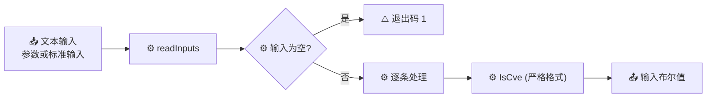

# cve validate is-cve 格式判断

:::tip 📂 查看源码
[`cmd/validate.go:35`](https://github.com/scagogogo/cve-skills/blob/main/cmd/validate.go#L35-L54) — 在 GitHub 上查看 cobra 命令定义（第 35–54 行）。
:::

逐条判断每个输入字符串是否**恰好**是合法 CVE 编号（仅校验格式），并按行输出 `文本<TAB>布尔值` 判定结果——整串匹配 CVE 格式时为 `true`，否则为 `false`。

:::tip 🖥️ 适用场景
- 把守只允许填入*纯* CVE 编号、不允许任何附加文字的输入框。
- 在管道中快速区分裸 CVE 与自由文本。
- 在下游做更严格（年份/序列号）校验前，先筛出候选者。
:::

## 命令语法

```bash
cve validate is-cve [text...]
```

当未提供位置参数时，命令从标准输入按行读取输入。

## 参数与选项

- `text...`（位置参数，可重复）：一个或多个待测字符串。每个参数为一条输入——参数内的空格会被保留，自由文本请加引号。省略时从标准输入按行读取（空行会被跳过）。
- 标准输入回退：未提供参数且标准输入为管道时，每个非空行作为一条输入。
- 本命令**没有自有 flag**，仅继承根命令的全局 `-q, --quiet`。

## 使用示例

格式正确的编号通过——判定结果为 `true`：

```bash
$ cve validate is-cve CVE-2022-12345
CVE-2022-12345	true
```

小写输入同样匹配格式，且原文本原样打印（不做规范化）：

```bash
$ cve validate is-cve cve-2022-12345
cve-2022-12345	true
```

仅*包含* CVE 的文本会被拒绝，因为整串并非恰好一个 CVE：

```bash
$ cve validate is-cve "affected by CVE-2021-44228"
affected by CVE-2021-44228	false
```

未来年份仍通过格式校验——`is-cve` 仅校验格式，不校验年份范围：

```bash
$ cve validate is-cve CVE-2099-1
CVE-2099-1	true
```

一次测试多个输入，以独立参数形式传入：

```bash
$ cve validate is-cve CVE-2021-44228 "not a cve" CVE-2099-1
CVE-2021-44228	true
not a cve	false
CVE-2099-1	true
```

## 工作流程



## 对应 Go API

本命令是对 [`IsCve`](/api/functions/is-cve) 的薄封装。库函数用严格的 CVE 正则表达式匹配输入——允许首尾空白，但不允许其他附加字符。与 [`ValidateCve`](/api/functions/validate-cve) 不同，`IsCve` **仅校验格式**：既不把年份限定在 1999..当前年份，也不校验序列号为正整数。CLI 遍历输入，对每条调用 `IsCve`，并输出 `input<TAB>布尔值`——注意输入**原样**打印，不做规范化。当你在代码中需要布尔结果而非打印文本时，请直接使用该 Go 函数。

## 退出码与输出

- 退出码 `0`：命令正常执行完毕。未通过格式校验的输入**不会**导致非零退出——每条都带各自的布尔值输出，因此可安全地串联到下游。
- 退出码 `1`：未提供任何输入（既无位置参数，标准输入也无管道数据）。
- 标准输出：每条输入一行，顺序与输入一致，格式为 `<输入><TAB>true|false`。输入原样打印——不大写、不去除内部字符。
- 标准错误：正常运行时无输出。

## 注意事项

- ⚠️ 输入**原样**打印——`cve-2022-12345` 仍为 `cve-2022-12345`。若需要规范化输出（大写、去空白），请改用 `cve validate`。
- ⚠️ `is-cve` **仅校验格式**。未来年份的 CVE 如 `CVE-2099-1` 在此处返回 `true`，尽管 `cve validate` 会拒绝它。如需校验年份范围，请使用 `cve validate year-ok`。
- ✅ 判定结果仅为单个布尔值，不含失败原因。当你需要可读的原因时，请使用 `cve validate-batch`。
- ✅ 重复项不会被合并——每条输入恰好产生一行输出。
- ✅ 若要检测自由文本中*任意位置*是否包含 CVE，而非整串恰好是 CVE，请使用 `cve validate contains-cve`。

## 内部实现

`isCveCmd` 是定义于 [`cmd/validate.go:35-54`](https://github.com/scagogogo/cve-skills/blob/main/cmd/validate.go#L35-L54) 的 cobra 命令。其 `Run` 函数是一个不带任何自有 flag 的轻量循环：

- **参数接入**：`Run` 接收 cobra 传入的原始 `args []string`，直接交给 `readInputs(args)`（共享辅助函数）。当 `args` 为空时，`readInputs` 回退为按行读取标准输入，并跳过空行。
- **空输入守卫**：若 `readInputs` 返回零条输入，命令立即调用 `os.Exit(1)`——不输出任何内容、不进入逐条循环。这是该命令唯一的非零退出路径。
- **逐条分发**：遍历 `inputs`，对每条调用 `cvepkg.IsCve(input)`。`IsCve` 执行严格的 CVE 格式正则匹配（仅允许首尾空白），**不**校验年份范围或序列号。
- **输出格式化**：每条判定结果以 `fmt.Printf("%s\t%v\n", input, cvepkg.IsCve(input))` 输出。输入字符串**原样**打印——不大写、不去空白——后接一个 TAB 和 Go `bool` 渲染出的 `true`/`false`。

## 参数流

```text
+------------------+     +------------------+     +-------------------+
| CLI 参数 / 标准输入 | --> | readInputs(args) | --> | []string inputs   |
+------------------+     +------------------+     +-------------------+
                                                          |
                                          +---------------+---------------+
                                          | len(inputs)==0                 | len(inputs)>0
                                          v                               v
                                  +----------------+          +-------------------------+
                                  | os.Exit(1)     |          | for _, input := range   |
                                  | (无输出)        |          |     inputs              |
                                  +----------------+          +-------------------------+
                                                                        |
                                                                        v
                                                            +-------------------------+
                                                            | cvepkg.IsCve(input)     |
                                                            | (严格格式正则)            |
                                                            +-------------------------+
                                                                        |
                                                                        v
                                                            +-------------------------+
                                                            | fmt.Printf              |
                                                            |   "%s\t%v\n", input, b  |
                                                            +-------------------------+
                                                                        |
                                                                        v
                                                            +-------------------------+
                                                            | 标准输出: input<TAB>bool |
                                                            +-------------------------+
```

## 边界情形

| 输入 | 行为 | 退出码 / 输出 |
| --- | --- | --- |
| 无位置参数，标准输入也无管道数据 | `readInputs` 返回空切片；在任何循环前调用 `os.Exit(1)` | 退出码 `1`；无标准输出、无标准错误 |
| 空字符串参数（`""`） | 视为一条输入；`IsCve("")` 返回 `false` | 退出码 `0`；输出 `<TAB>false` |
| 纯空白参数（`"   "`） | 一条输入；`IsCve` 去除首尾空白后为空 → `false` | 退出码 `0`；原样输出 `   \tfalse` |
| 小写输入（`cve-2022-12345`） | 匹配格式正则；原样打印，不大写 | 退出码 `0`；输出 `cve-2022-12345\ttrue` |
| 包含 CVE 的自由文本（`"see CVE-2021-44228"`） | 整串并非恰好一个 CVE → `IsCve` 返回 `false` | 退出码 `0`；输出该文本 + `\tfalse` |
| 未来年份 CVE（`CVE-2099-1`） | 仅校验格式通过；不校验年份范围 | 退出码 `0`；输出 `CVE-2099-1\ttrue` |
| 多个参数 | 每个参数为一条输入；循环按序每条输出一行 | 退出码 `0`；每个参数一行 |
| 标准输入含空行 | `readInputs` 跳过空行；仅非空行成为输入 | 退出码 `0`（若全为空行则为 `1`） |

## 退出码

- **退出码 `0`**：逐条循环执行完毕。注意 `false` 判定**不会**抬高退出码——每条都带各自的布尔值，因此可安全串联到管道下游。
- **退出码 `1`**：仅由空输入守卫触发（`if len(inputs) == 0 { os.Exit(1) }`），即位置参数与管道标准输入均未产生任何输入。
- **标准错误**：两条路径都不向标准错误写入任何内容——`os.Exit(1)` 被直接调用，无诊断信息。退出码本身是唯一的失败信号。
- **标准输出**：仅当至少存在一条输入时，才写入逐条的 `input<TAB>布尔值` 行。

## 相关命令

- [cve validate](/cli/commands/validate) — 完整校验（格式 + 年份范围 + 序列号），输出规范化。
- [cve validate contains-cve](/cli/commands/validate-contains-cve) — 文本中是否任意位置包含 CVE。
- [cve validate year-ok](/cli/commands/validate-year-ok) — 仅校验年份范围，可选 `--cutoff` 容忍未来年份。
- [cve validate-batch](/cli/commands/validate-batch) — 逐条判定并附带可读的失败原因。
