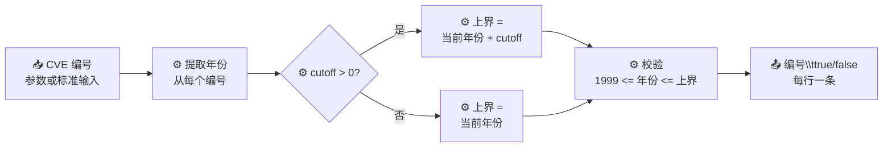

# cve validate year-ok 年份校验

:::tip 📂 查看源码
[`cmd/validate.go:76`](https://github.com/scagogogo/cve-skills/blob/main/cmd/validate.go#L76-L102) — 在 GitHub 上查看 cobra 命令定义（第 76–102 行）。
:::

检查 CVE 编号的年份是否落在有效范围内（1999 至当前年份），并可选地允许未来年份。

:::tip 🖥️ 适用场景
当你只关心 CVE 编号年份是否合理时使用——例如在漏洞情报流中过滤掉 `CVE-1998-12345` 这类笔误 ID，或标记 `CVE-2099-12345` 这类可疑的远未来 ID，而无需运行 `cve validate` 的完整格式与序列号校验。
:::

## 命令语法

```bash
cve validate year-ok [cve-id...] [flags]
```

当未提供参数时，从标准输入按行读取 CVE 编号。

## 参数与选项

- `cve-id...` — 一个或多个待校验的 CVE 编号。省略时从标准输入按行读取。
- `-c, --cutoff N` — 允许年份向未来偏移最多 N 年（整数，默认 `0`）。为 `0`（或未设置）时上界为当前年份；大于 `0` 时上界变为 `当前年份 + cutoff`。
- 不传 `--cutoff` 等价于 `--cutoff 0`：只接受不超过当前年份的年份。

## 使用示例

```bash
# 正常范围内的 CVE 编号 → true
cve validate year-ok CVE-2022-12345
# CVE-2022-12345	true

# 1998 早于 CVE 计划的 1999 起始年 → false
cve validate year-ok CVE-1998-12345
# CVE-1998-12345	false

# 不加 --cutoff 时，未来年份超过当前年份 → false
cve validate year-ok CVE-2030-12345
# CVE-2030-12345	false

# 加 --cutoff 5 后，不超过 当前+5 的年份被接受 → true
cve validate year-ok CVE-2030-12345 --cutoff 5
# CVE-2030-12345	true

# 从标准输入批量校验，允许 3 年未来偏移
printf "CVE-2022-12345\nCVE-1998-99999\nCVE-2030-1\n" | cve validate year-ok --cutoff 3
# CVE-2022-12345	true
# CVE-1998-99999	false
# CVE-2030-1	true
```

## 工作流程



## 对应 Go API

- [`IsCveYearOk`](/api/functions/is-cve-year-ok) — 校验年份 `>= 1999` 且 `<= 当前年份`（即 cutoff 为 `0`）。
- `IsCveYearOkWithCutoff` — 同样的校验，但可配置未来年份容忍度；CLI 在 `--cutoff` 大于 `0` 时调用此函数。

CLI 只是一层薄封装：先用库的格式化器规范化每个输入，再根据是否设置 `--cutoff` 调用 `IsCveYearOk` 或 `IsCveYearOkWithCutoff`，按行输出 `规范化编号<TAB>布尔值`。校验逻辑——包括 `1999` 下界和 `time.Now().Year()` 上界——完全位于 Go 库中。

## 退出码与输出

- 未提供任何输入（无参数且标准输入为空）时退出码为 `1`。
- 正常执行时退出码为 `0`。
- 每个输入输出一行：`<规范化CVE编号><TAB>true|false`。CVE 编号在打印前会被规范化/格式化，因此 `cve-2022-12345` 会输出为 `CVE-2022-12345`。
- 仅校验年份范围。返回 `true` 并不意味着整体格式或序列号有效；完整校验请使用 `cve validate`。

## 注意事项

- ⚠️ 下界固定为 `1999`（CVE 计划的起始年）；年份早于 1999 的编号始终返回 `false`。
- ⚠️ 上界取决于主机时钟的当前年份，因此在 `--cutoff` 为 `0` 时，同一输入今年可能返回 `true`，明年可能返回 `false`。
- ⚠️ 本命令只校验年份，不校验 CVE 前缀、连字符或序列号。格式错误的编号若其年份数字恰好落在范围内，仍可能返回 `true`。
- ✅ 在摄入预留或预发布的 CVE 编号（其年份可能略早于未来）时，使用 `--cutoff`。
- ✅ 需要对格式 + 年份 + 序列号做完整校验时，请改用 `cve validate`。

## 内部实现

`yearOkCmd` cobra 命令（`cmd/validate.go:76-102`）是 Go 库的一层薄封装。其 `Run` 函数工作流程如下：

- **先解析标志**：在读取任何输入之前，先调用 `cmd.Flags().GetInt("cutoff")` 获取 `--cutoff` 整数（默认 `0`）；此处刻意丢弃了返回的错误——非法值会在 `Run` 执行之前以 cobra 标志错误的形式暴露。
- **收集输入**：`readInputs(args)` 返回 `[]string`。当 `args` 非空时直接使用参数；否则按行读取标准输入（每行一个编号）。若结果切片为空，命令立即调用 `os.Exit(1)`，且不打印任何内容。
- **逐条分发**：对每个输入按 `cutoff > 0` 分支——设置容忍度时调用 `cvepkg.IsCveYearOkWithCutoff(input, cutoff)`，否则调用 `cvepkg.IsCveYearOk(input)`。`1999` 下界与 `time.Now().Year()` 上界均由这些库函数内部强制执行，而非在 CLI 中实现。
- **输出格式化**：每个结果通过 `fmt.Printf("%s\t%v\n", cvepkg.Format(input), result)` 打印，编号在打印前先经库的 `Format` 规范化，布尔值按 Go 的 `true`/`false` 渲染。

## 参数流

```text
+----------------------+     +------------------------+     +------------------------------+
| 命令行参数           | --> | cmd.Flags().GetInt     | --> | readInputs(args)             |
| [cve-id...] --cutoff |     | ("cutoff") -> int      |     | 有参数用参数，否则读 stdin   |
+----------------------+     +------------------------+     +---------------+--------------+
                                                                              |
                                                                              v
                       +--------------------------------------------+   <---+ 为空? os.Exit(1)
                       | 遍历每个输入：                              |
                       |   cutoff > 0 ?                             |
                       |     是 -> IsCveYearOkWithCutoff(id, cutoff)|
                       |     否 -> IsCveYearOk(id)                  |
                       +---------------------+----------------------+
                                             |
                                             v
                       +--------------------------------------------+
                       | fmt.Printf("%s\t%v\n",                     |
                       |   Format(input), result)                   |
                       |   -> "CVE-2022-12345\ttrue"                |
                       +--------------------------------------------+
```

## 边界情形

| 输入 | 行为 | 退出码 / 输出 |
| --- | --- | --- |
| 无参数且标准输入为空 | `readInputs` 返回空切片；`Run` 在输出前调用 `os.Exit(1)` | 退出 `1`，无 stdout |
| 无参数，标准输入含空行 | 空行被视为输入传给 `IsCveYearOk`/`IsCveYearOkWithCutoff`；非 CVE 文本年份校验失败 | 退出 `0`，每个空行输出一行 `\tfalse` |
| 单个有效范围内的编号（如 `CVE-2022-12345`） | `IsCveYearOk` 返回 `true`；`Format` 规范化大小写 | 退出 `0`，`CVE-2022-12345\ttrue` |
| 年份早于 1999（如 `CVE-1998-12345`） | 库下界 `1999` 拒绝 | 退出 `0`，`CVE-1998-12345\tfalse` |
| 未来年份，未加 `--cutoff`（如 `CVE-2030-12345`） | 上界为当前年份，故被拒绝 | 退出 `0`，`CVE-2030-12345\tfalse` |
| 未来年份加 `--cutoff 5` | `cutoff > 0` 走 `IsCveYearOkWithCutoff`；上界变为 当前年份 + 5 | 退出 `0`，`CVE-2030-12345\ttrue` |
| 小写或混合大小写编号（如 `cve-2022-12345`） | 原样校验，`Format` 仅在显示时转为大写 | 退出 `0`，`CVE-2022-12345\t<结果>` |
| 格式错误但年份数字落在范围内的编号 | 仅校验年份，故可能仍返回 `true` | 退出 `0`，`<规范化后>\ttrue` |
| 负数或非整数 `--cutoff` | cobra 在 `Run` 之前拒绝该标志；`GetInt` 的错误被丢弃 | 退出非零，stderr 输出 cobra 错误 |

## 退出码

- **成功**：退出码 `0`。命令未显式调用 `os.Exit(0)`——`Run` 在逐行输出后正常返回，cobra 以 `0` 退出。
- **无输入**：退出码 `1`，由 `readInputs(args)` 返回空切片（无参数且标准输入为空）时显式调用 `os.Exit(1)` 触发。此情况下不向 stderr 打印任何消息——命令静默退出。
- **标志错误**：非法 `--cutoff` 值（非整数）在 `Run` 执行前由 cobra 标志解析器捕获；cobra 向 stderr 打印错误并以非零码退出。`Run` 内部的 `GetInt` 调用丢弃其错误，是因为此时该值已被保证合法。
- **stderr 使用**：`Run` 函数本身从不写 stderr——其全部输出通过 `fmt.Printf` 走 stdout。如有 stderr 活动，均来自 cobra 的标志/错误处理，而非本命令逻辑。

## 相关命令

- [cve validate](/cli/commands/validate) — 完整 CVE 校验（格式、年份、序列号）。
- [cve validate is-cve](/cli/commands/validate-is-cve) — 严格精确格式 CVE 检查。
- [cve validate contains-cve](/cli/commands/validate-contains-cve) — 检测自由文本中嵌入的 CVE 编号。
