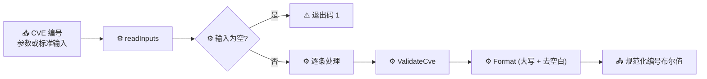

# cve validate 验证

:::tip 📂 查看源码
[`cmd/validate.go:11`](https://github.com/scagogogo/cve-skills/blob/main/cmd/validate.go#L11-L33) — 在 GitHub 上查看 cobra 命令定义（第 11–33 行）。
:::

对 CVE 编号做一次性完整校验——格式、年份范围（1999 至当前年份）以及正整数序列号——并按行输出 `规范化CVE编号<TAB>布尔值` 判定结果。

:::tip 🖥️ 适用场景
- 在将 CVE 编号录入追踪器、工单或报告前做一次完整性体检。
- 在 Shell 管道中快速校验，每行只需一个布尔值。
- 把守下游只接收严格规范 CVE 编号的工作流入口。
:::

## 命令语法

```bash
cve validate [cve-id...]
```

当未提供位置参数时，命令从标准输入按行读取 CVE 编号。

## 参数与选项

- `cve-id...`（位置参数，可重复）：一个或多个待校验的 CVE 编号。省略时从标准输入按行读取（空行会被跳过）。
- 标准输入回退：未提供参数且标准输入为管道时，每个非空行作为一条输入。
- 本命令**没有自有 flag**，仅继承根命令的全局 `-q, --quiet`。

## 使用示例

校验一个格式正确的编号——判定结果为 `true`：

```bash
$ cve validate CVE-2022-12345
CVE-2022-12345	true
```

早于 CVE 计划 1999 起始年的年份会被拒绝：

```bash
$ cve validate CVE-1998-12345
CVE-1998-12345	false
```

小写输入会在输出行被规范化为大写，但判定仍基于完整校验：

```bash
$ cve validate cve-2022-0001
CVE-2022-0001	true
```

未来年份超出当前年份上界，输出 `false`：

```bash
$ cve validate CVE-2099-1
CVE-2099-1	false
```

一次校验多个编号，以独立参数形式传入：

```bash
$ cve validate CVE-2021-44228 CVE-2099-1 not-a-cve
CVE-2021-44228	true
CVE-2099-1	false
NOT-A-CVE	false
```

从标准输入读取列表，校验另一条命令的输出：

```bash
$ printf 'CVE-2021-44228\nCVE-1998-1\n' | cve validate
CVE-2021-44228	true
CVE-1998-1	false
```

## 工作流程



## 对应 Go API

本命令是对 [`ValidateCve`](/api/functions/validate-cve) 的薄封装。库函数执行完整校验：编号须先通过 [`IsCve`](/api/functions/is-cve)（严格 CVE 格式），其次年份 `>= 1999` 且 `<= time.Now().Year()`，且序列号为正整数。CLI 遍历输入，对每条调用 `ValidateCve`，并输出 `Format(input)<TAB>布尔值`——其中 `Format` 会将编号大写并去空白，因此无论输入大小写如何，输出都是规范化的。当你在代码中需要布尔结果而非打印文本时，请直接使用该 Go 函数。

## 退出码与输出

- 退出码 `0`：命令正常执行完毕。无效 CVE **不会**导致非零退出——每条都带各自的布尔值输出，因此可安全地串联到下游。
- 退出码 `1`：未提供任何输入（既无位置参数，标准输入也无管道数据）。
- 标准输出：每条输入一行，顺序与输入一致，格式为 `<规范化CVE编号><TAB>true|false`。编号在打印前经 `Format` 规范化（大写、去空白）。
- 标准错误：正常运行时无输出。

## 注意事项

- ⚠️ 打印的编号会被**规范化**为大写并去空白——`cve-2022-12345` 输出为 `CVE-2022-12345`。若需保留原始输入，请改用 `cve validate-batch`。
- ⚠️ 年份上界为运行时的 `time.Now().Year()`，因此未来年份的 CVE 今天被拒绝，明年可能被接受。
- ✅ 判定结果仅为单个布尔值，不含失败原因。当你需要知道*为什么*失败时，请使用 `cve validate-batch`，它会给出原因（格式无效、年份越界、序列号非正等）。
- ✅ 重复项不会被合并——每条输入恰好产生一行输出。
- ✅ 仅对年份做范围校验；若只需年份校验而不校验格式/序列号，请使用 `cve validate year-ok`。

## 内部实现

`Run` 函数（`cmd/validate.go:23-32`）除标准 cobra 签名 `Run: func(cmd *cobra.Command, args []string)` 外不带额外参数：

- **不读取任何 flag**：命令内部从未调用 `cmd.Flags()`，所有输入都经位置参数 `args` 流入；继承的全局 `-q, --quiet` 对本子命令的逻辑而言是空操作。
- **经 `readInputs(args)` 获取输入**（`cmd/helpers.go:11`）：若 `args` 非空则原样返回；否则通过 `os.Stdin.Stat()` 检测 `os.ModeCharDevice`。管道/重定向（非字符设备）会触发 `bufio.Scanner` 收集非空行；交互式 TTY 则返回 `nil`。
- **空输入守卫**：`if len(inputs) == 0 { os.Exit(1) }`——这是命令中唯一的显式退出码分支。
- **逐条循环**：`valid := cvepkg.ValidateCve(input)`，随后 `fmt.Printf("%s\t%v\n", cvepkg.Format(input), valid)`。`ValidateCve` 执行格式 + 年份范围 + 正序列号的组合校验；`Format` 将输入大写并去空白，故无论输入大小写，打印的编号都是规范化的。输出经 `fmt.Printf` 写入标准输出，每条输入一行，顺序与输入一致。

## 参数流

```text
+-------------------+     +-------------------------------------------+
| 命令行参数 / stdin | --> | readInputs(args)                          |
| (CVE-... 各行)    |     |  - args 非空? 返回 args                   |
+-------------------+     |  - 否则: stdin 为管道? 扫描非空行          |
                          |  - 否则(TTY): 返回 nil                    |
                          +---------------------+---------------------+
                                                |
                                                v
                          +-------------------------------------------+
                          | len(inputs) == 0 ?  --> os.Exit(1)        |
                          +---------------------+---------------------+
                                                |
                                                v
                          +-------------------------------------------+
                          | 逐条处理:                                 |
                          |   valid = cvepkg.ValidateCve(input)       |
                          |   fmt.Printf("%s\t%v\n",                  |
                          |       cvepkg.Format(input), valid)        |
                          +---------------------+---------------------+
                                                |
                                                v
                          +-------------------------------------------+
                          | stdout: <规范化CVE编号><TAB>true|false     |
                          +-------------------------------------------+
```

## 边界情形

| 输入 | 行为 | 退出码 / 输出 |
| --- | --- | --- |
| 无参数且 stdin 为 TTY（交互式） | `readInputs` 返回 `nil`；触发空输入守卫 | 退出码 `1`；无 stdout、无 stderr |
| 无参数且管道为空（`echo -n \| cve validate`） | Scanner 无任何行；`inputs` 为空 | 退出码 `1`；无输出 |
| 无参数且管道全为空行 | 空行被 Scanner 跳过；`inputs` 为空 | 退出码 `1`；无输出 |
| 无效编号（`not-a-cve`） | `ValidateCve` 返回 `false`；`Format` 大写为 `NOT-A-CVE` | 退出码 `0`；`NOT-A-CVE\tfalse` |
| 年份越界（`CVE-1998-1`、`CVE-2099-1`） | 格式通过但年份校验失败 | 退出码 `0`；`CVE-...\tfalse` |
| 小写输入（`cve-2022-0001`） | `Format` 规范化为大写；判定基于完整校验 | 退出码 `0`；`CVE-2022-0001\ttrue` |
| 重复输入 | 不去重；每条各产生一行 | 退出码 `0`；重复项各一行 |
| 一次调用混入有效与无效项 | 每条独立判定，不短路 | 退出码 `0`；按序逐条输出 |

## 退出码

命令仅有单一显式退出分支，其余路径回落到 cobra 默认的 `0`。

- **退出码 `0`** — 循环正常结束。即使每条输入都无效也成立：每条输出 `false` 判定，但进程仍成功退出，故可安全地串联进 `&&` 管道。
- **退出码 `1`** — `cmd/validate.go:26` 处的 `os.Exit(1)`，仅在 `readInputs` 返回空切片时触发（无位置参数，且 stdin 为交互式 TTY 或全为空行的管道）。
- **stderr** — 两条路径均不向 stderr 写入任何内容；所有诊断都以 stdout 判定行或纯粹的非零退出码呈现。对于未知 flag，仅 cobra 自身会输出 `--help` 相关错误信息，本命令无额外处理。

## 相关命令

- [cve validate-batch](/cli/commands/validate-batch) — 逐条判定并附带可读的失败原因。
- [cve validate year-ok](/cli/commands/validate-year-ok) — 仅校验年份范围，可选 `--cutoff` 容忍未来年份。
- [cve validate is-cve](/cli/commands/validate-is-cve) — 严格“文本是否恰好是一个 CVE”检查。
- [cve filter-valid](/cli/commands/filter-valid) — 只保留有效 CVE，静默丢弃其余。
