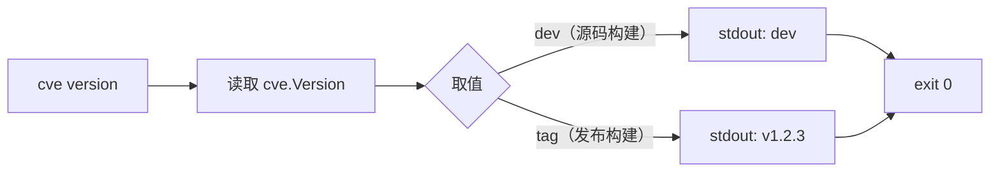

# cve version 版本

:::tip 📂 查看源码
[`cmd/version.go:10`](https://github.com/scagogogo/cve-skills/blob/main/cmd/version.go#L10-L17) — 在 GitHub 上查看 cobra 命令定义（第 10–17 行）。
:::

打印 `cve` 命令行工具的构建版本 —— 向 stdout 输出单行，无参数、无 flags。

:::tip 🖥️ 适用场景
- 验证刚下载或安装的二进制是否为你期望的发布版本。
- 在 shell 脚本或 CI 任务日志开头固化精确版本，以便日后复现该次运行。
- 排查多台机器行为不一致时 —— `cve version` 是首先应对比的内容。
:::

## 命令语法

```bash
cve version
```

本命令**不接受位置参数**，也**未定义任何自有 flags**。它始终只打印一行并以 `0` 退出。

## 参数与选项

- 无位置参数。`Run` 函数会忽略任何多余参数 —— 无论传入什么，命令都只打印 `cve.Version`。
- 无自有 flags。仅继承根命令的全局 `-q, --quiet` flag，但在此无任何可观察效果，因为版本字符串是本命令的唯一输出。
- 打印的值来自包级变量 `cve.Version`（在 `cve.go` 中声明为 `var Version = "dev"`）。直接从源码 `go build` 时为 `"dev"`；发布构建时由 goreleaser 在链接期用发布标签（如 `v1.2.3`）覆盖，注入方式为 `-ldflags "-X github.com/scagogogo/cve-skills.Version=<tag>"`。

## 使用示例

源码构建（未注入 ldflags）输出默认哨兵值：

```bash
$ cve version
dev
```

goreleaser 构建的发布二进制输出注入的标签：

```bash
$ cve version
v1.2.3
```

在运行其他命令前用它确认安装成功：

```bash
$ cve version && cve validate CVE-2022-12345
v1.2.3
CVE-2022-12345	true
```

将版本捕获到 shell 变量，用于流水线日志记录：

```bash
$ TOOL_VERSION="$(cve version)"
$ echo "running with cve-skills $TOOL_VERSION"
running with cve-skills v1.2.3
```

多余参数不会改变输出 —— `Run` 函数会忽略它们：

```bash
$ cve version anything-else
dev
```

## 工作流程



## 对应 Go API

本命令背后**没有专门的 Go 函数** —— 它通过 `fmt.Println(cve.Version)` 直接打印包级变量 [`Version`](https://pkg.go.dev/github.com/scagogogo/cve-skills#Version)。该变量声明为 `var`（而非 `const`），正是为了让 goreleaser 的 `-ldflags` 能在链接期覆盖它；若改为 `const`，发布版本的注入将静默失效。在你自己的 Go 代码中，可同样读取 `cve.Version` 来报告所链接库的版本。

## 退出码与输出

- 退出码 `0`：只要二进制能运行便始终为 `0`。本命令在正常情况下不会失败。
- stdout：恰好一行 —— `cve.Version` 的值（源码构建为 `dev`，发布构建为发布标签）。
- stderr：无输出。本命令仅写入 stdout。

## 注意事项

- 打印的字符串是单个 token，不含格式、不含构建 commit、不含构建日期 —— 只有版本。如需更多构建元数据，请在自己的脚本中补充。
- 用 `go build ./cmd/cve` 且不传 ldflags 从源码构建时，输出 `dev` 是预期且正确的结果，**并不**表示构建损坏。
- 由于输出是单行且无尾部负载，`cve version` 可安全地用 `$(cve version)` 捕获，并嵌入日志、lockfile 或 CI 步骤名。
- 全局 `-q, --quiet` flag 虽被继承，但不会抑制版本行 —— 不要依赖它来静音本命令。

## 内部实现

该 cobra 命令在 `cmd/version.go`（L10–L17）中注册，并通过 `init()` 中的 `rootCmd.AddCommand(versionCmd)` 挂到根命令下。其 `Run` 函数即为全部行为：

- **不做参数解析。** `Run` 签名接收 `cmd *cobra.Command, args []string`，但从不读取 `args`。cobra 在调用 `Run` 前仍会解析 flags，但本命令未定义任何自有 flag，`args` 被完全丢弃。
- **不处理 flag。** 命令未声明任何 `Flags()`；仅继承根命令的全局 flags（如 `-q, --quiet`），对单行输出无任何效果。
- **直接调用库。** 调用 `fmt.Println(cve.Version)` —— 将包级 `string` 变量 `cve.Version`（在 `cve.go` 中声明为 `var Version = "dev"`）直接打印到 stdout，无任何中间辅助函数。
- **输出格式。** 恰好一行：`cve.Version` 的字符串值后跟换行（`fmt.Println`），随后因 `Run` 正常返回、未调用 `os.Exit` 而隐式以 `0` 退出。

## 参数流

```text
+-------------------+     +-----------------------+     +-------------------------+     +---------------------+     +------------------+
| CLI: cve version  | --> | cobra 解析 flags     | --> | Run(cmd, args) 执行     | --> | fmt.Println(        | --> | stdout: 单行     |
| (多余参数无妨)    |     | (无自有 flag)        |     | args[] 被完全忽略       |     |   cve.Version)      |     | exit 0           |
+-------------------+     +-----------------------+     +-------------------------+     +---------------------+     +------------------+
        |                                                                                              ^
        |                                                                                              |
        +------------------------------------------------------------------------------------------------+
                      cve.Version 为 "dev"（源码）或注入标签（发布构建）
```

## 边界情形

| 输入 | 行为 | 退出码 / 输出 |
| --- | --- | --- |
| `cve version`（无参数） | 读取 `cve.Version` 并打印为单行 | `0`；stdout = 版本字符串 |
| `cve version anything-else`（多余位置参数） | `Run` 完全忽略 `args`；打印 `cve.Version` 不变 | `0`；stdout = 版本字符串 |
| `cve version --quiet` / `-q`（继承的全局 flag） | flag 被 cobra 解析但无可观察效果；版本行仍打印 | `0`；stdout = 版本字符串 |
| `cve version` 管道传入 stdin（如 `echo foo \| cve version`） | 命令从不读取 stdin；输入被忽略 | `0`；stdout = 版本字符串 |
| `cve.Version == "dev"`（普通 `go build`） | 打印哨兵值 | `0`；stdout = `dev` |
| `cve.Version` 被注入为 `v1.2.3`（goreleaser `-ldflags`） | 打印注入的标签 | `0`；stdout = `v1.2.3` |
| 空/非法 CVE 输入（如 `cve version CVE-bad`） | 本命令不做校验 —— `args` 被忽略，不执行任何解析 | `0`；stdout = 版本字符串 |

## 退出码

- **成功（退出 `0`）：** 唯一的正常结果。`Run` 在 `fmt.Println` 之后正常返回，cobra 以 `0` 退出。`Run` 内部没有任何错误路径 —— 它不检查 `args`、不打开文件、不执行校验、也不返回 error。
- **失败（非零）：** 并非本命令自身逻辑产生。`cve version` 退出非零的唯一可能是进程被信号杀死，或二进制本身无法启动（如可执行文件损坏、宿主缺少共享库）—— 这些都属于命令源码之外的情形。
- **stderr：** 在任何输入下命令都不向 stderr 写入任何内容。所有输出都通过 `fmt.Println` 走 stdout。

## 相关命令

- [CLI 参考](/zh/cli) —— 完整命令树与 I/O 约定。
- [下载与安装](/zh/download) —— 预构建二进制随附注入的发布标签。
