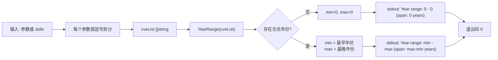

# cve year-range 年份范围

:::tip 📂 查看源码
[`cmd/stats.go:33`](https://github.com/scagogogo/cve-skills/blob/main/cmd/stats.go#L33-L50) — 在 GitHub 上查看 cobra 命令定义（第 33–50 行）。
:::

在一组 CVE 编号中找出最早（最小）与最晚（最大）的年份，并输出年份跨度 —— 一眼看清数据集时间窗口有多宽。

:::tip 🖥️ 适用场景
- 直接从原始输入生成“CVE 从 YYYY 到 YYYY”的范围，用于安全报告的标题摘要。
- 在深入分析前，校验导入的 CVE 列表是否落在预期的历史时间窗口内。
- 在 shell 管道中为按年份分桶的可视化或趋势汇总提供边界。
:::

## 命令语法

```bash
cve year-range <cve-list>
```

该命令接收一个或多个位置参数，每个参数本身也可以是逗号分隔的 CVE 编号列表。当未提供参数且 stdin 有管道输入时，改为按行从 stdin 读取 CVE。

## 参数与选项

- `<cve-list>`（位置参数，必填）：一个或多个 CVE 编号，例如 `CVE-2021-44228`。多个编号可作为独立参数传入，也可作为单个逗号分隔的值传入。
- 本命令自身**不定义任何 flag**。全局 `-q, --quiet` 标志继承自根命令。
- 输入由 `readInputs` 解析：位置参数优先；否则回退到管道 stdin（每个非空行一个 CVE）。若两者都没有，则以 `requires at least 1 argument (CVE list)` 报错。
- 每个位置参数还会按 `,` 进一步拆分，因此 `CVE-2020-1,CVE-2022-2` 会被视为两个 CVE。

## 使用示例

混合年份产生 `min=2020`、`max=2022`，跨度为 `2` 年：

```bash
$ cve year-range CVE-2020-1111 CVE-2022-2222 CVE-2021-3333
Year range: 2020 - 2022 (span: 2 years)
```

单个 CVE 时 `min == max`，跨度为 `0`：

```bash
$ cve year-range CVE-2024-12345
Year range: 2024 - 2024 (span: 0 years)
```

逗号分隔值与独立参数等价 —— 两者都覆盖 `2018..2019`：

```bash
$ cve year-range CVE-2019-9999,CVE-2018-1
Year range: 2018 - 2019 (span: 1 years)
```

非法条目会被静默跳过，只有合法 CVE 参与范围计算：

```bash
$ cve year-range not-a-cve "" CVE-2018-1 CVE-2019-99999
Year range: 2018 - 2019 (span: 1 years)
```

当参数不便传时，可通过 stdin 管道传入文件：

```bash
$ cat cves.txt | cve year-range
Year range: 2017 - 2023 (span: 6 years)
```

## 工作流程



## 对应 Go API

本命令是 [`YearRange`](/api/functions/year-range) 的轻量封装，后者扫描 `[]string` 形式的 CVE 编号并返回 `(min, max int)`。CLI 将每个位置参数按 `,` 拆分，把扁平化后的切片传给 `YearRange`，再输出 `Year range: <min> - <max> (span: <max-min> years)`。跨度由 CLI 端计算为 `max - min` —— Go 函数只返回两个边界。当你在代码中需要数值对而非格式化文本时，请直接使用该 Go 函数。

## 退出码与输出

- 退出码 `0`：命令正常结束，向 stdout 输出一行。
- 退出码 `1`：没有任何输入可用 —— 既无位置参数也无管道 stdin。此时向 stderr 输出错误 `requires at least 1 argument (CVE list)`。
- stdout：单独一行，格式为 `Year range: <min> - <max> (span: <span> years)`。无合法 CVE 时输出 `0 - 0 (span: 0 years)`。
- stderr：仅输出上述缺失输入错误。年份范围绝不写入 stderr。

## 注意事项

- 空输入或全非法输入会输出 `Year range: 0 - 0 (span: 0 years)` 而非报错 —— `0` 是“无数据”的哨兵值，与 Go 函数返回的 `0, 0` 一致。请将 `0` 边界视作空信号，而非真实年份。
- 年份提取委托给 `ExtractCveYearAsInt`；无法解析出正年份的条目会被静默跳过，因此范围只反映合法 CVE。
- 结果纯属描述性 —— `YearRange` 不会校验年份是否落在现实的 `1999..当前年份` 范围内。假设的 `CVE-1800-1` 会被解析为年份 `1800` 而不报错。
- 若需要按年份细分而非仅取边界，请使用 `cve count-by-year`；若需要排序输出请使用 `cve compare sort`。
- 扫描前不会规范化大小写与两侧空白 —— 请传入已格式化的编号，或先执行 `cve format`。

## 内部实现

cobra 命令 `yearRangeCmd`（定义于 `cmd/stats.go:33-50`）采用 `RunE`，因此返回的 error 会传播到 shell。其逻辑如下：

- **输入收集**：调用 `readInputs(args)`，先取位置参数，否则回退到管道 stdin（每个非空行一个 CVE）。若得到的 `inputs` 切片为空，则返回 `fmt.Errorf("requires at least 1 argument (CVE list)")` —— 本命令不解析任何自身 flag。
- **扁平化**：遍历 `inputs`，将 `strings.Split(input, ",")...` 追加到 `[]string cveList`，使每个参数按逗号展开为独立的 CVE token。
- **库函数调用**：将 `cveList` 交给 `cve.YearRange(cveList)`，后者返回 `(min, max int)` —— CLI 自身不做任何年份提取，相关逻辑由库通过 `ExtractCveYearAsInt` 完成。
- **输出格式化**：`fmt.Printf("Year range: %d - %d (span: %d years)\n", min, max, max-min)` 向 stdout 写入单独一行；跨度 `max-min` 由 CLI 端内联计算，Go 函数并不返回该值。

## 参数流

```text
+-------------------+     +-----------------------+     +-------------------------+
| CLI 参数 / stdin  -->  | readInputs(args)      | --> | []inputs                |
| (CVE-2020-1, ...) |     | 先参数，否则回退 stdin |     | (每参数/每行一个条目)    |
+-------------------+     +-----------------------+     +-------------------------+
                                                                |
                                                                v
                          +-----------------------------------+
                          | 遍历每个 input:                   |
                          |   cveList += strings.Split(",",   |
                          |                input)             |
                          +-----------------------------------+
                                |
                                v
                          +-------------------+
                          | cveList []string  |  (扁平 CVE token)
                          +-------------------+
                                |
                                v
                          +-----------------------------------+
                          | cve.YearRange(cveList)            |
                          |   -> 对每个 CVE 调                |
                          |      ExtractCveYearAsInt          |
                          |   -> (min, max int)               |
                          +-----------------------------------+
                                |
                                v
                          +-----------------------------------+
                          | fmt.Printf(                       |
                          |   "Year range: %d - %d            |
                          |    (span: %d years)\n",           |
                          |   min, max, max-min)              |
                          | -> stdout                         |
                          +-----------------------------------+
                                |
                                v
                          +-------------------+
                          | 退出码 0 (return nil)|
                          +-------------------+
```

## 边界情形

| 输入 | 行为 | 退出码 / 输出 |
| --- | --- | --- |
| 无参数且无管道 stdin | `readInputs` 返回空切片；`RunE` 返回 `requires at least 1 argument (CVE list)` | 退出码 1；错误写入 stderr |
| 有参数但全部非法（如 `not-a-cve ""`） | token 被解析但提取不到合法年份；`YearRange` 返回 `0, 0` | 退出码 0；stdout `Year range: 0 - 0 (span: 0 years)` |
| 空字符串参数 `""` | `strings.Split("", ",")` 得到 `[""]`；空 token 提取不到年份而被跳过 | 退出码 0；不参与范围计算 |
| 单个 CVE `CVE-2024-12345` | `min == max == 2024` | 退出码 0；stdout `Year range: 2024 - 2024 (span: 0 years)` |
| 逗号分隔 `CVE-2019-1,CVE-2018-2` | 拆成两个 token，均参与计算 | 退出码 0；stdout `Year range: 2018 - 2019 (span: 1 years)` |
| 仅管道 stdin（无参数） | `readInputs` 按非空行读取为 inputs；每行再按 `,` 拆分 | 退出码 0；范围反映 stdin 中的 CVE |
| 假设的 `CVE-1800-1` | 解析为年份 `1800`；不做真实性校验 | 退出码 0；`1800` 可能作为边界出现 |
| 混合大小写 / 带两侧空白 | 扫描前不规范化；可能解析不出年份 | 退出码 0；格式错误条目被跳过 |

## 退出码

- **成功（退出码 0）**：`RunE` 在向 stdout 输出单独一行 `Year range: ...` 后返回 `nil`。包括全非法 / 空输入的情形 —— 此时 `YearRange` 返回 `0, 0`，命令仍以退出码 0 结束。
- **失败（退出码 1）**：仅当 `readInputs` 完全取不到输入（既无参数也无 stdin）时发生。`RunE` 返回 `fmt.Errorf("requires at least 1 argument (CVE list)")`；cobra 将该错误写入 stderr 并把进程退出码置为 1。源码中不存在其他显式错误路径 —— `YearRange` 内部的解析失败被吞掉，最终以 `0` 边界体现，而非错误。

## 相关命令

- [cve count-by-year](/cli/commands/count-by-year) —— 按年份分组并统计每个年份的 CVE 数量。
- [cve filter by-year](/cli/commands/filter-by-year) —— 仅保留指定年份的 CVE。
- [cve filter by-year-range](/cli/commands/filter-by-year-range) —— 仅保留年份落在某范围内的 CVE。
- [cve compare sort](/cli/commands/compare-sort) —— 按年份再按序列号升序排序。
- [CLI 参考](/cli) —— 完整命令树与 I/O 约定。
