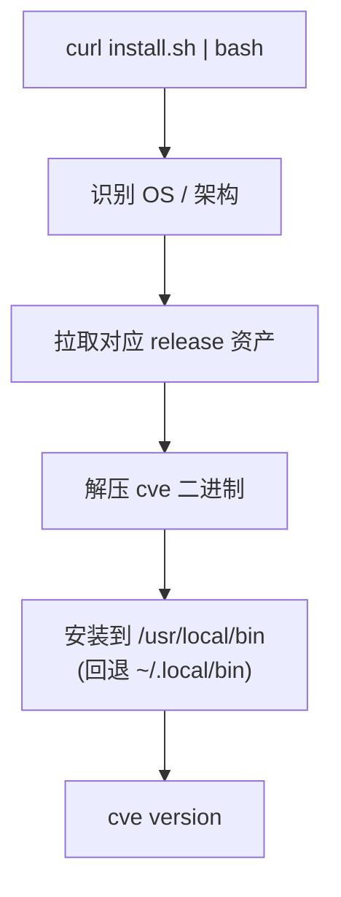

# 下载与安装

`cve` CLI 以预编译的**静态二进制**覆盖所有主流操作系统/架构 —— AI Agent 可直接下载运行，无需工具链。

## 一键安装（推荐）

```bash
# macOS / Linux —— 自动识别平台
curl -fsSL https://raw.githubusercontent.com/scagogogo/cve-skills/main/scripts/install.sh | bash
```

脚本会下载对应平台的压缩包、解压 `cve` 并放入 `PATH`。



## 从源码安装（Go）

```bash
go install github.com/scagogogo/cve-skills/cmd/cve@latest
```

## 预编译二进制

由 [goreleaser](https://goreleaser.com) 在每个 `v*` tag 上构建 —— 见 [Releases 页面](https://github.com/scagogogo/cve-skills/releases)。

| 操作系统 | amd64 | arm64 | arm | 386 |
|---------|:-----:|:-----:|:---:|:---:|
| **Linux** | ✅ tar.gz / deb / rpm / apk | ✅ | ✅ | ✅ |
| **macOS** | ✅ tar.gz | ✅ | — | — |
| **Windows** | ✅ zip | ✅ | — | — |
| **FreeBSD** | ✅ tar.gz | ✅ | — | — |

每个 Release 附带 `checksums.txt`（SHA-256）用于校验。

## 校验

```bash
sha256sum -c checksums.txt --ignore-missing
cve version
```

## 包管理器

- **Linux（deb/rpm/apk）**：从 Releases 下载对应包，用 `dpkg -i` / `rpm -i` / `apk add` 安装。

## 版本号

`cve version` 输出构建期注入的版本（如 `v0.1.0`）。从源码本地构建的二进制输出 `dev`。

## 下一步

安装完成后,请查阅 [CLI 参考](/zh/cli),了解每个子命令的输入方式与确定性输出。
