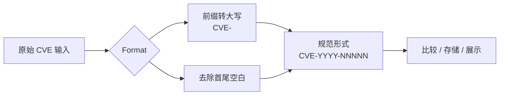

# 示例：格式化 CVE

:::tip 📂 查看源码
[`examples/01_format/main.go`](https://github.com/scagogogo/cve-skills/blob/main/examples/01_format/main.go) — 在 GitHub 上查看完整可运行示例。
:::

将单个 CVE 编号标准化为规范形式——转大写、去除首尾空白——便于后续比较、存储或展示。

:::tip 🎯 学习目标
- 了解 `Format` 如何将小写或混合大小写的 CVE 前缀转为规范的 `CVE-` 形式。
- 了解 `Format` 如何去除输入两侧的首尾空白字符。
- 理解为什么在比较或存储前做标准化能让管线中的每个 CVE 保持一致。
:::

## 场景

你正在从多个来源采集 CVE 编号——一份 CSV 导出、一个 JSON 数据流、还有用户粘进 Web 表单的自由文本。每个来源都有自己的怪癖：有的把前缀全小写（`cve-2022-12345`），有的在值两侧带了多余空格（`" CVE-2021-44228 "`），还有的大小写混杂（`Cve-2023-9999`）。在比较两个编号是否相等，或写入数据库之前，你希望它们都呈现同一种规范形态。`Format` 函数正是做这件事：返回大写且去空白后的 CVE，让下游逻辑无需再猜测。

## 完整代码

```go
package main

import (
	"fmt"

	"github.com/scagogogo/cve-skills"
)

func main() {
	// 示例1：格式化包含小写字母的CVE编号
	// Format函数会将CVE编号转换为标准大写格式
	input1 := "cve-2022-12345"
	fmt.Printf("原始输入: %s\n", input1)
	fmt.Printf("格式化后: %s\n\n", cve.Format(input1))
	// 预期输出:
	// 原始输入: cve-2022-12345
	// 格式化后: CVE-2022-12345

	// 示例2：格式化包含空白字符的CVE编号
	// Format函数会移除CVE编号两侧的空白字符
	input2 := " CVE-2021-44228 "
	fmt.Printf("原始输入: %q\n", input2)
	fmt.Printf("格式化后: %q\n\n", cve.Format(input2))
	// 预期输出:
	// 原始输入: " CVE-2021-44228 "
	// 格式化后: "CVE-2021-44228"

	// 示例3：格式化混合大小写的CVE编号
	// Format函数会统一将CVE部分转为大写
	input3 := "Cve-2023-9999"
	fmt.Printf("原始输入: %s\n", input3)
	fmt.Printf("格式化后: %s\n", cve.Format(input3))
	// 预期输出:
	// 原始输入: Cve-2023-9999
	// 格式化后: CVE-2023-9999

	// 总结: Format函数可以用于在比较或存储CVE编号前进行标准化，
	// 确保所有CVE编号遵循相同的格式规范，便于后续处理
}
```

## 运行方式

```bash
cd examples/01_format && go run main.go
```

## 预期输出

```text
原始输入: cve-2022-12345
格式化后: CVE-2022-12345

原始输入: " CVE-2021-44228 "
格式化后: "CVE-2021-44228"

原始输入: Cve-2023-9999
格式化后: CVE-2023-9999
```

## 代码讲解

程序通过三个小演示分别隔离出 `Format` 的一种标准化行为：

- ▶️ **小写前缀。** `input1` 是 `cve-2022-12345`——前缀全小写。`cve.Format(input1)` 返回 `CVE-2022-12345`，体现转大写规则。用 `%s` 打印时，小写输入与大写输出并排对照。
- 📋 **首尾空白。** `input2` 是 `" CVE-2021-44228 "`——注意首尾各有一个空格。这次代码用 `%q`，给字符串加引号，让空格可见。`cve.Format(input2)` 返回 `CVE-2021-44228`，`%q` 输出为 `"CVE-2021-44228"`，没有任何填充。
- 💡 **混合大小写。** `input3` 是 `Cve-2023-9999`——前缀部分大写。`Format` 将整个前缀统一为 `CVE-`，得到 `CVE-2023-9999`。这里改回 `%s` 直接展示。
- 🔗 **总结要点。** 收尾注释把三种行为串起来：在比较或存储编号前先调用 `Format`，让管线中每个 CVE 都遵循同一格式，下游处理就再不必应对各种变体。



## 涉及函数

- [Format](/api/functions/format) —— 将 CVE 编号标准化为大写、去首尾空白的规范形式。

## 扩展练习

- 💡 向 `Format` 传入一个已是规范形式的编号（`CVE-2024-1234`），确认输出保持不变——即 `Format` 是幂等的。
- 💡 构造一个杂乱输入的小切片（`["cve-2020-1", " CVE-2020-2 ", "Cve-2020-3"]`），逐个格式化，验证结果都能直接用 `==` 比较，无需再额外处理。
- 💡 在一个小管线里把 `Format` 与 `Validate` 配合使用：先格式化每个原始输入，再对规范形式做校验，观察标准化如何减少了你需要处理的校验边缘情形。
