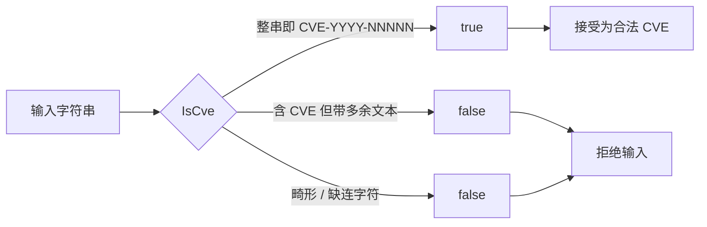

# 示例：判断 CVE 格式

:::tip 📂 查看源码
[`examples/02_is_cve/main.go`](https://github.com/scagogogo/cve-skills/blob/main/examples/02_is_cve/main.go) — 在 GitHub 上查看完整可运行示例。
:::

严格校验一个字符串是否是独立的 CVE 编号，形如 `CVE-YYYY-NNNNN`。

:::tip 🎯 学习目标
- 理解 `IsCve` 要求整个字符串就是一个 CVE 编号，而不只是包含 CVE。
- 了解 `IsCve` 允许编号两侧存在空白字符。
- 区分 `IsCve`（精确整串匹配）与 `IsContainsCve`（子串搜索）。
:::

## 场景

你在做一个表单，用户必须输入单个 CVE 编号，比如给工单挂载一个 CVE。你不能接受自由文本或仅仅是提到 CVE 的句子——这个值本身就必须是一个合法的 CVE。`IsCve` 就是这道关卡：只有当整个字符串（在裁剪两侧空白后）符合 `CVE-YYYY-NNNNN` 形态时，它才返回 `true`。粘贴进来的公告句子、缺失的连字符、任何多余字符，都会被挡下。

## 完整代码

```go
package main

import (
	"fmt"

	"github.com/scagogogo/cve-skills"
)

func main() {
	// 示例1：检查标准格式的CVE编号
	// IsCve函数用于检查字符串是否是标准格式的CVE编号（形如CVE-YYYY-NNNNN）
	input1 := "CVE-2022-12345"
	fmt.Printf("输入: %q, 是否为CVE: %v\n", input1, cve.IsCve(input1))
	// 预期输出:
	// 输入: "CVE-2022-12345", 是否为CVE: true

	// 示例2：检查包含空白字符的CVE编号
	// IsCve函数允许CVE编号两侧有空白字符
	input2 := " CVE-2021-44228 "
	fmt.Printf("输入: %q, 是否为CVE: %v\n", input2, cve.IsCve(input2))
	// 预期输出:
	// 输入: " CVE-2021-44228 ", 是否为CVE: true

	// 示例3：检查非标准格式
	// IsCve函数要求整个字符串都是CVE编号，而不只是包含CVE编号
	input3 := "包含CVE-2023-9999的文本"
	fmt.Printf("输入: %q, 是否为CVE: %v\n", input3, cve.IsCve(input3))
	// 预期输出:
	// 输入: "包含CVE-2023-9999的文本", 是否为CVE: false

	// 示例4：检查错误格式
	// IsCve函数检查格式是否严格符合CVE-YYYY-NNNNN
	input4 := "CVE2022-12345" // 缺少连字符
	fmt.Printf("输入: %q, 是否为CVE: %v\n", input4, cve.IsCve(input4))
	// 预期输出:
	// 输入: "CVE2022-12345", 是否为CVE: false

	// 总结: IsCve函数用于严格验证字符串是否为独立的CVE编号，
	// 常用于验证用户输入的字符串是否为有效的CVE编号，
	// 与IsContainsCve不同，它要求整个字符串就是一个CVE编号
}
```

## 运行方式

```bash
cd examples/02_is_cve && go run main.go
```

## 预期输出

```text
输入: "CVE-2022-12345", 是否为CVE: true
输入: " CVE-2021-44228 ", 是否为CVE: true
输入: "包含CVE-2023-9999的文本", 是否为CVE: false
输入: "CVE2022-12345", 是否为CVE: false
```

## 代码讲解

程序连续运行四个场景，每个场景隔离了 `IsCve` 的一个特性：

- ▶️ **示例1——标准 CVE。** 输入是 `CVE-2022-12345`，完全匹配 `CVE-YYYY-NNNNN`。`IsCve` 返回 `true`，确认了正常路径。
- 📋 **示例2——两侧空白。** 输入是 `" CVE-2021-44228 "`，两侧都有空格。函数允许首尾空白，结果仍为 `true`。
- 💡 **示例3——句子中提到一个 CVE。** 字符串是 `"包含CVE-2023-9999的文本"`。尽管其中嵌着一个合法的 CVE，`IsCve` 仍返回 `false`，因为它要求整个字符串就是 CVE，而不只是包含。
- 🔗 **示例4——畸形编号。** 输入 `CVE2022-12345` 缺少第一个连字符。严格格式校验失败，结果为 `false`。

末尾的注释总结了意图：`IsCve` 严格校验一个字符串是否是独立的 CVE 编号，因此非常适合校验用户输入——它与 `IsContainsCve` 不同，后者只检查包含关系。



## 涉及函数

- [IsCve](/zh/api/functions/is-cve) — 本页演示的严格整串校验。
- [IsContainsCve](/zh/api/functions/is-contains-cve) — 当周围文本也要保留时使用的子串搜索。
- [ValidateCve](/zh/api/functions/validate-cve) — 更严格的校验，同时检查年份和序号范围。

## 扩展练习

- 💡 向 `IsCve` 传入小写编号，例如 `cve-2022-12345`，观察严格校验是否区分大小写。
- 💡 在同一个输入 `"包含CVE-2023-9999的文本"` 上对比 `IsCve` 与 `IsContainsCve`，解释为何两者结果不同。
- 💡 写一个小 CLI，从 `os.Stdin` 读取一行，调用 `IsCve`，并相应地打印 `valid` 或 `invalid`。
