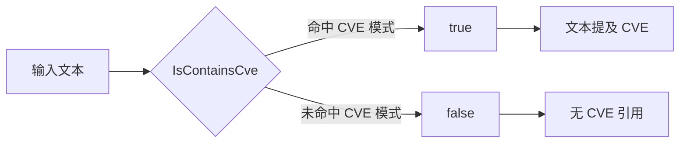

# 示例：检测文本是否包含 CVE

:::tip 📂 查看源码
[`examples/03_is_contains_cve/main.go`](https://github.com/scagogogo/cve-skills/blob/main/examples/03_is_contains_cve/main.go) — 在 GitHub 上查看完整可运行示例。
:::

检测任意文本是否提及了 CVE 编号——不要求整个字符串就是一个 CVE。

:::tip 🎯 学习目标
- 理解 `IsCve`（精确匹配）与 `IsContainsCve`（子串搜索）的区别。
- 了解 `IsContainsCve` 不区分大小写，且能处理中英文混排文本。
- 能够扫描报告、文章和日志，判断其中是否出现 CVE 编号。
:::

## 场景

你在对自然语言写成的安全公告做分诊。每条公告都是一句自由文本，里面可能嵌着、也可能没嵌 CVE 编号。你暂时不需要把编号提取出来，只需要一个快速的布尔答案："这段文本是否提到了任何 CVE？"这正是 `IsContainsCve` 的用途。它在字符串中扫描 CVE 模式，一旦命中就返回 `true`，无论周围是中文、英文还是标点。

## 完整代码

```go
package main

import (
	"fmt"

	"github.com/scagogogo/cve-skills"
)

func main() {
	// 示例1：检查包含一个CVE编号的文本
	// IsContainsCve函数用于检查字符串中是否包含CVE编号，不要求整个字符串就是CVE编号
	text1 := "系统受到CVE-2021-44228漏洞的影响，需要立即修复。"
	fmt.Printf("文本: %q\n", text1)
	fmt.Printf("是否包含CVE: %v\n\n", cve.IsContainsCve(text1))
	// 预期输出:
	// 文本: "系统受到CVE-2021-44228漏洞的影响，需要立即修复。"
	// 是否包含CVE: true

	// 示例2：检查包含多个CVE编号的文本
	// IsContainsCve函数只检查是否包含，不会提取出具体哪些CVE
	text2 := "安全公告：发现多个漏洞，包括CVE-2022-12345和CVE-2023-67890。"
	fmt.Printf("文本: %q\n", text2)
	fmt.Printf("是否包含CVE: %v\n\n", cve.IsContainsCve(text2))
	// 预期输出:
	// 文本: "安全公告：发现多个漏洞，包括CVE-2022-12345和CVE-2023-67890。"
	// 是否包含CVE: true

	// 示例3：检查不包含CVE编号的文本
	// 当文本中没有CVE编号时，返回false
	text3 := "这份文档中没有任何安全漏洞信息。"
	fmt.Printf("文本: %q\n", text3)
	fmt.Printf("是否包含CVE: %v\n\n", cve.IsContainsCve(text3))
	// 预期输出:
	// 文本: "这份文档中没有任何安全漏洞信息。"
	// 是否包含CVE: false

	// 示例4：检查包含小写cve编号的文本
	// IsContainsCve函数不区分大小写，能识别小写的cve编号
	text4 := "注意检查cve-2022-98765漏洞。"
	fmt.Printf("文本: %q\n", text4)
	fmt.Printf("是否包含CVE: %v\n", cve.IsContainsCve(text4))
	// 预期输出:
	// 文本: "注意检查cve-2022-98765漏洞。"
	// 是否包含CVE: true

	// 总结: IsContainsCve函数适用于从文章或报告中检测是否有提及CVE，
	// 与IsCve函数的区别在于它只检查包含关系，不要求整个字符串是CVE编号
}
```

## 运行方式

```bash
cd examples/03_is_contains_cve && go run main.go
```

## 预期输出

```text
文本: "系统受到CVE-2021-44228漏洞的影响，需要立即修复。"
是否包含CVE: true

文本: "安全公告：发现多个漏洞，包括CVE-2022-12345和CVE-2023-67890。"
是否包含CVE: true

文本: "这份文档中没有任何安全漏洞信息。"
是否包含CVE: false

文本: "注意检查cve-2022-98765漏洞。"
是否包含CVE: true
```

## 代码讲解

程序连续运行四个场景，每个场景隔离了 `IsContainsCve` 的一个特性：

- ▶️ **示例1——句中包含单个 CVE。** 文本是一句中文，中间嵌着 `CVE-2021-44228`。`IsContainsCve` 返回 `true`，因为 CVE 模式作为子串出现，即便周围文本并不是 CVE。
- 📋 **示例2——一段文本含多个 CVE。** 公告提到了 `CVE-2022-12345` 和 `CVE-2023-67890`。函数只报告"存在"（`true`），并不提取或计数具体编号。需要列表时请使用提取 API。
- 💡 **示例3——不含 CVE。** 一段普通文档字符串不含任何 CVE，返回 `false`，确认函数不会在普通文本上产生误报。
- 🔗 **示例4——小写 `cve-`。** 编号写作 `cve-2022-98765`。匹配不区分大小写，结果仍为 `true`。

末尾的注释将 `IsContainsCve` 与 `IsCve` 作对比：前者检查包含关系，后者要求整个字符串就是一个 CVE 编号。



## 涉及函数

- [IsContainsCve](/zh/api/functions/is-contains-cve) — 本页演示的包含检查函数。
- [IsCve](/zh/api/functions/is-cve) — 严格的整串 CVE 校验。
- [ExtractCve](/zh/api/functions/extract-cve) — 当你需要拿到真实编号、而不仅仅是布尔值时使用。

## 扩展练习

- 💡 向 `IsContainsCve` 传入一个包含畸形 CVE 的字符串，例如 `CVE-2021-4422`（位数不足），观察是否仍能命中。
- 💡 将 `IsContainsCve` 与 `ExtractCve` 组合使用：先检测，再列出多段公告中的所有 CVE。
- 💡 写一个小过滤器，从 `os.Stdin` 逐行读取，只打印 `IsContainsCve` 为 `true` 的行。
