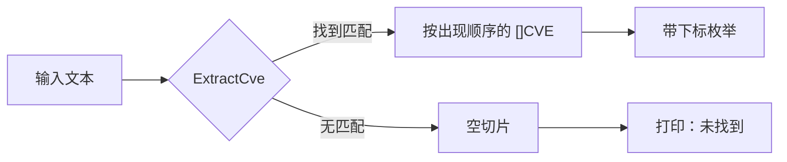

# 示例：提取全部 CVE

:::tip 📂 查看源码
[`examples/04_extract_cve/main.go`](https://github.com/scagogogo/cve-skills/blob/main/examples/04_extract_cve/main.go) — 在 GitHub 上查看完整可运行示例。
:::

从一段自由文本中把所有 CVE 编号都提取出来，整理成有序列表。

:::tip 🎯 学习目标
- 使用 `ExtractCve` 扫描任意文本，返回其中出现的全部 CVE 编号。
- 理解提取过程不区分大小写，并按首次出现的顺序保留结果。
- 学会在文本中不含 CVE 时优雅地处理空结果。
:::

## 场景

你在解析安全公告、发行说明和聊天记录，这些文本里零散地提到 CVE 编号。你需要的不是“有没有 CVE”这样的布尔答案，而是真实的编号列表，以便去重、排序并与漏洞库比对。`ExtractCve` 用 CVE 正则表达式遍历整段字符串，按出现顺序返回一个切片，包含所有匹配项。它是把非结构化文本转换为结构化 CVE 记录的天然入口。

## 完整代码

```go
package main

import (
	"fmt"

	"github.com/scagogogo/cve-skills"
)

func main() {
	// 示例1：从文本中提取所有CVE编号
	text := `安全公告：系统受到多个漏洞影响，包括：
- cve-2021-44228（Log4Shell）
- CVE-2022-22965（Spring4Shell）
- CVE-2022-1234
建议尽快更新到最新版本。`

	fmt.Println("原始文本:")
	fmt.Println(text)

	fmt.Println("\n提取的CVE编号:")
	cveList := cve.ExtractCve(text)
	for i, c := range cveList {
		fmt.Printf("[%d] %s\n", i+1, c)
	}

	// 示例2：从不包含CVE的文本中提取
	text2 := "这个文本中不包含任何CVE编号。"
	fmt.Println("\n另一个示例文本:")
	fmt.Println(text2)

	cveList2 := cve.ExtractCve(text2)
	fmt.Println("\n提取的CVE编号:")
	if len(cveList2) == 0 {
		fmt.Println("未找到任何CVE编号")
	} else {
		for i, c := range cveList2 {
			fmt.Printf("[%d] %s\n", i+1, c)
		}
	}
}
```

## 运行方式

```bash
cd examples/04_extract_cve && go run main.go
```

## 预期输出

```text
原始文本:
安全公告：系统受到多个漏洞影响，包括：
- cve-2021-44228（Log4Shell）
- CVE-2022-22965（Spring4Shell）
- CVE-2022-1234
建议尽快更新到最新版本。

提取的CVE编号:
[1] CVE-2021-44228
[2] CVE-2022-22965
[3] CVE-2022-1234

另一个示例文本:
这个文本中不包含任何CVE编号。

提取的CVE编号:
未找到任何CVE编号
```

## 代码讲解

程序演示了两个场景，分别覆盖正常路径和空结果路径：

- ▶️ **示例1 —— 从多行公告中提取。** 文本是一段中文安全公告，列出了三个 CVE，其中第一个写成小写（`cve-2021-44228`）。`ExtractCve` 扫描整段字符串，按出现顺序返回三个编号。注意结果中小写前缀被规范化为 `CVE-`，说明匹配不区分大小写，而返回的编号使用规范的大写形式。
- 💡 **示例2 —— 不含任何 CVE 的文本。** 一句不含 CVE 编号的普通句子会产生一个空切片。代码用 `len(cveList2) == 0` 做了保护，打印一句友好的“未找到任何CVE编号”，而不是去遍历空集合。这是输入可能合法地不含 CVE 时的推荐写法。

第一个循环用 `fmt.Printf("[%d] %s\n", i+1, c)` 枚举结果，使用从 1 开始的下标，让输出读起来更自然。第二个分支复用了同样的打印格式，无论列表是否有内容，输出风格都保持一致。



## 涉及函数

- [ExtractCve](/zh/api/functions/extract-cve) —— 本页演示的提取函数。
- [ExtractFirstCve](/zh/api/functions/extract-first-cve) —— 只需要第一个匹配时使用。
- [ExtractLastCve](/zh/api/functions/extract-last-cve) —— 只需要文本中最后一个匹配时使用。
- [IsContainsCve](/zh/api/functions/is-contains-cve) —— 只需判断是否存在任意 CVE 时的布尔检查。

## 扩展练习

- 💡 把一段多段落公告先交给 `ExtractCve`，再用 `RemoveDuplicateCves` 去重后汇报。
- 💡 把 `ExtractCve` 与 `FilterValidCves` 结合，丢弃文本中混入的格式不正确的编号。
- 💡 从 `os.Stdin` 逐行读取，对每一行调用 `ExtractCve`，最后输出整段输入中出现过的全部 CVE 的扁平列表。
