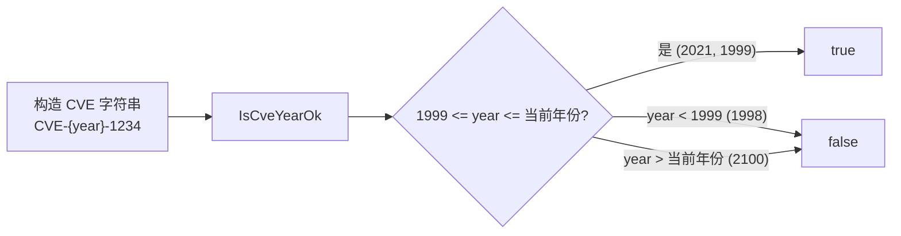

# 示例：校验 CVE 年份

:::tip 📂 查看源码
[`examples/04_is_valid_cve_year/main.go`](https://github.com/scagogogo/cve-skills/blob/main/examples/04_is_valid_cve_year/main.go) — 在 GitHub 上查看完整可运行示例。
:::

使用 `cve.IsCveYearOk` 校验 CVE 编号的年份段是否落在有效范围内——不早于 1999 年（CVE 项目启用之年），且不晚于当前年份——传入的是完整 CVE 字符串（如 `CVE-2021-1234`）。

:::tip 🎯 学习目标
- 理解 `IsCveYearOk` 约束的有效年份范围（1999 至当前年份，含端点）
- 了解该函数接收完整 CVE 字符串，仅检视其中的年份段
- 认识到早于 1999 与晚于当前年份的取值都会被判定为非法
:::

## 场景

某漏洞库在录入分析师提交的 CVE 编号时，一位初级分析师手误将记录写成 `CVE-1998-1234`，误以为 CVE 项目早于 1999 年就存在；另一张工单引用了 `CVE-2100-1234`，这是一个尚不可能存在的占位漏洞。入库前，数据库先将编号交给 `IsCveYearOk`：函数接收完整 CVE 字符串，提取年份段，拒绝任何低于 1999 或高于当前年份的取值。这一步即可拦截转录错误与不可能日期的记录，无需额外的解析步骤。

## 完整代码

```go
package main

import (
	"fmt"

	"github.com/scagogogo/cve-skills"
)

func main() {
	// 示例1：检查有效的CVE年份
	// CVE编号的年份部分从1999年开始，到当前年份有效
	year1 := 2021
	fmt.Printf("年份: %d\n", year1)
	fmt.Printf("是否为有效的CVE年份: %v\n\n", cve.IsCveYearOk(fmt.Sprintf("CVE-%d-1234", year1)))
	// 预期输出:
	// 年份: 2021
	// 是否为有效的CVE年份: true

	// 示例2：检查1999年（CVE编号的第一个有效年份）
	// 1999年是CVE编号系统开始使用的年份，是有效的
	year2 := 1999
	fmt.Printf("年份: %d\n", year2)
	fmt.Printf("是否为有效的CVE年份: %v\n\n", cve.IsCveYearOk(fmt.Sprintf("CVE-%d-1234", year2)))
	// 预期输出:
	// 年份: 1999
	// 是否为有效的CVE年份: true

	// 示例3：检查1998年（早于CVE编号系统开始的年份）
	// 1999年之前的年份对CVE编号无效
	year3 := 1998
	fmt.Printf("年份: %d\n", year3)
	fmt.Printf("是否为有效的CVE年份: %v\n\n", cve.IsCveYearOk(fmt.Sprintf("CVE-%d-1234", year3)))
	// 预期输出:
	// 年份: 1998
	// 是否为有效的CVE年份: false

	// 示例4：检查未来年份
	// 超过当前年份的未来年份不是有效的CVE年份
	year4 := 2100
	fmt.Printf("年份: %d\n", year4)
	fmt.Printf("是否为有效的CVE年份: %v\n", cve.IsCveYearOk(fmt.Sprintf("CVE-%d-1234", year4)))
	// 预期输出(假设当前年份小于2100):
	// 年份: 2100
	// 是否为有效的CVE年份: false

	// 总结: IsCveYearOk函数用于验证一个CVE编号的年份部分是否有效
	// 有效范围: 1999年至当前年份(含)
}
```

## 运行方式

```bash
cd examples/04_is_valid_cve_year && go run main.go
```

## 预期输出

前三组用例固定不变。第四组取决于运行时年份：仅当当前年份小于 2100 时 `2100` 才会被拒绝（这在当下的任何实际运行中都成立）。下方输出块即基于该假设。

```text
年份: 2021
是否为有效的CVE年份: true

年份: 1999
是否为有效的CVE年份: true

年份: 1998
是否为有效的CVE年份: false

年份: 2100
是否为有效的CVE年份: false
```

## 代码讲解

程序依次遍历四个具有代表性的年份，每次都用 `fmt.Sprintf("CVE-%d-1234", year)` 构造完整 CVE 字符串，再直接传给 `IsCveYearOk`。

- 📋 **常规年份通过** — `year1 = 2021` 落在 `[1999, 当前年份]` 区间内，`IsCveYearOk` 返回 `true`。函数接收完整 CVE 字符串，无需自行提取年份。
- ▶️ **下界包含端点** — `year2 = 1999` 是 CVE 项目发布记录的第一个年份，下界 `1999` 是含端点的，因此返回 `true`。
- 💡 **早于 1999 被拒** — `year3 = 1998` 早于 CVE 项目启用年份，硬编码的下界 1999 将其排除，结果为 `false`。
- 🔗 **晚于当前年份被拒** — `year4 = 2100` 超出当前年份（上界为 `time.Now().Year()`），因此在任何当前年份小于 2100 的运行中都返回 `false`。结尾注释重申了规则：有效范围为 `1999..当前年份`，两端含端点。



## 涉及函数

- [IsCveYearOk](/api/functions/is-cve-year-ok) — 偏移量为 0 的严格年份校验
- [IsCveYearOkWithCutoff](/api/functions/is-cve-year-ok-with-cutoff) — 可配置未来年份容差的校验
- [ExtractCveYear](/api/functions/extract-cve-year) — 以字符串形式提取年份段
- [ExtractCveYearAsInt](/api/functions/extract-cve-year-as-int) — 以整数形式提取年份段
- [ValidateCve](/api/functions/validate-cve) — 对 CVE 编号进行完整的结构性校验

## 扩展练习

- 🎯 将 `year1` 改为 `time.Now().Year()`（今年的年份），确认仍返回 `true`，因为上界是包含端点的。
- 🎯 向 `IsCveYearOk` 传入格式错误的字符串（如 `"CVE-20XX-1234"`），确认由于年份段无法解析而返回 `false`。
- 🎯 对 `2100` 这一组改用 `IsCveYearOkWithCutoff(cve, 10)`，观察将上界放宽 10 年后，在你当前的运行年份下判定结果是否改变。
