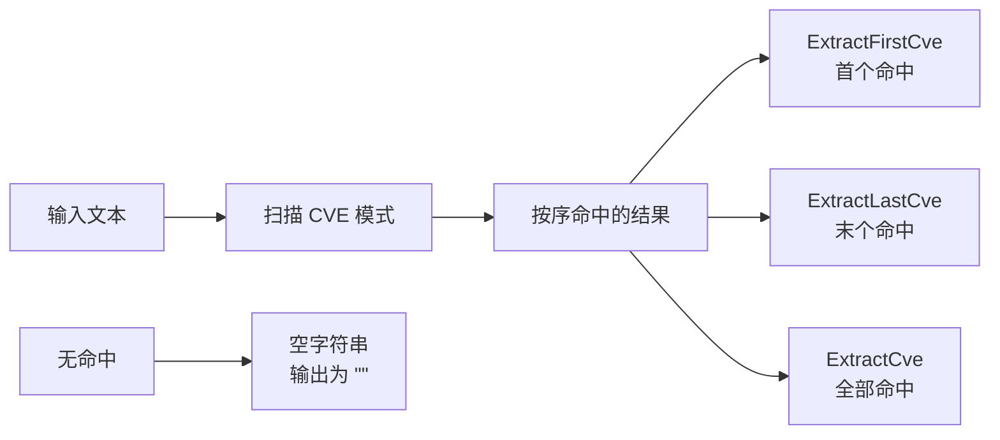

# 示例：提取首个/末个 CVE

:::tip 📂 查看源码
[`examples/05_extract_first_last_cve/main.go`](https://github.com/scagogogo/cve-skills/blob/main/examples/05_extract_first_last_cve/main.go) — 在 GitHub 上查看完整可运行示例。
:::

从一段文本中只取出第一个或最后一个 CVE 编号——不必自己遍历整张列表。

:::tip 🎯 学习目标
- 理解 `ExtractFirstCve`、`ExtractLastCve` 与返回完整列表的 `ExtractCve` 之间的区别。
- 了解当文本中不含任何 CVE 时，这两个函数各自返回什么（空字符串，经 `%q` 输出为 `""`）。
- 能够在只关心某个边界 CVE 时，选对提取函数。
:::

## 场景

你在读一份安全报告，里面用自然语言提到了好几个 CVE 编号。多数时候你并不需要整张列表，只需要两个端点：第一个 CVE 通常是文中最早提到的发现（方便按时间排序），最后一个 CVE 通常是最新的发现（方便看"还有什么没处理完"）。与其调用 `ExtractCve` 再去下标切片，不如直接用 `ExtractFirstCve` 和 `ExtractLastCve`。它们只扫一遍文本，给你一个编号——没匹配到时返回空字符串。

## 完整代码

```go
package main

import (
	"fmt"

	"github.com/scagogogo/cve-skills"
)

func main() {
	text := `系统安全报告：
首先发现的漏洞是CVE-2021-44228，这是最严重的。
随后还发现了CVE-2022-22965和CVE-2022-33891。
最新发现的漏洞是CVE-2023-12345，正在评估中。`

	fmt.Println("原始文本:")
	fmt.Println(text)

	// 提取第一个CVE
	firstCve := cve.ExtractFirstCve(text)
	fmt.Printf("\n第一个CVE: %s\n", firstCve)

	// 提取最后一个CVE
	lastCve := cve.ExtractLastCve(text)
	fmt.Printf("最后一个CVE: %s\n", lastCve)

	// 提取所有CVE作为对比
	allCves := cve.ExtractCve(text)
	fmt.Println("\n所有CVE:")
	for i, c := range allCves {
		fmt.Printf("[%d] %s\n", i+1, c)
	}

	// 处理没有CVE的文本
	emptyText := "这个文本中没有任何CVE编号信息。"
	fmt.Printf("\n没有CVE的文本中的第一个CVE: %q\n", cve.ExtractFirstCve(emptyText))
	fmt.Printf("没有CVE的文本中的最后一个CVE: %q\n", cve.ExtractLastCve(emptyText))
}
```

## 运行方式

```bash
cd examples/05_extract_first_last_cve && go run main.go
```

## 预期输出

```text
原始文本:
系统安全报告：
首先发现的漏洞是CVE-2021-44228，这是最严重的。
随后还发现了CVE-2022-22965和CVE-2022-33891。
最新发现的漏洞是CVE-2023-12345，正在评估中。

第一个CVE: CVE-2021-44228
最后一个CVE: CVE-2023-12345

所有CVE:
[1] CVE-2021-44228
[2] CVE-2022-22965
[3] CVE-2022-33891
[4] CVE-2023-12345

没有CVE的文本中的第一个CVE: ""
没有CVE的文本中的最后一个CVE: ""
```

## 代码讲解

程序构造了一份含四个 CVE 的中文安全报告，然后在它上面跑了三个提取 API：

- ▶️ **打印原始文本。** `fmt.Println(text)` 原样回显报告，方便对照后续输出。
- 📋 **第一个 CVE。** `cve.ExtractFirstCve(text)` 返回最左侧的命中 `CVE-2021-44228`——报告中最早的发现。拿到的是单个字符串，无需处理切片。
- 📋 **最后一个 CVE。** `cve.ExtractLastCve(text)` 返回最右侧的命中 `CVE-2023-12345`——最新的发现。同样是单个字符串的契约。
- 💡 **完整列表作对照。** `cve.ExtractCve(text)` 把所有命中作为切片返回；`for i, c := range` 循环用 `i+1` 从 1 开始编号逐条打印。这恰好验证了两个端点函数与完整列表的首尾元素一致。
- 🔗 **空文本行为。** `emptyText` 不含任何 CVE，`ExtractFirstCve` 与 `ExtractLastCve` 都返回空字符串。用 `%q` 打印时显示为 `""`，这正是你在报告里没提到任何编号时要判断的信号。



## 涉及函数

- [ExtractFirstCve](/zh/api/functions/extract-first-cve) — 返回文本中第一个 CVE。
- [ExtractLastCve](/zh/api/functions/extract-last-cve) — 返回文本中最后一个 CVE。
- [ExtractCve](/zh/api/functions/extract-cve) — 返回文本中所有 CVE，以切片形式。

## 扩展练习

- 💡 向 `ExtractLastCve` 传入一份最新 CVE 写成小写（`cve-2024-0001`）的报告，确认它命中的仍是最后一个。
- 💡 组合 `ExtractFirstCve` 与 `ExtractLastCve`，为多段公告打印一行精简的"最早 → 最新"摘要，并在结果为空时回退到"未发现 CVE"提示。
- 💡 在一个大日志文件上对比 `ExtractFirstCve` 与 `ExtractCve(text)[0]` 的性能，并解释为什么专用的首命中函数不必收集其余命中。
