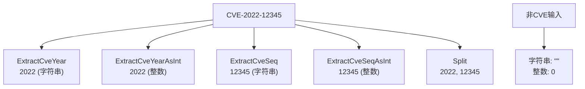

# 示例：提取年份与序列号

:::tip 📂 查看源码
[`examples/06_extract_year_seq/main.go`](https://github.com/scagogogo/cve-skills/blob/main/examples/06_extract_year_seq/main.go) — 在 GitHub 上查看完整可运行示例。
:::

从一个 CVE 编号中单独取出年份或序列号——可以是字符串，也可以是整数——并看清当输入根本不是 CVE 时各函数会返回什么。

:::tip 🎯 学习目标
- 区分四个提取辅助函数：`ExtractCveYear`、`ExtractCveYearAsInt`、`ExtractCveSeq` 与 `ExtractCveSeqAsInt`。
- 理解每个函数对无效输入的返回值（空字符串、零值），以及为什么用 `%q` 打印时空字符串显示为 `""`。
- 掌握 `Split` 作为一次调用同时拿到年份和序列号的替代方案。
:::

## 场景

你正在规范化一个 CVE 编号数据流，需要按年份和序列号对每条记录建立索引。原始编号以字符串形式到来，例如 `CVE-2022-12345`，但下游有时需要把年份转成整数来做范围比较，把序列号转成整数来做数值排序。与其自己切分字符串再去折腾 `strconv`，包里提供了四个专用提取器和一个 `Split` 辅助函数。每个函数对格式正确的 CVE 都返回干净的值，对无法解析的输入则返回安全的零值（空字符串或 `0`）——因此你无需处理 panic 就能识别出坏数据。

## 完整代码

```go
package main

import (
	"fmt"

	"github.com/scagogogo/cve-skills"
)

func main() {
	// 示例CVE编号
	cveID := "CVE-2022-12345"
	fmt.Printf("CVE编号: %s\n\n", cveID)

	// 提取年份（字符串形式）
	year := cve.ExtractCveYear(cveID)
	fmt.Printf("年份(字符串): %s\n", year)

	// 提取年份（整数形式）
	yearInt := cve.ExtractCveYearAsInt(cveID)
	fmt.Printf("年份(整数): %d\n\n", yearInt)

	// 提取序列号（字符串形式）
	seq := cve.ExtractCveSeq(cveID)
	fmt.Printf("序列号(字符串): %s\n", seq)

	// 提取序列号（整数形式）
	seqInt := cve.ExtractCveSeqAsInt(cveID)
	fmt.Printf("序列号(整数): %d\n\n", seqInt)

	// 演示处理无效输入
	invalidCve := "这不是CVE格式"
	fmt.Printf("无效输入: %s\n", invalidCve)
	fmt.Printf("无效输入的年份(字符串): %q\n", cve.ExtractCveYear(invalidCve))
	fmt.Printf("无效输入的年份(整数): %d\n", cve.ExtractCveYearAsInt(invalidCve))
	fmt.Printf("无效输入的序列号(字符串): %q\n", cve.ExtractCveSeq(invalidCve))
	fmt.Printf("无效输入的序列号(整数): %d\n", cve.ExtractCveSeqAsInt(invalidCve))

	// 使用Split函数作为替代方法
	fmt.Println("\n使用Split函数:")
	splitYear, splitSeq := cve.Split(cveID)
	fmt.Printf("Split解析的年份: %s\n", splitYear)
	fmt.Printf("Split解析的序列号: %s\n", splitSeq)
}
```

## 运行方式

```bash
cd examples/06_extract_year_seq && go run main.go
```

## 预期输出

```text
CVE编号: CVE-2022-12345

年份(字符串): 2022
年份(整数): 2022

序列号(字符串): 12345
序列号(整数): 12345

无效输入: 这不是CVE格式
无效输入的年份(字符串): ""
无效输入的年份(整数): 0
无效输入的序列号(字符串): ""
无效输入的序列号(整数): 0

使用Split函数:
Split解析的年份: 2022
Split解析的序列号: 12345
```

## 代码讲解

程序取一个 CVE 编号，依次调用每一个年份/序列号提取器，随后对一段垃圾输入重复同样的调用以展示失败约定，最后演示 `Split`：

- 📋 **年份（字符串）。** `cve.ExtractCveYear(cveID)` 返回 `"2022"`——年份片段保留为字符串，当你只是想回显或拼接时很有用。
- 📋 **年份（整数）。** `cve.ExtractCveYearAsInt(cveID)` 返回 `2022`——同一片段解析为 `int`，这样你就能做诸如"这个 CVE 是 2020 年之后的吗？"的范围判断。
- 📋 **序列号（字符串）。** `cve.ExtractCveSeq(cveID)` 返回 `"12345"`——序列号片段保留为字符串，便于展示或补零。
- 📋 **序列号（整数）。** `cve.ExtractCveSeqAsInt(cveID)` 返回 `12345`——序列号解析为 `int`，这样你就能对同一年的 CVE 按数值而非字典序排序。
- 💡 **无效输入。** 字符串 `"这不是CVE格式"` 并非 CVE。字符串提取器返回空字符串（经 `%q` 打印显示为 `""`），整数提取器返回 `0`。没有错误、没有 panic——这些零值就是你需要检查的信号。
- 🔗 **Split 作为替代。** `cve.Split(cveID)` 一次性返回两半，结果为 `(year, seq)`。当你两样都需要时，一次调用胜过两次单独提取。



## 涉及函数

- [ExtractCveYear](/zh/api/functions/extract-cve-year) —— 以字符串形式返回年份片段。
- [ExtractCveYearAsInt](/zh/api/functions/extract-cve-year-as-int) —— 以 int 形式返回年份片段。
- [ExtractCveSeq](/zh/api/functions/extract-cve-seq) —— 以字符串形式返回序列号片段。
- [ExtractCveSeqAsInt](/zh/api/functions/extract-cve-seq-as-int) —— 以 int 形式返回序列号片段。
- [Split](/zh/api/functions/split) —— 一次调用同时返回年份与序列号。

## 扩展练习

- 💡 给提取器喂一个序列号超过 5 位的 CVE（例如 `CVE-2024-999999`），确认 `ExtractCveSeqAsInt` 仍能返回完整的整数。
- 💡 构建一个小索引：按 `ExtractCveYearAsInt` 分组、每组内按 `ExtractCveSeqAsInt` 排序，再把结果与原始编号的字典序排序做对比。
- 💡 给四个提取器包一层守卫逻辑：只要字符串结果为空就打印"跳过无效输入"的警告，并统计样本数据流中有多少条记录被跳过。
