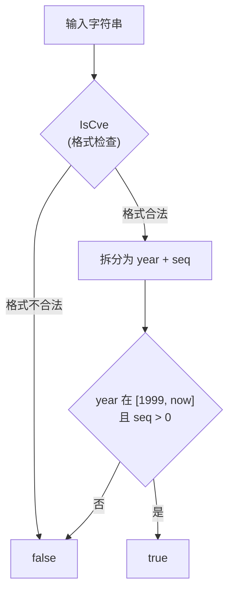

# 示例：全面验证 CVE

:::tip 📂 查看源码
[`examples/08_validate_cve/main.go`](https://github.com/scagogogo/cve-skills/blob/main/examples/08_validate_cve/main.go) — 在 GitHub 上查看完整可运行示例。
:::

对一个 CVE 编号做一次完整校验——格式、年份范围、序列号——全部汇聚到一次布尔调用里。

:::tip 🎯 学习目标
- 理解 `ValidateCve` 的三条规则：格式、年份范围、序列号为正整数。
- 弄清未来年份的 CVE、嵌在句中的 CVE 为什么会被拒绝。
- 能够把用户输入过滤成可以直接去漏洞库查询的安全标识符。
:::

## 场景

你在做一个分诊工具，需要接收用户手敲进来的 CVE 编号。用户粘贴的来源五花八门——邮件、聊天、PDF 报告，数据很脏：有的少了连字符，有的把 CVE 嵌在一句话里，有的年份根本还没到。在拿这些字符串去请求 NVD 之前，你需要一个严格的守门人，把一切不是"干净且年份合法的 CVE"挡在门外。`ValidateCve` 就是这个守门人：只有当整个字符串是规范的 `CVE-YYYY-NNNNN`、年份落在 1999 到当前年份之间、且序列号是正整数时，它才返回 `true`。

## 完整代码

```go
package main

import (
	"fmt"
	"time"

	"github.com/scagogogo/cve-skills"
)

func main() {
	currentYear := time.Now().Year()

	fmt.Println("CVE全面验证示例:")

	// 有效的CVE示例
	validCVEs := []string{
		fmt.Sprintf("CVE-%d-12345", currentYear),   // 当前年份
		fmt.Sprintf("CVE-%d-12345", currentYear-1), // 去年
		"CVE-2020-1234", // 2020年
		"CVE-1999-0001", // 较早的CVE
	}

	fmt.Println("\n有效的CVE示例:")
	for _, id := range validCVEs {
		fmt.Printf("%s: %v\n", id, cve.ValidateCve(id))
	}

	// 无效的CVE示例
	invalidCVEs := []string{
		fmt.Sprintf("CVE-%d-12345", currentYear+1), // 未来年份
		"CVE-1998-1234",      // 早于1999
		"CVE-2022-ABC",       // 序列号不是数字
		"CVE2022-1234",       // 格式错误，缺少连字符
		"包含CVE-2022-1234的文本", // 非独立CVE
		"cve-2022--1234",     // 双连字符
		"CVE-2022-0",         // 序列号太短
	}

	fmt.Println("\n无效的CVE示例:")
	for _, id := range invalidCVEs {
		fmt.Printf("%s: %v\n", id, cve.ValidateCve(id))
	}

	// 解释验证规则
	fmt.Println("\nValidateCve函数验证规则说明:")
	fmt.Println("1. 必须是完整的CVE格式 (如 'CVE-YYYY-NNNNN')")
	fmt.Println("2. 年份必须在1999年至当前年份之间")
	fmt.Println("3. 序列号必须是正整数")
}
```

## 运行方式

```bash
cd examples/08_validate_cve && go run main.go
```

## 预期输出

输出会随程序运行的年份而变化。当 `currentYear = 2026` 时：

```text
CVE全面验证示例:

有效的CVE示例:
CVE-2026-12345: true
CVE-2025-12345: true
CVE-2020-1234: true
CVE-1999-0001: true

无效的CVE示例:
CVE-2027-12345: false
CVE-1998-1234: false
CVE-2022-ABC: false
CVE2022-1234: false
包含CVE-2022-1234的文本: false
cve-2022--1234: false
CVE-2022-0: false

ValidateCve函数验证规则说明:
1. 必须是完整的CVE格式 (如 'CVE-YYYY-NNNNN')
2. 年份必须在1999年至当前年份之间
3. 序列号必须是正整数
```

## 代码讲解

程序构造了两个切片——一个预期通过、一个预期失败——逐个送进 `cve.ValidateCve`。它先用 `currentYear := time.Now().Year()` 取当前年份，使得边界用例（今年、去年、明年）随时间一起移动。

- ▶️ **有效块。** 构造了四个落在合法区间内的标识符。`CVE-{currentYear}-12345` 和 `CVE-{currentYear-1}-12345` 用来压测上边界：今天和昨天都被接受。`CVE-2020-1234` 是一条普通的历史记录。`CVE-1999-0001` 钉住下边界——1999 是 CVE 项目认定的第一个年份，而序列号 `0001` 仍是正整数，所以通过。
- 📋 **无效块。** 七个标识符各自恰好违反一条规则。`CVE-{currentYear+1}-12345` 是未来年份，被年份上界拒绝。`CVE-1998-1234` 早于 1999。`CVE-2022-ABC` 序列号不是数字。`CVE2022-1234` 丢了第一个连字符，格式错误。`包含CVE-2022-1234的文本` 是一句"包含" CVE 的话，而不是一个独立的 CVE。`cve-2022--1234` 出现了双连字符。`CVE-2022-0` 序列号为 0，不是正整数。
- 💡 **规则总结。** 末尾的 `fmt.Println` 块把三条规则再说一遍，让程序自带文档：完整的 `CVE-YYYY-NNNNN` 格式、年份落在 `[1999, currentYear]`、序列号为正整数。



## 涉及函数

- [ValidateCve](/zh/api/functions/validate-cve) — 本页演示的单字符串校验函数。
- [ValidateCves](/zh/api/functions/validate-cves) — 批量版本，返回逐项结果切片。
- [IsCve](/zh/api/functions/is-cve) — `ValidateCve` 第一步调用的纯格式检查。

## 扩展练习

- 💡 把 `currentYear+1` 这一项换成硬编码的 `CVE-1999-0001` 和 `CVE-1998-0001` 一对，确认 1999 这边的边界是闭区间。
- 💡 把同样七个非法字符串送进 `IsCve`，对比哪些 `IsCve` 单独就能拦下、哪些必须靠 `ValidateCve` 的年份/序列号规则。
- 💡 写一个流水线：从 `os.Stdin` 逐行读取，对每行跑 `ValidateCve`，只打印被拒绝的项并附一句简短原因。
