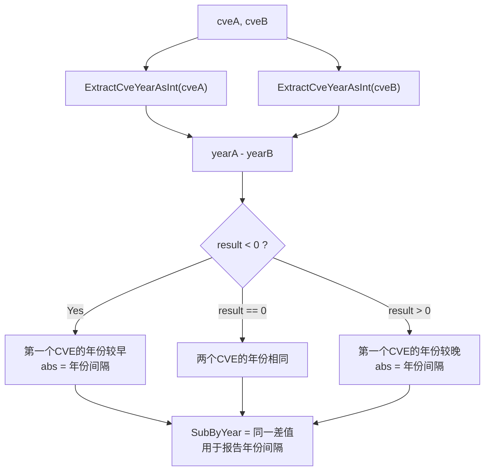

# 示例：按年份比较

:::tip 📂 查看源码
[`examples/09_compare_by_year/main.go`](https://github.com/scagogogo/cve-skills/blob/main/examples/09_compare_by_year/main.go) — 在 GitHub 上查看完整可运行示例。
:::

使用 `cve.CompareByYear` 仅按年份段比较两个 CVE 编号。它用第一个 CVE 的年份减去第二个的年份，返回原始整数差值，因此符号告诉你哪个 CVE 更早，绝对值告诉你两者相差多少年。

:::tip 🎯 学习目标
- 理解 `cve.CompareByYear` 及其别名 `cve.SubByYear` 的签名与行为
- 看清原始年份差与 `CompareCves` 的 `-1 / 0 / 1` 约定有何不同
- 同时利用符号与绝对值，既判定顺序又度量年份间隔
:::

## 场景

一位漏洞研究员正在整理披露时间线，除了想知道两个 CVE 谁先谁后，还想知道它们之间相隔几年。仅比较年份段的 `cve.CompareByYear` 返回 `yearA - yearB`：负值表示第一个 CVE 披露更早，正值表示更晚，绝对值就是年份间隔。配套的 `cve.SubByYear` 是同名函数，当关注点是间隔本身而非排序时读起来更自然。本示例依次演示跨年比较、同年比较和反向比较，以确认比较器具有反对称性。

## 完整代码

```go
package main

import (
	"fmt"

	"github.com/scagogogo/cve-skills"
)

func main() {
	// 比较不同年份的CVE
	cve1 := "CVE-2020-1234"
	cve2 := "CVE-2022-5678"

	fmt.Printf("比较 %s 和 %s:\n", cve1, cve2)

	// 使用CompareByYear比较
	result := cve.CompareByYear(cve1, cve2)
	if result < 0 {
		fmt.Printf("CompareByYear结果: %d (第一个CVE的年份较早)\n", result)
	} else if result > 0 {
		fmt.Printf("CompareByYear结果: %d (第一个CVE的年份较晚)\n", result)
	} else {
		fmt.Printf("CompareByYear结果: %d (两个CVE的年份相同)\n", result)
	}

	// 使用SubByYear计算年份差
	diff := cve.SubByYear(cve1, cve2)
	fmt.Printf("SubByYear结果: %d (两个CVE的年份相差%d年)\n\n", diff, abs(diff))

	// 比较相同年份的CVE
	cve3 := "CVE-2022-1111"
	cve4 := "CVE-2022-9999"

	fmt.Printf("比较 %s 和 %s:\n", cve3, cve4)

	// 使用CompareByYear比较
	result2 := cve.CompareByYear(cve3, cve4)
	fmt.Printf("CompareByYear结果: %d (年份相同)\n", result2)

	// 使用SubByYear计算年份差
	diff2 := cve.SubByYear(cve3, cve4)
	fmt.Printf("SubByYear结果: %d (年份相同，无差异)\n\n", diff2)

	// 反向比较
	fmt.Printf("反向比较 %s 和 %s:\n", cve2, cve1)
	fmt.Printf("CompareByYear结果: %d\n", cve.CompareByYear(cve2, cve1))
	fmt.Printf("SubByYear结果: %d\n", cve.SubByYear(cve2, cve1))
}

// 辅助函数：计算绝对值
func abs(x int) int {
	if x < 0 {
		return -x
	}
	return x
}
```

## 运行方式

```bash
cd examples/09_compare_by_year && go run main.go
```

## 预期输出

```text
比较 CVE-2020-1234 和 CVE-2022-5678:
CompareByYear结果: -2 (第一个CVE的年份较早)
SubByYear结果: -2 (两个CVE的年份相差2年)

比较 CVE-2022-1111 和 CVE-2022-9999:
CompareByYear结果: 0 (年份相同)
SubByYear结果: 0 (年份相同，无差异)

反向比较 CVE-2022-5678 和 CVE-2020-1234:
CompareByYear结果: 2
SubByYear结果: 2
```

## 代码讲解

本示例依次演示三种比较形态，凸显 `CompareByYear` 及其别名 `SubByYear` 返回原始差值的行为。

- 📋 **不同年份** — `CVE-2020-1234` 与 `CVE-2022-5678`：`CompareByYear` 计算 `2020 - 2022 = -2`。负号触发"较早"分支，绝对值 `2` 即年份间隔，由本地 `abs` 辅助函数还原，再由 `SubByYear` 打印出来。
- ▶️ **同年不同序列号** — `CVE-2022-1111` 与 `CVE-2022-9999`：年份段相等，因此 `CompareByYear` 返回 `0`，与序列号无关。这正是它与 `CompareCves` 的关键差别——后者会下沉到序列号比较并返回 `-1`。
- 🔗 **反向比较** — 交换参数后符号由 `-2` 翻转为 `2`，确认比较器具有反对称性，同时绝对值不变，这正是 `SubByYear` 所暴露的年份间隔。
- 💡 **符号与绝对值** — `CompareByYear` 与 `SubByYear` 返回同一个整数；`< 0 / > 0` 分支只消费符号，而 `abs(diff)` 只消费绝对值，一次调用同时支撑排序判定与间隔度量。



## 涉及函数

- [CompareByYear](/zh/api/functions/compare-by-year) — 本示例使用的函数
- [SubByYear](/zh/api/functions/sub-by-year) — `CompareByYear` 的别名，读作年份相减
- [CompareCves](/zh/api/functions/compare-cves) — 年份优先再比序列号的比较器，返回 `-1 / 0 / 1`
- [ExtractCveYearAsInt](/zh/api/functions/extract-cve-year-as-int) — 驱动减法运算的年份提取器
- [SortCves](/zh/api/functions/sort-cves) — 用完整比较器对 CVE 切片排序

## 扩展练习

- 🎯 将同年那对的 `CompareByYear` 换成 `CompareCves`，确认结果由 `0` 变为 `-1`，证明只有完整比较器才会考察序列号。
- 🎯 把一段 CVE 切片用 `sort.Slice` 配合 `cve.CompareByYear` 排序，观察同年 CVE 保持原有相对顺序（排序对同年的序列号是稳定的）。
- 🎯 传入非法字符串如 `"CVE-2021-44228-xxx"` 作为操作数，观察其年份仍解析为 `2021`；再传入 `"not-a-cve"`，确认其回退为年份 `0`。
