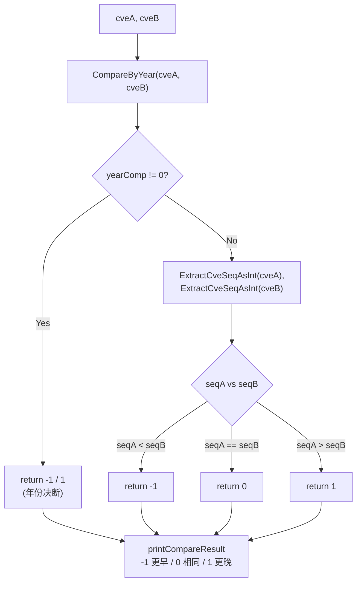

# 示例：完整比较 CVE

:::tip 📂 查看源码
[`examples/10_compare_cves/main.go`](https://github.com/scagogogo/cve-skills/blob/main/examples/10_compare_cves/main.go) — 在 GitHub 上查看完整可运行示例。
:::

使用 `cve.CompareCves` 对两个 CVE 标识符做端到端比较。它先比年份再比序列号，返回稳定的 `-1 / 0 / 1` 结果，既能告诉你哪个 CVE 更早，也能直接喂给 `sort.Slice`。

:::tip 🎯 学习目标
- 掌握 `cve.CompareCves` 的函数签名与行为
- 理解「年份优先、序列号其次」的比较如何处理同年、相同、反向等情形
- 利用返回值在真实工作流中判断两个 CVE 的时间先后
:::

## 场景

漏洞分析师正在关联两个广为人知的漏洞——Log4Shell（`CVE-2021-44228`）与 Spring4Shell（`CVE-2022-22965`），需要确认哪个先披露。把 CVE 字符串当普通文本比较是错的（不同年份的序列号位数并不对齐），因此分析师改用 `CompareCves`：先比年份再比序列号，第一个更早返回 `-1`、完全相同返回 `0`、第一个更晚返回 `1`。同一次调用还能处理大小写不同但本质相同的 CVE、以及参数顺序反转等边界情形。

## 完整代码

```go
package main

import (
	"fmt"

	"github.com/scagogogo/cve-skills"
)

func main() {
	fmt.Println("CVE完整比较示例")
	// 预期输出:
	// CVE完整比较示例

	// 比较不同年份的CVE
	cve1 := "CVE-2020-1234"
	cve2 := "CVE-2022-5678"

	fmt.Printf("1. 比较不同年份的CVE: %s 和 %s\n", cve1, cve2)
	result1 := cve.CompareCves(cve1, cve2)
	printCompareResult(result1)
	// 预期输出:
	// 1. 比较不同年份的CVE: CVE-2020-1234 和 CVE-2022-5678
	// CompareCves结果: -1 (第一个CVE更早)

	// 比较相同年份但不同序列号的CVE
	cve3 := "CVE-2022-1111"
	cve4 := "CVE-2022-9999"

	fmt.Printf("\n2. 比较相同年份不同序列号的CVE: %s 和 %s\n", cve3, cve4)
	result2 := cve.CompareCves(cve3, cve4)
	printCompareResult(result2)
	// 预期输出:
	// 2. 比较相同年份不同序列号的CVE: CVE-2022-1111 和 CVE-2022-9999
	// CompareCves结果: -1 (第一个CVE更早)

	// 比较完全相同的CVE
	cve5 := "CVE-2022-1111"
	cve6 := "cve-2022-1111" // 大小写不同，但格式化后相同

	fmt.Printf("\n3. 比较完全相同的CVE (大小写不同): %s 和 %s\n", cve5, cve6)
	result3 := cve.CompareCves(cve5, cve6)
	printCompareResult(result3)
	// 预期输出:
	// 3. 比较完全相同的CVE (大小写不同): CVE-2022-1111 和 cve-2022-1111
	// CompareCves结果: 0 (两个CVE完全相同)

	// 反向比较
	fmt.Printf("\n4. 反向比较: %s 和 %s\n", cve2, cve1)
	result4 := cve.CompareCves(cve2, cve1)
	printCompareResult(result4)
	// 预期输出:
	// 4. 反向比较: CVE-2022-5678 和 CVE-2020-1234
	// CompareCves结果: 1 (第一个CVE更晚)

	// 演示使用场景
	fmt.Println("\n5. 使用场景示例 - 确定两个CVE的时间顺序:")
	cveA := "CVE-2021-44228" // Log4Shell漏洞
	cveB := "CVE-2022-22965" // Spring4Shell漏洞

	fmt.Printf("比较 %s 和 %s:\n", cveA, cveB)

	result := cve.CompareCves(cveA, cveB)
	if result < 0 {
		fmt.Printf("%s 出现在 %s 之前\n", cveA, cveB)
	} else if result > 0 {
		fmt.Printf("%s 出现在 %s 之后\n", cveA, cveB)
	} else {
		fmt.Printf("%s 和 %s 在同一时间点发布\n", cveA, cveB)
	}
	// 预期输出:
	// 5. 使用场景示例 - 确定两个CVE的时间顺序:
	// 比较 CVE-2021-44228 和 CVE-2022-22965:
	// CVE-2021-44228 出现在 CVE-2022-22965 之前
}

// 辅助函数：打印比较结果
func printCompareResult(result int) {
	fmt.Printf("CompareCves结果: %d ", result)
	switch result {
	case -1:
		fmt.Println("(第一个CVE更早)")
	case 0:
		fmt.Println("(两个CVE完全相同)")
	case 1:
		fmt.Println("(第一个CVE更晚)")
	}
}
```

## 运行方式

```bash
cd examples/10_compare_cves && go run main.go
```

## 预期输出

```text
CVE完整比较示例
1. 比较不同年份的CVE: CVE-2020-1234 和 CVE-2022-5678
CompareCves结果: -1 (第一个CVE更早)

2. 比较相同年份不同序列号的CVE: CVE-2022-1111 和 CVE-2022-9999
CompareCves结果: -1 (第一个CVE更早)

3. 比较完全相同的CVE (大小写不同): CVE-2022-1111 和 cve-2022-1111
CompareCves结果: 0 (两个CVE完全相同)

4. 反向比较: CVE-2022-5678 和 CVE-2020-1234
CompareCves结果: 1 (第一个CVE更晚)

5. 使用场景示例 - 确定两个CVE的时间顺序:
比较 CVE-2021-44228 和 CVE-2022-22965:
CVE-2021-44228 出现在 CVE-2022-22965 之前
```

## 代码讲解

示例依次演示了四种比较形态，最后把返回值应用到一次真实的顺序判断。

- 📋 **不同年份** —— `CVE-2020-1234` 与 `CVE-2022-5678`：年份段不同，`CompareCves` 立即决断，返回 `-1`，无需再看序列号。
- ▶️ **同年不同序列号** —— `CVE-2022-1111` 与 `CVE-2022-9999`：年份相等，于是提取序列号 `1111` 与 `9999` 再比较，同样得到 `-1`。
- 💡 **大小写无关的相等** —— `CVE-2022-1111` 与 `cve-2022-1111`：输入仅大小写不同，但库内部会先规范化格式，年份与序列号都匹配，结果为 `0`。
- 🔗 **反向比较** —— 交换参数顺序后符号翻转为 `1`，验证比较器是反对称的。
- 🎯 **真实工作流** —— `CVE-2021-44228`（Log4Shell）与 `CVE-2022-22965`（Spring4Shell）：一个 `< 0` 分支即可告诉分析师 Log4Shell 先披露，这正是 `sort.Slice` 所期望的 `cmp` 契约。



## 涉及函数

- [CompareCves](/zh/api/functions/compare-cves) —— 本示例使用的函数
- [CompareByYear](/zh/api/functions/compare-by-year) —— 仅按年份比较（返回原始年份差）
- [SortCves](/zh/api/functions/sort-cves) —— 用本比较器对 CVE 切片排序并规范化
- [SubByYear](/zh/api/functions/sub-by-year) —— `CompareByYear` 的年份差别名
- [DiffCves](/zh/api/functions/diff-cves) —— 两个 CVE 集合的差集

## 扩展练习

- 🎯 把 `CompareCves` 接入 `sort.Slice`，对一组 CVE 按时间排序，验证输出符合「年份优先、序列号其次」的规则。
- 🎯 把非法字符串如 `"CVE-2021-44228-xxx"` 作为其中一个操作数传入，观察它如何回退到年份 `0` / 序列号 `0` 并排到最前。
- 🎯 把 `CompareCves` 与 `RemoveDuplicateCves` 组合，先对列表去重，再排成一条统一的时间线。
