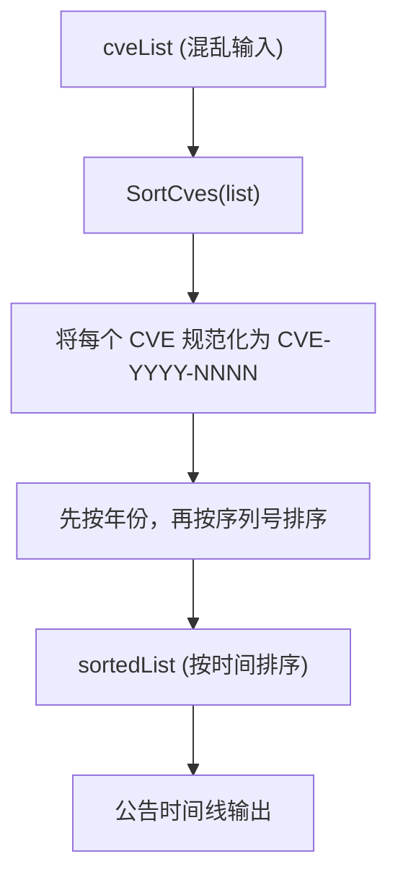

# 示例：排序 CVE 列表

:::tip 📂 查看源码
[`examples/11_sort_cves/main.go`](https://github.com/scagogogo/cve-skills/blob/main/examples/11_sort_cves/main.go) — 在 GitHub 上查看完整可运行示例。
:::

使用 `cve.SortCves` 把混乱的 CVE 列表按时间顺序排好。该函数还会把每个标识符统一规范化为 `CVE-YYYY-NNNN` 标准格式，因此一次调用即可同时完成格式化与排序。

:::tip 🎯 学习目标
- 掌握 `cve.SortCves` 的函数签名与行为
- 了解小写前缀、多余空格、年份错位如何在一次调用中被一并处理
- 基于原始 CVE 数据源构建按时间排序的安全公告视图
:::

## 场景

漏洞管理看板从多个数据源拉取 CVE 标识符，输入顺序几乎随机：有的条目是小写，有的带前导空格，年份还互相穿插。在发布公告时间线之前，团队需要把每个标识符规范化为 `CVE-YYYY-NNNN` 标准格式，并先按年份、再按序列号排序。`SortCves` 一次调用即可完成这两件事——它格式化每个条目，并返回一个按年份与序列号排序的新切片。

## 完整代码

```go
package main

import (
	"fmt"

	"github.com/scagogogo/cve-skills"
)

func main() {
	fmt.Println("CVE排序示例")
	// 预期输出:
	// CVE排序示例

	// 创建一个混乱顺序的CVE列表
	cveList := []string{
		"CVE-2022-22965", // Spring4Shell
		"cve-2021-44228", // Log4Shell (小写格式)
		"CVE-2022-1234",  // 随机示例
		"CVE-2020-1337",  // 较早的CVE
		"CVE-2022-0000",  // 相同年份，序列号较小
		" CVE-2023-9999", // 带有空格的CVE
	}

	fmt.Println("原始CVE列表:")
	printCveList(cveList)
	// 预期输出:
	// 原始CVE列表:
	// [1] CVE-2022-22965
	// [2] cve-2021-44228
	// [3] CVE-2022-1234
	// [4] CVE-2020-1337
	// [5] CVE-2022-0000
	// [6]  CVE-2023-9999

	// 使用SortCves函数对列表进行排序
	sortedList := cve.SortCves(cveList)

	fmt.Println("\n排序后的CVE列表:")
	printCveList(sortedList)
	// 预期输出:
	// 排序后的CVE列表:
	// [1] CVE-2020-1337
	// [2] CVE-2021-44228
	// [3] CVE-2022-0000
	// [4] CVE-2022-1234
	// [5] CVE-2022-22965
	// [6] CVE-2023-9999

	// 演示SortCves函数的格式化功能
	fmt.Println("\n注意事项:")
	fmt.Println("1. SortCves函数会自动对所有CVE进行格式化")
	fmt.Println("2. 排序首先按年份，然后按序列号进行")
	// 预期输出:
	// 注意事项:
	// 1. SortCves函数会自动对所有CVE进行格式化
	// 2. 排序首先按年份，然后按序列号进行

	// 实际应用场景
	fmt.Println("\n应用场景示例 - 按时间顺序显示CVE的安全公告:")
	for i, id := range sortedList {
		var description string
		switch id {
		case "CVE-2020-1337":
			description = "Windows内核权限提升漏洞"
		case "CVE-2021-44228":
			description = "Log4Shell远程代码执行漏洞"
		case "CVE-2022-0000":
			description = "示例低序列号漏洞"
		case "CVE-2022-1234":
			description = "示例中等序列号漏洞"
		case "CVE-2022-22965":
			description = "Spring4Shell远程代码执行漏洞"
		case "CVE-2023-9999":
			description = "示例未来漏洞"
		}
		fmt.Printf("%d. %s - %s\n", i+1, id, description)
	}
	// 预期输出:
	// 应用场景示例 - 按时间顺序显示CVE的安全公告:
	// 1. CVE-2020-1337 - Windows内核权限提升漏洞
	// 2. CVE-2021-44228 - Log4Shell远程代码执行漏洞
	// 3. CVE-2022-0000 - 示例低序列号漏洞
	// 4. CVE-2022-1234 - 示例中等序列号漏洞
	// 5. CVE-2022-22965 - Spring4Shell远程代码执行漏洞
	// 6. CVE-2023-9999 - 示例未来漏洞
}

// 辅助函数：打印CVE列表
func printCveList(list []string) {
	for i, id := range list {
		fmt.Printf("[%d] %s\n", i+1, id)
	}
}
```

## 运行方式

```bash
cd examples/11_sort_cves && go run main.go
```

## 预期输出

```text
CVE排序示例
原始CVE列表:
[1] CVE-2022-22965
[2] cve-2021-44228
[3] CVE-2022-1234
[4] CVE-2020-1337
[5] CVE-2022-0000
[6]  CVE-2023-9999

排序后的CVE列表:
[1] CVE-2020-1337
[2] CVE-2021-44228
[3] CVE-2022-0000
[4] CVE-2022-1234
[5] CVE-2022-22965
[6] CVE-2023-9999

注意事项:
1. SortCves函数会自动对所有CVE进行格式化
2. 排序首先按年份，然后按序列号进行

应用场景示例 - 按时间顺序显示CVE的安全公告:
1. CVE-2020-1337 - Windows内核权限提升漏洞
2. CVE-2021-44228 - Log4Shell远程代码执行漏洞
3. CVE-2022-0000 - 示例低序列号漏洞
4. CVE-2022-1234 - 示例中等序列号漏洞
5. CVE-2022-22965 - Spring4Shell远程代码执行漏洞
6. CVE-2023-9999 - 示例未来漏洞
```

## 代码讲解

示例从一个刻意弄乱的 `cveList` 起步：条目顺序并非按时间排列，有一条是小写（`cve-2021-44228`），有一条带前导空格（` CVE-2023-9999`），还有两条同年但序列号不同。

- 📋 **构建混乱列表** — 先通过 `printCveList` 辅助函数打印 `cveList`，以便看到原始输入，包括小写前缀和前导空格。
- ▶️ **一次调用完成排序与格式化** — `cve.SortCves(cveList)` 返回一个新切片，其中每个标识符都被规范化为 `CVE-YYYY-NNNN`，并先按年份、再按序列号排序。小写的 `cve-` 变成 `CVE-`，前导空格也被去除。
- 💡 **注意事项块** — 两行 `fmt.Println` 重申了该函数提供的两项保证：自动格式化，以及先年份后序列号的排序。
- 🔗 **公告时间线** — 末尾循环遍历 `sortedList`，通过 `switch` 把每个 ID 匹配到可读描述，展示一个已排序、已规范化的列表如何直接嵌入按时间排列的公告视图。



## 涉及函数

- [SortCves](/zh/api/functions/sort-cves) — 本示例使用的函数
- [Format](/zh/api/functions/format) — 仅规范化单个 CVE 标识符，不排序
- [CompareCves](/zh/api/functions/compare-cves) — 按年份与序列号比较两个 CVE 标识符
- [RemoveDuplicateCves](/zh/api/functions/remove-duplicate-cves) — 在排序前后对 CVE 列表去重
- [GroupByYear](/zh/api/functions/group-by-year) — 按年份分组，而非展平为一个已排序切片

## 扩展练习

- 🎯 加入一个重复条目（例如第二个 `CVE-2022-22965`），把 `SortCves` 与 `RemoveDuplicateCves` 组合，得到一个已排序且去重的列表。
- 🎯 插入一个非法字符串（例如 `"CVE-2021-999"`，数字位数不足），观察 `SortCves` 是否仍会规范化并安放它。
- 🎯 排序后把结果传入 `GroupByYear`，渲染一个按年份分组的公告视图，而非扁平时间线。
