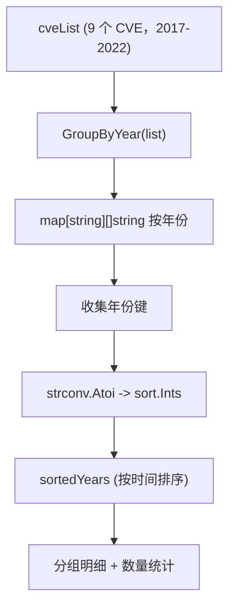

# 示例：按年份分组

:::tip 📂 查看源码
[`examples/12_group_by_year/main.go`](https://github.com/scagogogo/cve-skills/blob/main/examples/12_group_by_year/main.go) — 在 GitHub 上查看完整可运行示例。
:::

使用 `cve.GroupByYear` 把扁平的 CVE 列表按年份装进 `map[string][]string`，再对年份排序，输出按年分组明细和每年数量统计——趋势分析与按年组织漏洞报告的起点。

:::tip 🎯 学习目标
- 掌握 `cve.GroupByYear` 的函数签名与返回值（`map[string][]string`）
- 了解在 Go map 迭代顺序随机时如何对键（年份）做确定性排序
- 基于原始 CVE 列表构建按年分组明细与每年数量统计
:::

## 场景

漏洞管理团队维护着一份覆盖多个年份的知名 CVE 扁平列表——Log4Shell、Spring4Shell、Dirty Pipe、BlueKeep、EternalBlue 等。年度复盘时，他们需要把列表按年份组织：每一年单独列出本年的 CVE 及数量，并按时间顺序展示。由于 `GroupByYear` 返回的是 `map[string][]string`，年份键的迭代顺序是随机的，因此团队在打印前还会对键做数值排序——得到一份稳定的、按年排列的视图，可用于趋势分析、优先级排序与报告生成。

## 完整代码

```go
package main

import (
	"fmt"
	"sort"
	"strconv"

	"github.com/scagogogo/cve-skills"
)

func main() {
	fmt.Println("按年份分组CVE示例")
	// 预期输出:
	// 按年份分组CVE示例

	// 创建一个CVE列表
	cveList := []string{
		"CVE-2022-22965", // Spring4Shell
		"CVE-2021-44228", // Log4Shell
		"CVE-2020-1337",  // 2020年的CVE
		"CVE-2021-3156",  // Sudo漏洞
		"CVE-2022-0847",  // Dirty Pipe
		"CVE-2020-0601",  // Windows CryptoAPI
		"CVE-2019-0708",  // BlueKeep
		"CVE-2017-0144",  // EternalBlue
		"CVE-2022-42889", // Text4Shell
	}

	fmt.Println("原始CVE列表:")
	for i, id := range cveList {
		fmt.Printf("[%d] %s\n", i+1, id)
	}
	// 预期输出:
	// 原始CVE列表:
	// [1] CVE-2022-22965
	// [2] CVE-2021-44228
	// [3] CVE-2020-1337
	// [4] CVE-2021-3156
	// [5] CVE-2022-0847
	// [6] CVE-2020-0601
	// [7] CVE-2019-0708
	// [8] CVE-2017-0144
	// [9] CVE-2022-42889

	// 按年份分组
	groupedCves := cve.GroupByYear(cveList)

	// 获取所有年份并排序，以便按年份顺序打印
	years := make([]string, 0, len(groupedCves))
	for year := range groupedCves {
		years = append(years, year)
	}

	// 转换为整数进行排序
	yearInts := make([]int, len(years))
	for i, year := range years {
		yearInt, _ := strconv.Atoi(year)
		yearInts[i] = yearInt
	}
	sort.Ints(yearInts)

	// 将排序后的整数年份转回字符串
	sortedYears := make([]string, len(yearInts))
	for i, yearInt := range yearInts {
		sortedYears[i] = strconv.Itoa(yearInt)
	}

	// 打印分组结果
	fmt.Println("\n按年份分组结果:")
	for _, year := range sortedYears {
		yearInt, _ := strconv.Atoi(year)
		fmt.Printf("%d年的CVE (%d个):\n", yearInt, len(groupedCves[year]))
		for i, id := range groupedCves[year] {
			fmt.Printf("  [%d] %s\n", i+1, id)
		}
	}
	// 预期输出:
	// 按年份分组结果:
	// 2017年的CVE (1个):
	//   [1] CVE-2017-0144
	// 2019年的CVE (1个):
	//   [1] CVE-2019-0708
	// 2020年的CVE (2个):
	//   [1] CVE-2020-0601
	//   [2] CVE-2020-1337
	// 2021年的CVE (2个):
	//   [1] CVE-2021-3156
	//   [2] CVE-2021-44228
	// 2022年的CVE (3个):
	//   [1] CVE-2022-0847
	//   [2] CVE-2022-22965
	//   [3] CVE-2022-42889

	// 示例：统计每年的CVE数量
	fmt.Println("\n每年CVE数量统计:")
	for _, year := range sortedYears {
		yearInt, _ := strconv.Atoi(year)
		fmt.Printf("%d年: %d个CVE\n", yearInt, len(groupedCves[year]))
	}
	// 预期输出:
	// 每年CVE数量统计:
	// 2017年: 1个CVE
	// 2019年: 1个CVE
	// 2020年: 2个CVE
	// 2021年: 2个CVE
	// 2022年: 3个CVE

	// 应用场景
	fmt.Println("\n应用场景示例:")
	fmt.Println("1. 漏洞趋势分析：对比不同年份的CVE数量和类型")
	fmt.Println("2. 漏洞响应优先级：优先处理最近年份的CVE")
	fmt.Println("3. 报告生成：按年份组织CVE列表，生成漏洞报告")
	// 预期输出:
	// 应用场景示例:
	// 1. 漏洞趋势分析：对比不同年份的CVE数量和类型
	// 2. 漏洞响应优先级：优先处理最近年份的CVE
	// 3. 报告生成：按年份组织CVE列表，生成漏洞报告
}
```

## 运行方式

```bash
cd examples/12_group_by_year && go run main.go
```

## 预期输出

```text
按年份分组CVE示例
原始CVE列表:
[1] CVE-2022-22965
[2] CVE-2021-44228
[3] CVE-2020-1337
[4] CVE-2021-3156
[5] CVE-2022-0847
[6] CVE-2020-0601
[7] CVE-2019-0708
[8] CVE-2017-0144
[9] CVE-2022-42889

按年份分组结果:
2017年的CVE (1个):
  [1] CVE-2017-0144
2019年的CVE (1个):
  [1] CVE-2019-0708
2020年的CVE (2个):
  [1] CVE-2020-0601
  [2] CVE-2020-1337
2021年的CVE (2个):
  [1] CVE-2021-3156
  [2] CVE-2021-44228
2022年的CVE (3个):
  [1] CVE-2022-0847
  [2] CVE-2022-22965
  [3] CVE-2022-42889

每年CVE数量统计:
2017年: 1个CVE
2019年: 1个CVE
2020年: 2个CVE
2021年: 2个CVE
2022年: 3个CVE

应用场景示例:
1. 漏洞趋势分析：对比不同年份的CVE数量和类型
2. 漏洞响应优先级：优先处理最近年份的CVE
3. 报告生成：按年份组织CVE列表，生成漏洞报告
```

## 代码讲解

示例从一个扁平的 `cveList` 起步，包含九个知名 CVE，年份互相穿插（2022、2021、2020、2021、2022、2020、2019、2017、2022），分组的必要性一目了然。

- 📋 **打印原始列表** — 第一个循环用 `fmt.Printf("[%d] %s\n", i+1, id)` 给 CVE 编号 `1..9`，展示未分组、乱序的输入。
- ▶️ **按年份分组** — `cve.GroupByYear(cveList)` 遍历切片、提取每个年份，返回一个 `map[string][]string`，把年份字符串（例如 `"2022"`）映射到该年份下的 CVE，且保持原始相对顺序。
- 💡 **对年份键排序** — Go map 迭代顺序是随机的，因此把年份收集到 `years` 切片，用 `strconv.Atoi` 解析为整数，用 `sort.Ints` 排序，再用 `strconv.Itoa` 转回字符串存入 `sortedYears`，保证按时间顺序、确定的输出。
- 🔗 **渲染分组视图** — 循环遍历 `sortedYears`；对每个年份打印表头（`%d年的CVE (%d个):`），数量取自 `len(groupedCves[year])`，随后把每个 CVE 缩进列在下方。
- 📋 **每年数量统计** — 对 `sortedYears` 再做一次遍历，每年打印一行紧凑的 `%d年: %d个CVE`，把分组 map 转成一张速览趋势表。
- 💡 **应用场景** — 末尾三行 `fmt.Println` 重申了三种动机：跨年份的趋势分析、优先处理近期 CVE、按年组织报告。



## 涉及函数

- [GroupByYear](/zh/api/functions/group-by-year) — 本示例使用的函数
- [CountByYear](/zh/api/functions/count-by-year) — 只统计每年 CVE 数量，不收集 ID
- [ExtractCveYear](/zh/api/functions/extract-cve-year) — 从单个 CVE 提取年份字符串
- [FilterCvesByYear](/zh/api/functions/filter-cves-by-year) — 分组前先把列表收窄到某一年
- [SortCves](/zh/api/functions/sort-cves) — 把列表展平为按时间排序的切片，而非分组

## 扩展练习

- 🎯 加入一个重复条目（例如第二个 `CVE-2022-22965`），观察 `GroupByYear` 如何把两份都放进 2022 桶；先配合 `RemoveDuplicateCves` 去重再看结果。
- 🎯 插入一个非法字符串（例如 `"not-a-cve"`），确认它被静默丢弃——每年数量不变，也不会出现新的年份桶。
- 🎯 分组后把 `GroupByYear` 与 `FilterCvesByYearRange` 组合，只渲染 2020–2022 的桶，并与完整列表对比数量。
