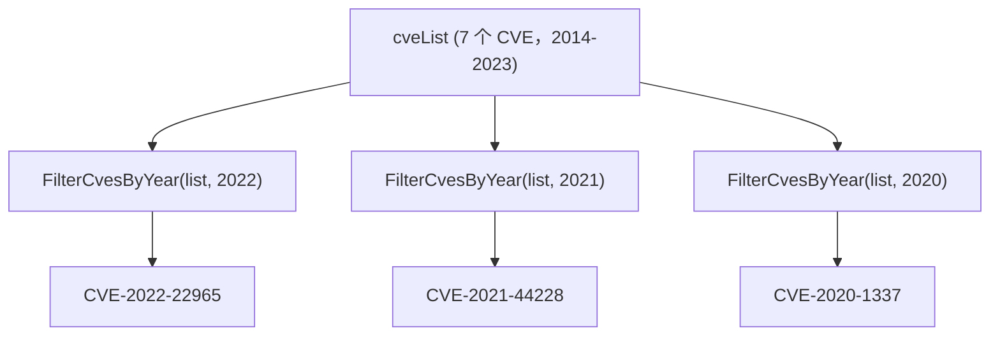

# 示例：按年份筛选

:::tip 📂 查看源码
[`examples/13_filter_by_year/main.go`](https://github.com/scagogogo/cve-skills/blob/main/examples/13_filter_by_year/main.go) — 在 GitHub 上查看完整可运行示例。
:::

使用 `cve.FilterCvesByYear` 快速把混杂的 CVE 列表收敛到指定年份。这是按年份做趋势分析或合规范围划定时，隔离某一年全部 CVE 的最快方式。

:::tip 🎯 学习目标
- 掌握 `cve.FilterCvesByYear` 的函数签名与行为
- 了解非 CVE 字符串与不匹配年份如何被自动过滤
- 构建面向安全分析工作流的按年份 CVE 视图
:::

## 场景

安全团队维护着一份从多个来源汇总的原始 CVE 标识符列表，跨越多个年份。在年度复盘时，他们需要把某一年披露的全部 CVE 单独抽出来分析（例如 2021 年，即 Log4Shell 披露的年份）。`FilterCvesByYear` 接收完整列表和目标年份，只返回匹配的 CVE，并自动忽略任何非合法 CVE 标识符的字符串。

## 完整代码

```go
package main

import (
	"fmt"

	"github.com/scagogogo/cve-skills"
)

func main() {
	fmt.Println("按年份筛选CVE示例")
	// 预期输出:
	// 按年份筛选CVE示例

	// 创建一个包含不同年份CVE的列表
	cveList := []string{
		"CVE-2022-22965", // Spring4Shell
		"CVE-2021-44228", // Log4Shell
		"CVE-2020-1337",  // 2020年的CVE
		"CVE-2019-0708",  // BlueKeep
		"CVE-2017-0144",  // EternalBlue
		"CVE-2014-0160",  // Heartbleed
		"CVE-2023-9999",  // 2023年的CVE
	}

	fmt.Println("原始CVE列表:")
	for i, id := range cveList {
		fmt.Printf("[%d] %s\n", i+1, id)
	}
	// 预期输出:
	// 原始CVE列表:
	// [1] CVE-2022-22965
	// [2] CVE-2021-44228
	// [3] CVE-2020-1337
	// [4] CVE-2019-0708
	// [5] CVE-2017-0144
	// [6] CVE-2014-0160
	// [7] CVE-2023-9999

	// 筛选2022年的CVE
	cves2022 := cve.FilterCvesByYear(cveList, 2022)
	fmt.Println("\n2022年的CVE:")
	for i, id := range cves2022 {
		fmt.Printf("[%d] %s\n", i+1, id)
	}
	// 预期输出:
	// 2022年的CVE:
	// [1] CVE-2022-22965

	// 筛选2021年的CVE
	cves2021 := cve.FilterCvesByYear(cveList, 2021)
	fmt.Println("\n2021年的CVE:")
	for i, id := range cves2021 {
		fmt.Printf("[%d] %s\n", i+1, id)
	}
	// 预期输出:
	// 2021年的CVE:
	// [1] CVE-2021-44228

	// 筛选2020年的CVE
	cves2020 := cve.FilterCvesByYear(cveList, 2020)
	fmt.Println("\n2020年的CVE:")
	for i, id := range cves2020 {
		fmt.Printf("[%d] %s\n", i+1, id)
	}
	// 预期输出:
	// 2020年的CVE:
	// [1] CVE-2020-1337

	// 应用场景示例
	fmt.Println("\n应用场景示例 - 安全分析:")
	fmt.Println("安全团队需要对特定年份的CVE进行单独分析")
	fmt.Println("例如分析2021年的Log4Shell漏洞及相关CVE")
	// 预期输出:
	// 应用场景示例 - 安全分析:
	// 安全团队需要对特定年份的CVE进行单独分析
	// 例如分析2021年的Log4Shell漏洞及相关CVE

	// 注意事项
	fmt.Println("\n注意事项:")
	fmt.Println("1. 年份必须是有效的CVE年份(1999年至今)")
	fmt.Println("2. 非CVE格式的字符串会被自动过滤")
	fmt.Println("3. 年份不匹配的CVE会被过滤掉")
	// 预期输出:
	// 注意事项:
	// 1. 年份必须是有效的CVE年份(1999年至今)
	// 2. 非CVE格式的字符串会被自动过滤
	// 3. 年份不匹配的CVE会被过滤掉
}
```

## 运行方式

```bash
cd examples/13_filter_by_year && go run main.go
```

## 预期输出

```text
按年份筛选CVE示例
原始CVE列表:
[1] CVE-2022-22965
[2] CVE-2021-44228
[3] CVE-2020-1337
[4] CVE-2019-0708
[5] CVE-2017-0144
[6] CVE-2014-0160
[7] CVE-2023-9999

2022年的CVE:
[1] CVE-2022-22965

2021年的CVE:
[1] CVE-2021-44228

2020年的CVE:
[1] CVE-2020-1337

应用场景示例 - 安全分析:
安全团队需要对特定年份的CVE进行单独分析
例如分析2021年的Log4Shell漏洞及相关CVE

注意事项:
1. 年份必须是有效的CVE年份(1999年至今)
2. 非CVE格式的字符串会被自动过滤
3. 年份不匹配的CVE会被过滤掉
```

## 代码讲解

示例先构造了一个 `cveList`，包含 2014 到 2023 的七个 CVE，每个都用其广为人知的名字注释（Spring4Shell、Log4Shell、BlueKeep、EternalBlue、Heartbleed 等）。

- 📋 **构造源列表** —— `cveList` 故意混合多个年份，让筛选有内容可收敛。先打印该切片，让输入顺序一目了然。
- ▶️ **按年份筛选** —— 分别以 `2022`、`2021`、`2020` 调用三次 `cve.FilterCvesByYear(cveList, year)`。每次调用都返回一个新切片，只含年份段与目标匹配的 CVE。
- 💡 **自动清理** —— 非合法 CVE 标识符的字符串在筛选时会被丢弃，因此无需预先清洗输入。
- 🔗 **场景与注意事项** —— 结尾的 `fmt.Println` 展示了一个真实的安全分析用例，并提醒读者有效年份范围（1999 年至今）。



## 涉及函数

- [FilterCvesByYear](/zh/api/functions/filter-cves-by-year) —— 本示例使用的函数
- [FilterCvesByYearRange](/zh/api/functions/filter-cves-by-year-range) —— 按年份区间筛选而非单一年份
- [FilterCvesByPattern](/zh/api/functions/filter-cves-by-pattern) —— 按正则模式筛选
- [FilterValidCves](/zh/api/functions/filter-valid-cves) —— 只保留合法的 CVE 标识符
- [GroupByYear](/zh/api/functions/group-by-year) —— 按年份分组而非筛选

## 扩展练习

- 🎯 在 `cveList` 中加入一个非 CVE 字符串（例如 `"CVE-2021-44228-xxx"`），验证它从所有结果中被丢弃。
- 🎯 用一次覆盖 2019–2021 的 `FilterCvesByYearRange` 调用替换单年份调用，对比输出。
- 🎯 把 `FilterCvesByYear` 与 `GroupByYear` 组合，先隔离 2021 年再按 CVE 前缀细分。
