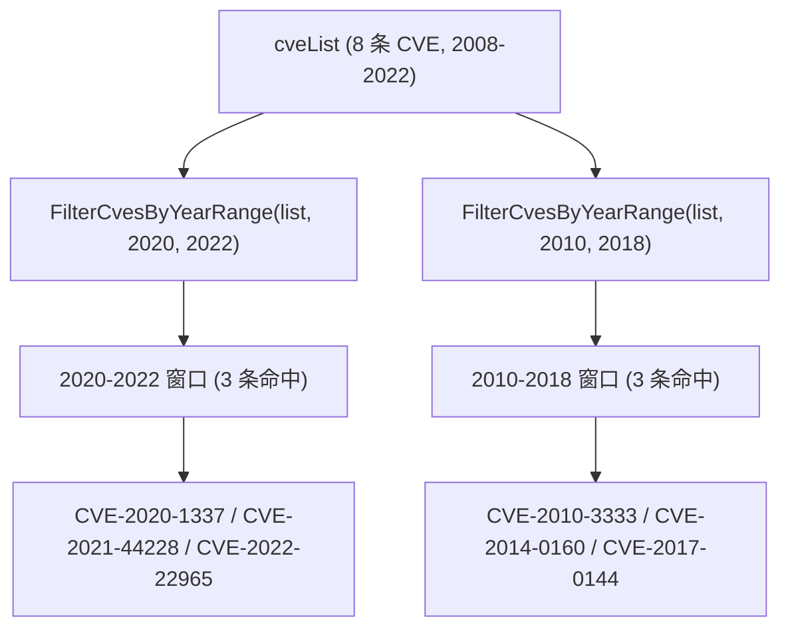

# 示例：年份范围筛选

:::tip 📂 查看源码
[`examples/14_filter_by_year_range/main.go`](https://github.com/scagogogo/cve-skills/blob/main/examples/14_filter_by_year_range/main.go) — 在 GitHub 上查看完整可运行示例。
:::

用 `cve.FilterCvesByYearRange` 把跨多年的 CVE 列表收窄到一个闭合年份窗口。当你需要从一份累积的 CVE 数据源中提取某个报告期（财年、季度、多年合规范围）内发布的全部 CVE 时，这是最自然的选择。

:::tip 🎯 学习目标
- 掌握 `cve.FilterCvesByYearRange` 的函数签名与闭区间行为
- 了解非法字符串与年份不在区间内的 CVE 如何在筛选时被静默丢弃
- 构建一个按年份窗口划分的 CVE 视图，用于趋势分析与合规检查
:::

## 场景

某安全运营中心维护着一份逐年累积的 CVE 列表，从早期披露的 Conficker（2008）、Heartbleed（2014）一直到较新的 Spring4Shell（2022）。在年度评审中，他们需要提取年份落在某个闭合窗口内的全部 CVE，例如先取 2020–2022，再取 2010–2018 用于遗留系统审计。`FilterCvesByYearRange` 接收完整列表外加 `startYear` 与 `endYear`（两端均含），只返回匹配的 CVE，任何不是合法 CVE 标识符的字符串都会被忽略。

## 完整代码

```go
package main

import (
	"fmt"

	"github.com/scagogogo/cve-skills"
)

func main() {
	fmt.Println("按年份区间筛选CVE示例")
	// 预期输出:
	// 按年份区间筛选CVE示例

	// 创建一个包含不同年份CVE的列表
	cveList := []string{
		"CVE-2022-22965", // Spring4Shell
		"CVE-2021-44228", // Log4Shell
		"CVE-2020-1337",  // 2020年的CVE
		"CVE-2019-0708",  // BlueKeep
		"CVE-2017-0144",  // EternalBlue
		"CVE-2014-0160",  // Heartbleed
		"CVE-2010-3333",  // RTF Stack Buffer Overflow
		"CVE-2008-4250",  // Conficker
	}

	fmt.Println("原始CVE列表:")
	for i, id := range cveList {
		fmt.Printf("[%d] %s\n", i+1, id)
	}
	// 预期输出:
	// 原始CVE列表:
	// [1] CVE-2022-22965
	// [2] CVE-2021-44228
	// [3] CVE-2020-1337
	// [4] CVE-2019-0708
	// [5] CVE-2017-0144
	// [6] CVE-2014-0160
	// [7] CVE-2010-3333
	// [8] CVE-2008-4250

	// 筛选2020-2022年的CVE
	startYear := 2020
	endYear := 2022
	filteredCves := cve.FilterCvesByYearRange(cveList, startYear, endYear)

	fmt.Printf("\n%d-%d年的CVE:\n", startYear, endYear)
	for i, id := range filteredCves {
		fmt.Printf("[%d] %s\n", i+1, id)
	}
	// 预期输出:
	// 2020-2022年的CVE:
	// [1] CVE-2020-1337
	// [2] CVE-2021-44228
	// [3] CVE-2022-22965

	// 筛选2010-2018年的CVE
	startYear = 2010
	endYear = 2018
	filteredCves = cve.FilterCvesByYearRange(cveList, startYear, endYear)

	fmt.Printf("\n%d-%d年的CVE:\n", startYear, endYear)
	for i, id := range filteredCves {
		fmt.Printf("[%d] %s\n", i+1, id)
	}
	// 预期输出:
	// 2010-2018年的CVE:
	// [1] CVE-2010-3333
	// [2] CVE-2014-0160
	// [3] CVE-2017-0144

	// 应用场景示例
	fmt.Println("\n应用场景示例:")
	fmt.Println("1. 安全漏洞分析：分析特定时间范围内发布的CVE")
	fmt.Println("2. 合规性检查：检查系统是否受到特定年份范围内发布的CVE影响")
	fmt.Println("3. 趋势分析：分析不同年份区间CVE的数量和类型变化")
	// 预期输出:
	// 应用场景示例:
	// 1. 安全漏洞分析：分析特定时间范围内发布的CVE
	// 2. 合规性检查：检查系统是否受到特定年份范围内发布的CVE影响
	// 3. 趋势分析：分析不同年份区间CVE的数量和类型变化

	// 注意事项
	fmt.Println("\n注意事项:")
	fmt.Println("1. 年份范围包含起始年和结束年")
	fmt.Println("2. 如果开始年份大于结束年份，函数会返回空列表")
	fmt.Println("3. 筛选的年份必须在有效的CVE年份范围内(1999年至今)")
	// 预期输出:
	// 注意事项:
	// 1. 年份范围包含起始年和结束年
	// 2. 如果开始年份大于结束年份，函数会返回空列表
	// 3. 筛选的年份必须在有效的CVE年份范围内(1999年至今)
}
```

## 运行方式

```bash
cd examples/14_filter_by_year_range && go run main.go
```

## 预期输出

```text
按年份区间筛选CVE示例
原始CVE列表:
[1] CVE-2022-22965
[2] CVE-2021-44228
[3] CVE-2020-1337
[4] CVE-2019-0708
[5] CVE-2017-0144
[6] CVE-2014-0160
[7] CVE-2010-3333
[8] CVE-2008-4250

2020-2022年的CVE:
[1] CVE-2020-1337
[2] CVE-2021-44228
[3] CVE-2022-22965

2010-2018年的CVE:
[1] CVE-2010-3333
[2] CVE-2014-0160
[3] CVE-2017-0144

应用场景示例:
1. 安全漏洞分析：分析特定时间范围内发布的CVE
2. 合规性检查：检查系统是否受到特定年份范围内发布的CVE影响
3. 趋势分析：分析不同年份区间CVE的数量和类型变化

注意事项:
1. 年份范围包含起始年和结束年
2. 如果开始年份大于结束年份，函数会返回空列表
3. 筛选的年份必须在有效的CVE年份范围内(1999年至今)
```

## 代码讲解

示例先构造一个包含 8 条 CVE 的 `cveList`，年份从 2008 跨到 2022，每条都用其知名名称标注（Spring4Shell、Log4Shell、BlueKeep、EternalBlue、Heartbleed、2010 年 RTF 栈缓冲区溢出、Conficker）。

- 📋 **构造源列表** — `cveList` 故意混入多个年份，让区间筛选有内容可收窄。先打印整个切片，让输入顺序一目了然。
- ▶️ **按闭合年份窗口筛选** — `cve.FilterCvesByYearRange(cveList, startYear, endYear)` 被调用两次，第一次是 `(2020, 2022)`，第二次是 `(2010, 2018)`。每次都返回一个新切片，只包含年份落在闭区间 `[startYear, endYear]` 内的 CVE。
- 💡 **两端均含** — 起止年份都计入，所以 `(2020, 2022)` 保留 2020、2021、2022 三年的 CVE。当 `startYear == endYear` 时退化为单年筛选。
- 🔗 **场景与注意事项** — 末尾的 `fmt.Println` 列出真实使用场景（安全漏洞分析、合规性检查、趋势分析），并提醒读者：区间为闭区间；反向区间（`startYear > endYear`）会返回空列表；年份必须落在合法 CVE 年份范围（1999 年至今）内。



## 涉及函数

- [FilterCvesByYearRange](/zh/api/functions/filter-cves-by-year-range) — 本示例使用的函数
- [FilterCvesByYear](/zh/api/functions/filter-cves-by-year) — 按单个年份而非区间筛选
- [GetRecentCves](/zh/api/functions/get-recent-cves) — 筛选最近 N 年的 CVE（基于本函数封装）
- [GroupByYear](/zh/api/functions/group-by-year) — 按年份分组而非筛选
- [CountByYear](/zh/api/functions/count-by-year) — 按年份统计 CVE 数量，用于趋势分析

## 扩展练习

- 🎯 加入一个反向区间，例如 `(2022, 2020)`，确认函数返回空切片。
- 🎯 向 `cveList` 插入一个非法字符串如 `"CVE-2021-44228-xxx"`，验证它会在每个区间结果中被静默丢弃。
- 🎯 将 `FilterCvesByYearRange(list, 2019, 2022)` 与 `SortCves` 串联，得到一份严格按年份升序、序号升序排列的 CVE 列表用于报告。
