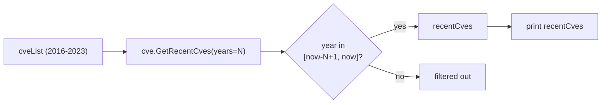

# 示例：最近 N 年 CVE

:::tip 📂 查看源码
[`examples/15_get_recent_cves/main.go`](https://github.com/scagogogo/cve-skills/blob/main/examples/15_get_recent_cves/main.go) — 在 GitHub 上查看完整可运行示例。
:::

从一个 CVE 列表中筛选出最近 N 年内发布的 CVE，让你专注于当下最需要关注的漏洞。

:::tip 🎯 学习目标

- 使用 `cve.GetRecentCves` 只保留最近 N 年的 CVE。
- 理解年份窗口是基于当前时间动态计算的。
- 将结果与漏洞响应优先级、态势感知、合规检查结合使用。

:::

## 场景

你维护着一份横跨多年的漏洞 backlog——Log4Shell、BlueKeep、EternalBlue，以及今年新批次。可分配的处置时间有限，因此你只想先暴露最近 1-3 年的 CVE：这些更可能在野外被利用，也更贴近当前攻击面。`GetRecentCves` 接收一组 CVE ID 和一个年数，返回年份落在「以当前年份为终点的滚动窗口」内的那些 CVE。

## 完整代码

```go
package main

import (
	"fmt"
	"time"

	"github.com/scagogogo/cve-skills"
)

func main() {
	fmt.Println("获取最近几年的CVE示例")
	// 预期输出:
	// 获取最近几年的CVE示例

	// 创建一个包含多个年份CVE的列表
	cveList := []string{
		"CVE-2023-22965", // 今年的CVE
		"CVE-2022-1111",  // 去年的CVE
		"CVE-2021-44228", // Log4Shell (2年前)
		"CVE-2020-1337",  // 3年前的CVE
		"CVE-2019-0708",  // BlueKeep (4年前)
		"CVE-2018-1000",  // 5年前的CVE
		"CVE-2017-0144",  // EternalBlue (6年前)
		"CVE-2016-0123",  // 7年前的CVE
	}

	fmt.Println("原始CVE列表:")
	for i, id := range cveList {
		fmt.Printf("[%d] %s\n", i+1, id)
	}
	// 预期输出:
	// 原始CVE列表:
	// [1] CVE-2023-22965
	// [2] CVE-2022-1111
	// [3] CVE-2021-44228
	// [4] CVE-2020-1337
	// [5] CVE-2019-0708
	// [6] CVE-2018-1000
	// [7] CVE-2017-0144
	// [8] CVE-2016-0123

	// 获取最近1年的CVE
	years := 1
	recentCves := cve.GetRecentCves(cveList, years)
	fmt.Printf("\n最近%d年的CVE (包含%d年):\n", years, time.Now().Year())
	for i, id := range recentCves {
		fmt.Printf("[%d] %s\n", i+1, id)
	}
	currentYear := time.Now().Year()
	// 预期输出:
	// 最近1年的CVE (包含2023年):
	// [1] CVE-2023-22965

	// 获取最近2年的CVE
	years = 2
	recentCves = cve.GetRecentCves(cveList, years)
	fmt.Printf("\n最近%d年的CVE (包含%d-%d年):\n", years, currentYear-years+1, currentYear)
	for i, id := range recentCves {
		fmt.Printf("[%d] %s\n", i+1, id)
	}
	// 预期输出:
	// 最近2年的CVE (包含2022-2023年):
	// [1] CVE-2022-1111
	// [2] CVE-2023-22965

	// 获取最近3年的CVE
	years = 3
	recentCves = cve.GetRecentCves(cveList, years)
	fmt.Printf("\n最近%d年的CVE (包含%d-%d年):\n", years, currentYear-years+1, currentYear)
	for i, id := range recentCves {
		fmt.Printf("[%d] %s\n", i+1, id)
	}
	// 预期输出:
	// 最近3年的CVE (包含2021-2023年):
	// [1] CVE-2021-44228
	// [2] CVE-2022-1111
	// [3] CVE-2023-22965

	// 应用场景示例
	fmt.Println("\n应用场景示例:")
	fmt.Println("1. 漏洞响应优先级 - 优先修复最近几年的漏洞")
	fmt.Println("2. 安全态势感知 - 分析最近一段时间内的CVE趋势")
	fmt.Println("3. 合规性检查 - 检查系统是否受到最近发布的高危CVE影响")
	// 预期输出:
	// 应用场景示例:
	// 1. 漏洞响应优先级 - 优先修复最近几年的漏洞
	// 2. 安全态势感知 - 分析最近一段时间内的CVE趋势
	// 3. 合规性检查 - 检查系统是否受到最近发布的高危CVE影响

	// 注意事项
	fmt.Println("\n注意事项:")
	fmt.Println("1. 函数会自动基于当前时间计算年份范围")
	fmt.Println("2. 包含参数指定的年数(包括当前年份)")
	fmt.Println("3. 结果会按照CVE的标准格式返回")
	// 预期输出:
	// 注意事项:
	// 1. 函数会自动基于当前时间计算年份范围
	// 2. 包含参数指定的年数(包括当前年份)
	// 3. 结果会按照CVE的标准格式返回
}

// 辅助函数：打印CVE列表
func printCveList(list []string) {
	for i, id := range list {
		fmt.Printf("[%d] %s\n", i+1, id)
	}
}
```

## 运行方式

```bash
cd examples/15_get_recent_cves && go run main.go
```

## 预期输出

年份窗口在运行时基于当前时间动态计算。下方输出是源码注释中记录的快照（编写时当前年份为 2023）；今天运行会看到窗口整体前移。

```text
获取最近几年的CVE示例
原始CVE列表:
[1] CVE-2023-22965
[2] CVE-2022-1111
[3] CVE-2021-44228
[4] CVE-2020-1337
[5] CVE-2019-0708
[6] CVE-2018-1000
[7] CVE-2017-0144
[8] CVE-2016-0123

最近1年的CVE (包含2023年):
[1] CVE-2023-22965

最近2年的CVE (包含2022-2023年):
[1] CVE-2022-1111
[2] CVE-2023-22965

最近3年的CVE (包含2021-2023年):
[1] CVE-2021-44228
[2] CVE-2022-1111
[3] CVE-2023-22965

应用场景示例:
1. 漏洞响应优先级 - 优先修复最近几年的漏洞
2. 安全态势感知 - 分析最近一段时间内的CVE趋势
3. 合规性检查 - 检查系统是否受到最近发布的高危CVE影响

注意事项:
1. 函数会自动基于当前时间计算年份范围
2. 包含参数指定的年数(包括当前年份)
3. 结果会按照CVE的标准格式返回
```

## 代码讲解

📋 **构造输入列表。** `cveList` 混合了 2016 至 2023 共 8 个 CVE，包含若干知名漏洞（Log4Shell、BlueKeep、EternalBlue）。刻意拉开年份跨度，让过滤器有内容可裁剪。

▶️ **调用 `cve.GetRecentCves(cveList, years)`。** 函数用 `time.Now().Year()` 读取当前年份，构造闭区间 `[currentYear-years+1, currentYear]`，从每个 CVE ID 中解析出年份，只保留落在窗口内的项，结果以 CVE 标准格式返回。

💡 **将 `years` 从 1 调到 3。** `years=1` 时仅当前年份的 CVE 保留；`years=2` 补上一年；`years=3` 再往前推一年。BlueKeep（2019）、EternalBlue（2017）这类更早的条目要等 `years` 足够大才会重新出现。

🔗 **留意滚动窗口。** 窗口锚定在 `time.Now()`，因此同一调用在不同日历年会产生不同结果。源码注释记录的是 2023 年的快照，重新运行可看到窗口向前滑动。



## 涉及函数

- [GetRecentCves](/zh/api/functions/get-recent-cves)

## 扩展练习

- 筛选最近 5 年的 CVE，确认 BlueKeep（2019）与 EternalBlue（2017）出现在结果中。
- 将 `cve.GetRecentCves` 与 `cve.SortCves` 串联，按升序打印最近 CVE。
- 生成一份并排报告：最近一年的 CVE，以及超过 5 年的老 CVE。
