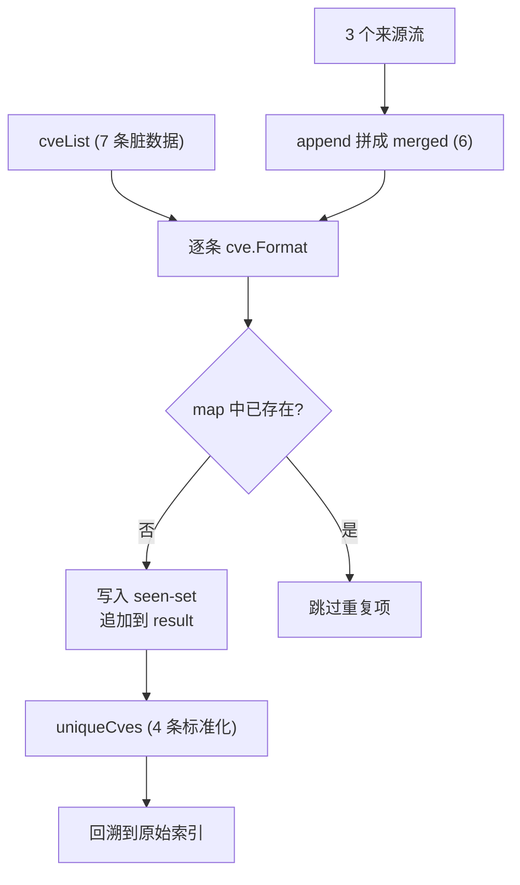

# 示例：去重

:::tip 📂 查看源码
[`examples/16_remove_duplicate_cves/main.go`](https://github.com/scagogogo/cve-skills/blob/main/examples/16_remove_duplicate_cves/main.go) — 在 GitHub 上查看完整可运行示例。
:::

从一个 CVE 列表中去除大小写不敏感、容忍首尾空格的重复项，只保留首次出现且已标准化的版本。

:::tip 🎯 学习目标

- 使用 `cve.RemoveDuplicateCves` 对 CVE 列表做大小写不敏感的去重。
- 理解比较发生在标准化（大写、去空格）形式上，结果只保留首次出现。
- 将其用于合并多个来源采集到的 CVE，得到一份干净集合。

:::

## 场景

你从多个来源汇聚 CVE——扫描器、SBOM、人工工单、厂商公告。同一个漏洞会重复出现：一次是 `CVE-2022-1111`，一次来自全小写的订阅流 `cve-2022-1111`，一次带多余空格 ` CVE-2021-3333 `。在分类处置或上报前，你需要一份没有重复的干净列表。`RemoveDuplicateCves` 把每条标准化（大写、去空格）后只保留首次出现，返回标准化后的列表。

## 完整代码

```go
package main

import (
	"fmt"

	"github.com/scagogogo/cve-skills"
)

func main() {
	fmt.Println("去除重复CVE示例")

	// 创建一个包含重复CVE的列表
	cveList := []string{
		"CVE-2022-1111",
		"cve-2022-1111", // 与第一个相同，但大小写不同
		"CVE-2022-2222",
		"CVE-2021-3333",
		"CVE-2022-2222",   // 与第三个完全相同
		" CVE-2021-3333 ", // 与第四个相同，但有空格
		"CVE-2020-4444",
	}

	fmt.Println("原始CVE列表:")
	for i, id := range cveList {
		fmt.Printf("[%d] %q\n", i+1, id)
	}

	// 去除重复的CVE
	uniqueCves := cve.RemoveDuplicateCves(cveList)

	fmt.Println("\n去重后的CVE列表:")
	for i, id := range uniqueCves {
		fmt.Printf("[%d] %s\n", i+1, id)
	}

	// 演示时显示每个去重后CVE的来源
	fmt.Println("\n去重效果分析:")

	// 创建映射表示原始索引
	originalIndices := make(map[string][]int)
	for i, id := range cveList {
		formattedID := cve.Format(id)
		originalIndices[formattedID] = append(originalIndices[formattedID], i+1)
	}

	// 显示每个去重后的CVE来自哪些原始项
	for i, id := range uniqueCves {
		indices := originalIndices[id]
		indicesStr := ""
		for j, idx := range indices {
			if j > 0 {
				indicesStr += ", "
			}
			indicesStr += fmt.Sprintf("%d", idx)
		}
		fmt.Printf("[%d] %s - 来自原始列表中的第 %s 项\n", i+1, id, indicesStr)
	}

	// 应用场景示例
	fmt.Println("\n应用场景示例 - 合并多个来源的CVE:")

	// 模拟来自不同来源的CVE列表
	source1 := []string{"CVE-2022-1111", "CVE-2022-2222"}
	source2 := []string{"cve-2022-1111", "CVE-2022-3333"}
	source3 := []string{"CVE-2022-4444", "CVE-2022-2222"}

	fmt.Println("来源1的CVE:", source1)
	fmt.Println("来源2的CVE:", source2)
	fmt.Println("来源3的CVE:", source3)

	// 合并所有来源
	merged := make([]string, 0)
	merged = append(merged, source1...)
	merged = append(merged, source2...)
	merged = append(merged, source3...)

	fmt.Println("\n合并后的CVE列表:")
	for i, id := range merged {
		fmt.Printf("[%d] %s\n", i+1, id)
	}

	// 去重
	uniqueMerged := cve.RemoveDuplicateCves(merged)

	fmt.Println("\n合并并去重后的CVE列表:")
	for i, id := range uniqueMerged {
		fmt.Printf("[%d] %s\n", i+1, id)
	}
	fmt.Printf("\n总计: 从%d个条目中提取出%d个唯一的CVE\n",
		len(merged), len(uniqueMerged))
}
```

## 运行方式

```bash
cd examples/16_remove_duplicate_cves && go run main.go
```

## 预期输出

```text
去除重复CVE示例
原始CVE列表:
[1] "CVE-2022-1111"
[2] "cve-2022-1111"
[3] "CVE-2022-2222"
[4] "CVE-2021-3333"
[5] "CVE-2022-2222"
[6] " CVE-2021-3333 "
[7] "CVE-2020-4444"

去重后的CVE列表:
[1] CVE-2022-1111
[2] CVE-2022-2222
[3] CVE-2021-3333
[4] CVE-2020-4444

去重效果分析:
[1] CVE-2022-1111 - 来自原始列表中的第 1, 2 项
[2] CVE-2022-2222 - 来自原始列表中的第 3, 5 项
[3] CVE-2021-3333 - 来自原始列表中的第 4, 6 项
[4] CVE-2020-4444 - 来自原始列表中的第 7 项

应用场景示例 - 合并多个来源的CVE:
来源1的CVE: [CVE-2022-1111 CVE-2022-2222]
来源2的CVE: [cve-2022-1111 CVE-2022-3333]
来源3的CVE: [CVE-2022-4444 CVE-2022-2222]

合并后的CVE列表:
[1] CVE-2022-1111
[2] CVE-2022-2222
[3] cve-2022-1111
[4] CVE-2022-3333
[5] CVE-2022-4444
[6] CVE-2022-2222

合并并去重后的CVE列表:
[1] CVE-2022-1111
[2] CVE-2022-2222
[3] CVE-2022-3333
[4] CVE-2022-4444

总计: 从6个条目中提取出4个唯一的CVE
```

## 代码讲解

📋 **构造含脏重复的列表。** `cveList` 共 7 条，但真正独立的只有 4 个。重复项以大小写变体（`cve-2022-1111`）、完全重复（`CVE-2022-2222`）、首尾带空格（` CVE-2021-3333 `）三种形式混入。打印循环用 `%q` 让空格和大小写一目了然。

▶️ **调用 `cve.RemoveDuplicateCves(cveList)`。** 函数遍历每条，先用 `cve.Format` 标准化（大写、去空格），再用 `map[string]struct{}` 当已见集合。某标准化形式首次出现就追加到结果，之后再次出现一律丢弃。返回值始终是标准化格式。

💡 **把每个幸存者回溯到来源。** 第二趟构建 `originalIndices`，用 `cve.Format(id)` 把每个原始位置归并到对应标准化形式。这能证明哪些输入塌缩成了同一个 CVE——例如 `CVE-2022-1111` 同时来自第 1 项（`CVE-2022-1111`）和第 2 项（`cve-2022-1111`）。

🔗 **合并多来源再去重。** 三个来源切片用 `append(merged, sourceN...)` 拼成 6 条带重叠的列表。一次 `cve.RemoveDuplicateCves(merged)` 即塌缩为 4 个唯一 CVE，最后的 `fmt.Printf` 汇报缩减比例（`从6个条目中提取出4个唯一的CVE`）。



## 涉及函数

- [RemoveDuplicateCves](/zh/api/functions/remove-duplicate-cves)
- [Format](/zh/api/functions/format)

## 扩展练习

- 输入一个每条都只是大小写不同的同一个 CVE 的列表，确认结果长度为 1。
- 将 `cve.RemoveDuplicateCves` 与 `cve.SortCves` 串联，按升序打印去重后的列表。
- 合并三个来源后，再把结果接到 `cve.GetRecentCves(_, 2)`，只保留近两年的唯一 CVE。
