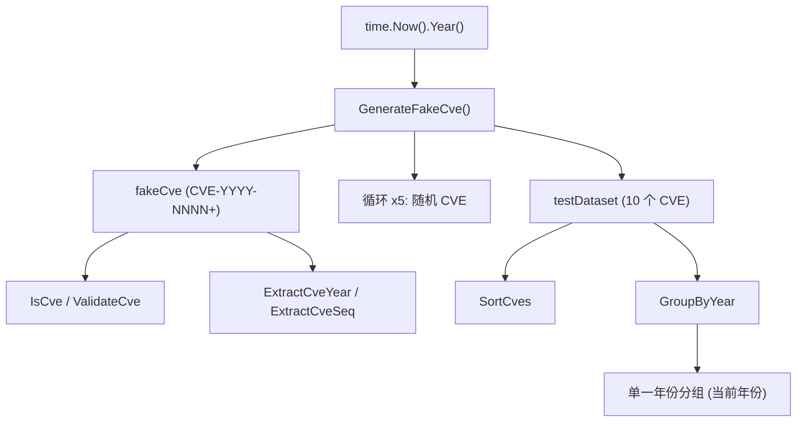

# 示例：生成假 CVE

:::tip 📂 查看源码
[`examples/18_generate_fake_cve/main.go`](https://github.com/scagogogo/cve-skills/blob/main/examples/18_generate_fake_cve/main.go) — 在 GitHub 上查看完整可运行示例。
:::

使用 `cve.GenerateFakeCve` 按需生成随机且格式合法的 CVE 编号。生成的值携带当前年份与一个随机序列号，非常适合用于测试夹具、单元测试和演示数据集。

:::tip 🎯 学习目标
- 理解 `cve.GenerateFakeCve` 的返回值，以及为何年份始终等于当前年份
- 用 `IsCve`、`ValidateCve`、`ExtractCveYear`、`ExtractCveSeq` 校验生成的 CVE
- 构建一个随机测试数据集，并对它执行 `SortCves` 与 `GroupByYear`
:::

## 场景

一位开发者正在为漏洞仪表板编写单元测试，需要一批看起来真实、且保证语法合法的 CVE 编号，但又不能与真实公告冲突。手工编写 CVE 容易出错，而复用真实 ID 又可能在上游关联引擎中触发误报。`cve.GenerateFakeCve` 解决了这个问题：每次调用都返回一个全新的 `CVE-<当前年份>-<随机序列号>`，它既能通过格式与校验检查，又明显是合成的标识符。

## 完整代码

```go
package main

import (
	"fmt"
	"time"

	"github.com/scagogogo/cve-skills"
)

func main() {
	fmt.Println("生成随机CVE编号示例")

	// 获取当前年份
	currentYear := time.Now().Year()
	fmt.Printf("当前年份: %d\n\n", currentYear)

	// 生成一个随机CVE
	fakeCve := cve.GenerateFakeCve()
	fmt.Printf("生成的随机CVE: %s\n", fakeCve)

	// 验证生成的CVE
	fmt.Printf("验证生成的CVE:\n")
	fmt.Printf("- 是否符合CVE格式: %v\n", cve.IsCve(fakeCve))
	fmt.Printf("- 是否有效的CVE: %v\n", cve.ValidateCve(fakeCve))

	// 提取并检查年份和序列号
	year := cve.ExtractCveYear(fakeCve)
	seq := cve.ExtractCveSeq(fakeCve)

	fmt.Printf("- 年份: %s (应该是当前年份 %d)\n", year, currentYear)
	fmt.Printf("- 序列号: %s (应该是一个5位以上的随机数)\n\n", seq)

	// 生成多个随机CVE以展示随机性
	fmt.Println("生成多个随机CVE:")

	count := 5
	for i := 0; i < count; i++ {
		id := cve.GenerateFakeCve()
		fmt.Printf("[%d] %s\n", i+1, id)
	}

	// 应用场景示例
	fmt.Println("\n应用场景示例 - 使用随机CVE进行测试:")
	fmt.Println("1. 创建测试数据集:")

	testDataset := make([]string, 10)
	for i := range testDataset {
		testDataset[i] = cve.GenerateFakeCve()
	}

	for i, id := range testDataset {
		fmt.Printf("  [%d] %s\n", i+1, id)
	}

	fmt.Println("\n2. 对测试数据集执行排序操作:")
	sortedData := cve.SortCves(testDataset)

	for i, id := range sortedData {
		fmt.Printf("  [%d] %s\n", i+1, id)
	}

	fmt.Println("\n3. 按年份分组 (所有CVE应该在同一组):")
	groupedData := cve.GroupByYear(testDataset)

	for year, ids := range groupedData {
		fmt.Printf("  %s年的CVE (%d个): %v\n", year, len(ids), ids)
	}
}
```

## 运行方式

```bash
cd examples/18_generate_fake_cve && go run main.go
```

## 预期输出

年份取自当前年份，序列号是随机生成的，因此每次运行的具体值都不同。下面的结构具有代表性。

```text
生成随机CVE编号示例
当前年份: 2026

生成的随机CVE: CVE-2026-12345
验证生成的CVE:
- 是否符合CVE格式: true
- 是否有效的CVE: true
- 年份: 2026 (应该是当前年份 2026)
- 序列号: 12345 (应该是一个5位以上的随机数)

生成多个随机CVE:
[1] CVE-2026-67890
[2] CVE-2026-23456
[3] CVE-2026-98765
[4] CVE-2026-34567
[5] CVE-2026-76543

应用场景示例 - 使用随机CVE进行测试:
1. 创建测试数据集:
  [1] CVE-2026-11111
  [2] CVE-2026-22222
  [3] CVE-2026-33333
  [4] CVE-2026-44444
  [5] CVE-2026-55555
  [6] CVE-2026-66666
  [7] CVE-2026-77777
  [8] CVE-2026-88888
  [9] CVE-2026-99999
  [10] CVE-2026-10101

2. 对测试数据集执行排序操作:
  [1] CVE-2026-10101
  [2] CVE-2026-11111
  [3] CVE-2026-22222
  [4] CVE-2026-33333
  [5] CVE-2026-44444
  [6] CVE-2026-55555
  [7] CVE-2026-66666
  [8] CVE-2026-77777
  [9] CVE-2026-88888
  [10] CVE-2026-99999

3. 按年份分组 (所有CVE应该在同一组):
  2026年的CVE (10个): [CVE-2026-11111 CVE-2026-22222 CVE-2026-33333 CVE-2026-44444 CVE-2026-55555 CVE-2026-66666 CVE-2026-77777 CVE-2026-88888 CVE-2026-99999 CVE-2026-10101]
```

## 代码讲解

示例先打印标题，并通过 `time.Now().Year()` 读取当前年份。这个 `currentYear` 值稍后会用作校验生成 CVE 时的期望年份。

- 📋 **生成一个随机 CVE** — `cve.GenerateFakeCve()` 返回一个形如 `CVE-<当前年份>-<随机序列号>` 的字符串。年份段始终跟随真实的当前年份，而序列段是随机的。
- ▶️ **校验结果** — `cve.IsCve(fakeCve)` 检查原始的 `CVE-YYYY-NNNN+` 格式，`cve.ValidateCve(fakeCve)` 应用更严格的合法性规则。对于生成的值，两者都返回 `true`。
- 💡 **提取年份与序列号** — `cve.ExtractCveYear(fakeCve)` 与 `cve.ExtractCveSeq(fakeCve)` 把两段重新取出来，确认年份等于 `currentYear`，序列号是一个 5 位以上的随机数。
- 🔗 **展示随机性** — 一个循环调用 `GenerateFakeCve` 五次，让读者看到每次调用都得到不同的序列号。
- 📋 **构建测试数据集** — 用新生成的 CVE 填充一个 10 元素的切片，然后打印出来。
- ▶️ **排序与分组** — `cve.SortCves(testDataset)` 按年份再按序列号对切片重排，`cve.GroupByYear(testDataset)` 按年份对条目分桶。由于每个生成的 CVE 都共享当前年份，`GroupByYear` 只会产生一个包含全部 10 条记录的分组。



## 涉及函数

- [GenerateFakeCve](/zh/api/functions/generate-fake-cve) — 本示例使用的函数
- [GenerateCve](/zh/api/functions/generate-cve) — 用显式年份与序列号生成 CVE
- [IsCve](/zh/api/functions/is-cve) — 检查原始 CVE 格式
- [ValidateCve](/zh/api/functions/validate-cve) — 应用更严格的合法性规则
- [ExtractCveYear](/zh/api/functions/extract-cve-year) — 以字符串形式提取年份段
- [ExtractCveSeq](/zh/api/functions/extract-cve-seq) — 以字符串形式提取序列号段
- [SortCves](/zh/api/functions/sort-cves) — 按年份与序列号排序 CVE
- [GroupByYear](/zh/api/functions/group-by-year) — 按年份对 CVE 分桶

## 扩展练习

- 🎯 生成 100 个随机 CVE，并用 `RemoveDuplicateCves` 确认是否出现碰撞。
- 🎯 将当前年份的随机 CVE 与几个手写的历史 CVE 混合，然后排序并分组，观察 `GroupByYear` 如何把不同年份分开。
- 🎯 用 `GenerateCve` 指定一个过去的年份来构建不依赖系统时钟的测试夹具，再用 `ValidateCve` 校验它。
