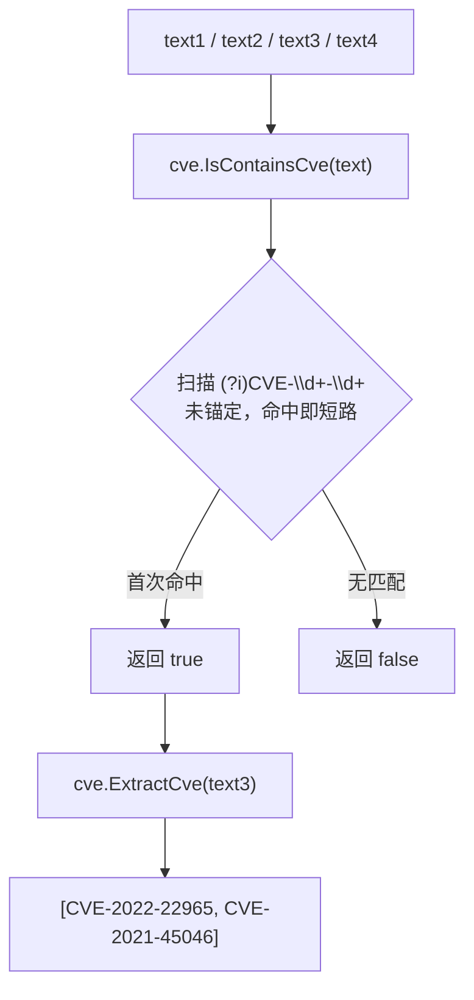

# 示例：检测报告中的 CVE

:::tip 📂 查看源码
[`examples/19_is_contains_cve/main.go`](https://github.com/scagogogo/cve-skills/blob/main/examples/19_is_contains_cve/main.go) — 在 GitHub 上查看完整可运行示例。
:::

使用 `cve.IsContainsCve` 快速判断一段自由文本中是否至少包含一个 CVE 编号。它通过大小写不敏感的正则扫描整段文本并返回布尔值，非常适合在执行开销更大的 `ExtractCve` 提取之前，对报告、日志和公告做预过滤。

:::tip 🎯 学习目标
- 理解 `cve.IsContainsCve` 的返回值，以及为何它能检测嵌在正文任意位置的 CVE
- 验证大小写不敏感与非规范格式（如 `cve-2022-1234`、`CVE2023-5678`）的匹配行为
- 对比 `IsContainsCve`（仅判断存在性）与 `ExtractCve`（返回匹配到的 CVE 切片）
:::

## 场景

安全分析师会持续收到公告邮件、威胁情报报告和变更日志。其中大部分根本不包含任何 CVE，对每篇文档都跑完整提取流程既浪费又低效。分析师需要一个轻量的预过滤函数，能用一个布尔值回答"这段文本里提到 CVE 了吗？"。`cve.IsContainsCve` 正是为此而生——它用预编译正则扫描文本，命中第一个匹配即短路返回，因此只有在确实值得提取时，分析师才会调用 `cve.ExtractCve`。

## 完整代码

```go
package main

import (
	"fmt"

	"github.com/scagogogo/cve-skills"
)

func main() {
	fmt.Println("检测文本中是否包含CVE示例")
	// 预期输出:
	// 检测文本中是否包含CVE示例

	// 包含CVE的文本示例
	text1 := "这是一个包含CVE-2021-44228漏洞的文本。"
	fmt.Printf("文本1: %s\n", text1)
	containsCve1 := cve.IsContainsCve(text1)
	fmt.Printf("检测结果: %v\n", containsCve1)
	// 预期输出:
	// 文本1: 这是一个包含CVE-2021-44228漏洞的文本。
	// 检测结果: true

	// 不包含CVE的文本示例
	text2 := "这是一个不包含任何CVE编号的普通文本。"
	fmt.Printf("\n文本2: %s\n", text2)
	containsCve2 := cve.IsContainsCve(text2)
	fmt.Printf("检测结果: %v\n", containsCve2)
	// 预期输出:
	// 文本2: 这是一个不包含任何CVE编号的普通文本。
	// 检测结果: false

	// 包含多个CVE的文本示例
	text3 := "这个文本包含多个CVE：CVE-2022-22965和CVE-2021-45046。"
	fmt.Printf("\n文本3: %s\n", text3)
	containsCve3 := cve.IsContainsCve(text3)
	fmt.Printf("检测结果: %v\n", containsCve3)
	// 预期输出:
	// 文本3: 这个文本包含多个CVE：CVE-2022-22965和CVE-2021-45046。
	// 检测结果: true

	// 包含不规范CVE格式的文本示例
	text4 := "这个文本包含不规范格式的cve-2022-1234和CVE2023-5678。"
	fmt.Printf("\n文本4: %s\n", text4)
	containsCve4 := cve.IsContainsCve(text4)
	fmt.Printf("检测结果: %v\n", containsCve4)
	// 预期输出:
	// 文本4: 这个文本包含不规范格式的cve-2022-1234和CVE2023-5678。
	// 检测结果: true

	// 提取文本中的所有CVE
	fmt.Printf("\n提取文本3中的所有CVE:\n")
	cves := cve.ExtractCve(text3)
	for i, id := range cves {
		fmt.Printf("[%d] %s\n", i+1, id)
	}
	// 预期输出:
	// 提取文本3中的所有CVE:
	// [1] CVE-2022-22965
	// [2] CVE-2021-45046

	// 应用场景示例
	fmt.Println("\n应用场景示例:")
	fmt.Println("1. 安全公告分析：自动扫描安全公告中提到的CVE")
	fmt.Println("2. 漏洞跟踪：从各种文档中提取CVE进行追踪管理")
	fmt.Println("3. 威胁情报分析：检测威胁情报报告中的CVE编号")
	// 预期输出:
	// 应用场景示例:
	// 1. 安全公告分析：自动扫描安全公告中提到的CVE
	// 2. 漏洞跟踪：从各种文档中提取CVE进行追踪管理
	// 3. 威胁情报分析：检测威胁情报报告中的CVE编号

	// 与ExtractCve的区别
	fmt.Println("\n与ExtractCve的区别:")
	fmt.Println("1. IsContainsCve - 仅检测是否存在，返回布尔值")
	fmt.Println("2. ExtractCve - 提取所有CVE并返回标准格式的CVE切片")
	// 预期输出:
	// 与ExtractCve的区别:
	// 1. IsContainsCve - 仅检测是否存在，返回布尔值
	// 2. ExtractCve - 提取所有CVE并返回标准格式的CVE切片
}
```

## 运行方式

```bash
cd examples/19_is_contains_cve && go run main.go
```

## 预期输出

```text
检测文本中是否包含CVE示例
文本1: 这是一个包含CVE-2021-44228漏洞的文本。
检测结果: true

文本2: 这是一个不包含任何CVE编号的普通文本。
检测结果: false

文本3: 这个文本包含多个CVE：CVE-2022-22965和CVE-2021-45046。
检测结果: true

文本4: 这个文本包含不规范格式的cve-2022-1234和CVE2023-5678。
检测结果: true

提取文本3中的所有CVE:
[1] CVE-2022-22965
[2] CVE-2021-45046

应用场景示例:
1. 安全公告分析：自动扫描安全公告中提到的CVE
2. 漏洞跟踪：从各种文档中提取CVE进行追踪管理
3. 威胁情报分析：检测威胁情报报告中的CVE编号

与ExtractCve的区别:
1. IsContainsCve - 仅检测是否存在，返回布尔值
2. ExtractCve - 提取所有CVE并返回标准格式的CVE切片
```

## 代码讲解

示例先打印标题，随后用四段文本样例从不同角度检验检测器。

- 📋 **文本1——嵌在正文中的 CVE** —— `text1` 在中文正文中包含 `CVE-2021-44228`。`cve.IsContainsCve(text1)` 返回 `true`，因为正则未锚定，会扫描整段字符串。
- ▶️ **文本2——不含 CVE** —— `text2` 提到了"CVE"一词，但从未构成 `CVE-YYYY-NNNN` 形态。模式要求年份和连字符后都必须是数字，因此结果为 `false`。
- 💡 **文本3——多个 CVE** —— `text3` 提到了两个 CVE（`CVE-2022-22965` 和 `CVE-2021-45046`）。`IsContainsCve` 仍然只返回一个 `true`；它在首次命中即短路，不会统计出现次数。
- 🔗 **文本4——非规范格式** —— `text4` 使用了小写的 `cve-2022-1234` 和缺少连字符的 `CVE2023-5678`。两者均被检测到（`true`），印证了大小写不敏感与宽松匹配的行为。
- 📋 **提取 CVE** —— `cve.ExtractCve(text3)` 返回 `text3` 中的两个标准 CVE 字符串，并以 1 为下标打印。这是在 `IsContainsCve` 确认存在后的自然后续步骤。
- ▶️ **应用场景与对比** —— 结尾的 `fmt.Println` 块总结了三个真实场景（公告分析、漏洞跟踪、威胁情报），并对比了 `IsContainsCve`（布尔存在性）与 `ExtractCve`（返回匹配切片）。



## 涉及函数

- [IsContainsCve](/api/functions/is-contains-cve) —— 本示例使用的函数
- [ExtractCve](/api/functions/extract-cve) —— 从文本中提取所有 CVE，返回标准格式切片
- [IsCve](/api/functions/is-cve) —— 要求整段字符串就是一个 CVE
- [ExtractFirstCve](/api/functions/extract-first-cve) —— 提取文本中的第一个 CVE
- [ExtractLastCve](/api/functions/extract-last-cve) —— 提取文本中的最后一个 CVE
- [ValidateCve](/api/functions/validate-cve) —— 完整校验（格式 + 年份范围 + 正序列号）

## 扩展练习

- 🎯 构建预过滤流水线：对一组文档先调用 `IsContainsCve`，仅对返回 `true` 的文档执行 `ExtractCve`，并与"全部提取"方案对比总开销。
- 🎯 将 `text4` 交给 `ExtractCve`，观察小写和缺少连字符的匹配是否会被归一化为标准的 `CVE-YYYY-NNNN` 形态。
- 🎯 将 `IsContainsCve` 与 `ValidateCve` 组合使用：先检测报告中是否含 CVE，再提取并校验其年份范围与序列号，以区分真实 ID 与格式错误的匹配。
