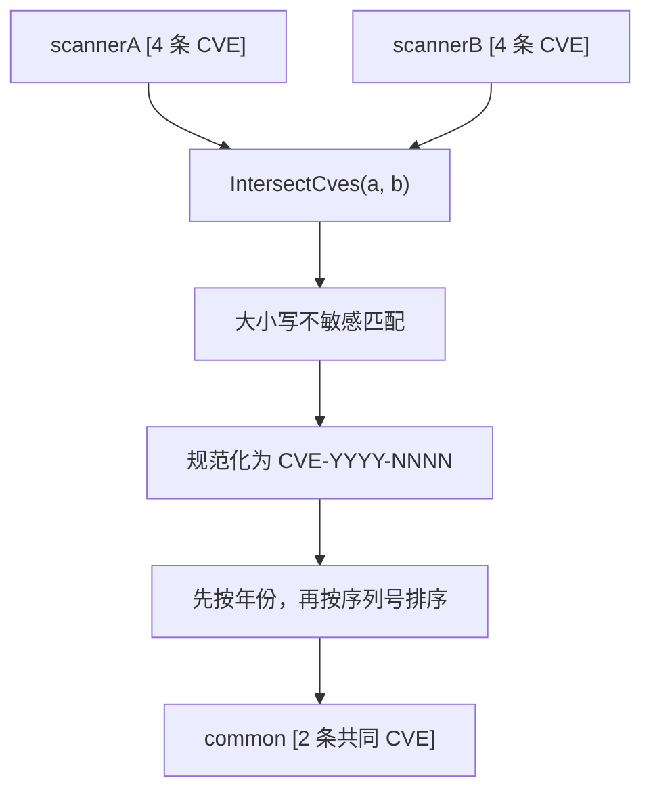

# 示例：交集

:::tip 📂 查看源码
[`examples/20_intersect_cves/main.go`](https://github.com/scagogogo/cve-skills/blob/main/examples/20_intersect_cves/main.go) — 在 GitHub 上查看完整可运行示例。
:::

使用 `cve.IntersectCves` 计算两个扫描器共同发现的 CVE 标识符。比较时不区分大小写，返回的标识符会被规范化为 `CVE-YYYY-NNNN` 标准格式，并按年份、再按序列号排序。

:::tip 🎯 学习目标
- 掌握 `cve.IntersectCves` 的函数签名与行为
- 了解大小写混写的标识符如何被匹配并返回为规范形式
- 基于两次漏洞扫描构建"共同发现"视图
:::

## 场景

安全运营中心对同一资产运行了两款独立的扫描器，每款各产出一份 CVE 标识符列表。团队需要用最短路径得到两款工具都确认的漏洞——这些是最高置信度、应优先修复的项。两份列表的大小写不一致（`cve-`、`Cve-`、`CVE-` 混用），直接做字符串比较会漏掉匹配。`cve.IntersectCves` 在比较时不区分大小写，并把交集作为干净、规范、已排序的切片返回。

## 完整代码

```go
package main

import (
	"fmt"

	"github.com/scagogogo/cve-skills"
)

func main() {
	fmt.Println("=== CVE 交集运算 (Intersection) ===")

	scannerA := []string{"CVE-2022-1111", "CVE-2022-2222", "CVE-2022-3333", "CVE-2022-4444"}
	scannerB := []string{"CVE-2022-2222", "CVE-2022-3333", "CVE-2022-5555", "CVE-2022-6666"}

	fmt.Println("扫描器A发现的CVE:", scannerA)
	fmt.Println("扫描器B发现的CVE:", scannerB)

	common := cve.IntersectCves(scannerA, scannerB)
	fmt.Printf("\n共同发现的CVE (交集): %v\n", common)
	fmt.Printf("共同发现数量: %d\n", len(common))

	fmt.Println("\n--- 大小写不敏感示例 ---")
	list1 := []string{"cve-2022-1111", "CVE-2022-2222", "Cve-2022-3333"}
	list2 := []string{"CVE-2022-1111", "cve-2022-3333", "CVE-2022-4444"}
	fmt.Println("列表1:", list1)
	fmt.Println("列表2:", list2)
	fmt.Printf("交集: %v\n", cve.IntersectCves(list1, list2))

	fmt.Println("\n--- 空列表场景 ---")
	fmt.Printf("空列表交集: %v\n", cve.IntersectCves([]string{}, []string{"CVE-2022-1111"}))
}
```

## 运行方式

```bash
cd examples/20_intersect_cves && go run main.go
```

## 预期输出

```text
=== CVE 交集运算 (Intersection) ===
扫描器A发现的CVE: [CVE-2022-1111 CVE-2022-2222 CVE-2022-3333 CVE-2022-4444]
扫描器B发现的CVE: [CVE-2022-2222 CVE-2022-3333 CVE-2022-5555 CVE-2022-6666]

共同发现的CVE (交集): [CVE-2022-2222 CVE-2022-3333]
共同发现数量: 2

--- 大小写不敏感示例 ---
列表1: [cve-2022-1111 CVE-2022-2222 Cve-2022-3333]
列表2: [CVE-2022-1111 cve-2022-3333 CVE-2022-4444]
交集: [CVE-2022-1111 CVE-2022-3333]

--- 空列表场景 ---
空列表交集: []
```

## 代码讲解

示例依次演示了三种场景：两份扫描器输出的干净交集、大小写不敏感的匹配，以及空输入的边界情况。

- 📋 **两份扫描器列表** — 先打印 `scannerA` 与 `scannerB`，让原始输入可见。二者共享 `CVE-2022-2222` 与 `CVE-2022-3333`，各自还带有对方没有的独有条目。
- ▶️ **计算交集** — `cve.IntersectCves(scannerA, scannerB)` 只返回在两个列表中都存在的标识符。结果被规范化为 `CVE-YYYY-NNNN` 并按年份、再按序列号排序，因此 `len(common)` 是共同发现数的可靠计数。
- 💡 **大小写不敏感匹配** — `list1` 与 `list2` 故意混用 `cve-`、`Cve-`、`CVE-` 前缀。`CVE-2022-1111` 在一个列表里写作 `cve-2022-1111`，在另一个里写作 `CVE-2022-1111`，仍能被匹配并以规范形式返回。
- 🔗 **空输入安全** — 第一个参数传空切片时返回空结果而非 panic，因此即便某款扫描器零报告也可以安全调用。



## 涉及函数

- [IntersectCves](/zh/api/functions/intersect-cves) — 本示例使用的函数
- [UnionCves](/zh/api/functions/union-cves) — 将两个 CVE 列表合并为一个去重集合
- [DiffCves](/zh/api/functions/diff-cves) — 返回在一个列表中存在、另一个列表中不存在的 CVE
- [RemoveDuplicateCves](/zh/api/functions/remove-duplicate-cves) — 对单个 CVE 列表去重
- [SortCves](/zh/api/functions/sort-cves) — 按年份与序列号对 CVE 列表排序

## 扩展练习

- 🎯 把 `IntersectCves` 与 `DiffCves` 组合，把一次扫描拆成"两者一致"与"仅扫描器 A"两个分桶以便分诊。
- 🎯 把交集结果传入 `GroupByYear`，渲染一个按年份分组的共同发现视图。
- 🎯 向其中一个列表加入重复条目，验证 `IntersectCves` 仍只返回每条共同 CVE 一次。
