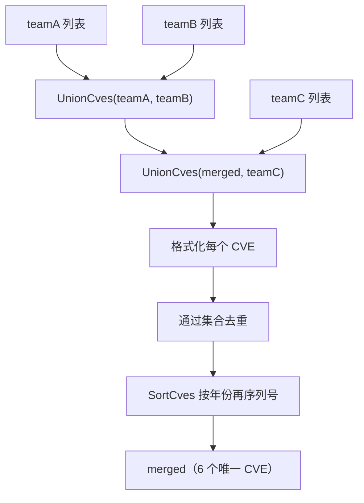

# 示例：并集

:::tip 📂 查看源码
[`examples/21_union_cves/main.go`](https://github.com/scagogogo/cve-skills/blob/main/examples/21_union_cves/main.go) — 在 GitHub 上查看完整可运行示例。
:::

用 `cve.UnionCves` 把多个来源的 CVE 列表合并成一份去重、排序后的切片。每次调用都会将每个编号归一化为标准的 `CVE-YYYY-NNNN` 形式，因此并集结果既去重又按年份再序列号排序。

:::tip 🎯 学习目标
- 理解 `cve.UnionCves` 的函数签名与行为
- 观察小写前缀与重复编号如何在一次调用中被归一化消除
- 从多个团队数据源构建一份合并后的漏洞视图
:::

## 场景

三个安全团队各自维护同一产品的 CVE 列表。团队 A、B、C 的条目存在重叠——例如 `CVE-2023-1003` 同时出现在 A 和 B，而 `CVE-2023-1004` 与 `CVE-2023-1005` 同时出现在 B 和 C。在发布合并公告前，需要把所有列表合并为一组唯一编号、格式化为标准形式、并按时间顺序排序。`UnionCves` 在一次调用中完成格式化、去重与排序。

## 完整代码

```go
package main

import (
	"fmt"

	"github.com/scagogogo/cve-skills"
)

func main() {
	fmt.Println("=== CVE 并集运算 (Union) ===")

	teamA := []string{"CVE-2023-1001", "CVE-2023-1002", "CVE-2023-1003"}
	teamB := []string{"CVE-2023-1003", "CVE-2023-1004", "CVE-2023-1005"}
	teamC := []string{"CVE-2023-1004", "CVE-2023-1005", "CVE-2023-1006"}

	fmt.Println("团队A的CVE:", teamA)
	fmt.Println("团队B的CVE:", teamB)
	fmt.Println("团队C的CVE:", teamC)

	merged := cve.UnionCves(teamA, teamB)
	merged = cve.UnionCves(merged, teamC)
	fmt.Printf("\n全部团队的CVE (并集): %v\n", merged)
	fmt.Printf("总唯一CVE数量: %d\n", len(merged))

	fmt.Println("\n--- 去重效果 ---")
	withDups := []string{"CVE-2022-1111", "cve-2022-1111", "CVE-2022-1111", "CVE-2022-2222"}
	unique := cve.UnionCves(withDups, []string{})
	fmt.Printf("原始 (含重复): %v\n", withDups)
	fmt.Printf("并集 (去重后): %v\n", unique)
}
```

## 运行方式

```bash
cd examples/21_union_cves && go run main.go
```

## 预期输出

```text
=== CVE 并集运算 (Union) ===
团队A的CVE: [CVE-2023-1001 CVE-2023-1002 CVE-2023-1003]
团队B的CVE: [CVE-2023-1003 CVE-2023-1004 CVE-2023-1005]
团队C的CVE: [CVE-2023-1004 CVE-2023-1005 CVE-2023-1006]

全部团队的CVE (并集): [CVE-2023-1001 CVE-2023-1002 CVE-2023-1003 CVE-2023-1004 CVE-2023-1005 CVE-2023-1006]
总唯一CVE数量: 6

--- 去重效果 ---
原始 (含重复): [CVE-2022-1111 cve-2022-1111 CVE-2022-1111 CVE-2022-2222]
并集 (去重后): [CVE-2022-1111 CVE-2022-2222]
```

## 代码讲解

示例从三个故意重叠的团队列表出发，演示 `UnionCves` 如何把重复项归并为一份标准、排序后的集合。

- 📋 **三个团队数据源** —— 先打印 `teamA`、`teamB`、`teamC`，让原始输入可见。`CVE-2023-1003` 为 A、B 共有，`CVE-2023-1004` 与 `CVE-2023-1005` 为 B、C 共有。
- ▶️ **两步合并** —— `cve.UnionCves(teamA, teamB)` 得到 A 与 B 的并集，再用 `cve.UnionCves(merged, teamC)` 折入 C。每次调用都会格式化每个编号、通过内部集合去重、并用 `SortCves` 排序，因此最终切片包含六个唯一编号，按年份再序列号排序。
- 💡 **唯一数量** —— `len(merged)` 验证去重效果：三组各三个（共九条）条目归并为六个唯一 CVE。
- 🔗 **去重演示** —— 第二段向 `UnionCves` 传入一个含小写 `cve-2022-1111` 与两份 `CVE-2022-1111` 的列表，第二个参数为空。由于 `UnionCves` 在比较前会先格式化，小写形式被归一化为 `CVE-2022-1111` 并视为重复，最终只留下两个唯一条目。



## 涉及函数

- [UnionCves](/api/functions/union-cves) —— 本示例使用的函数
- [DiffCves](/api/functions/diff-cves) —— 返回在第一个列表出现但不在第二个列表出现的 CVE
- [IntersectCves](/api/functions/intersect-cves) —— 返回两个列表共有的 CVE
- [RemoveDuplicateCves](/api/functions/remove-duplicate-cves) —— 对单个列表去重而不合并
- [SortCves](/api/functions/sort-cves) —— 按年份再序列号排序，UnionCves 内部使用

## 扩展练习

- 🎯 用链式方式在一次调用中对三个列表求并集，并与两步版本的结果对比。
- 🎯 混入一个无效字符串如 `"CVE-2023-99"`（位数不足），观察 `UnionCves` 如何格式化并放置它。
- 🎯 将 `UnionCves` 与 `DiffCves` 配合，找出 `teamC` 中有但 A∪B 并集中缺失的 CVE。
