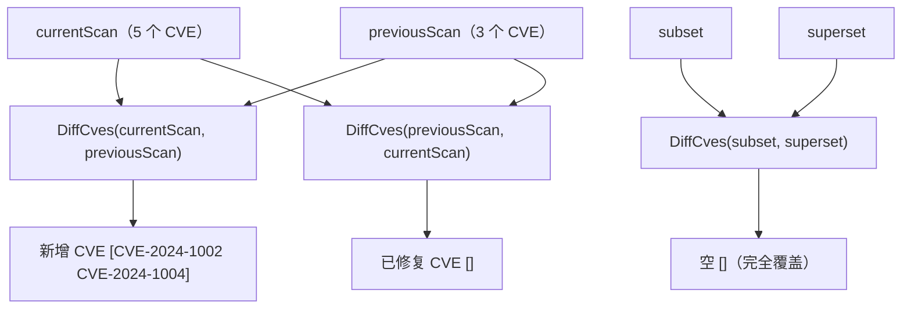

# 示例：差集

:::tip 📂 查看源码
[`examples/22_diff_cves/main.go`](https://github.com/scagogogo/cve-skills/blob/main/examples/22_diff_cves/main.go) — 在 GitHub 上查看完整可运行示例。
:::

用 `cve.DiffCves` 找出在一份扫描结果中出现、却在另一份中缺失的 CVE。给定两个列表，它返回在第一个列表出现且不在第二个列表出现的编号——正向差集暴露新出现的漏洞，反向差集暴露已修复的漏洞。

:::tip 🎯 学习目标
- 理解 `cve.DiffCves` 的函数签名与行为
- 用正向与反向差集检测两次扫描之间新增与已修复的 CVE
- 推理当一份列表被另一份完全覆盖时结果为空的边界情况
:::

## 场景

安全团队每周执行一次漏洞扫描。本周扫描返回五个 CVE，上周扫描返回其中三个。为了向修复团队汇报，分析师需要两样东西：本周新增的 CVE（现在有、之前没有）以及本周消失的 CVE（之前有、现在没有，说明已被修复）。`DiffCves(current, previous)` 得到新增项，交换参数则得到已修复项。示例还验证了完全覆盖的情形——第一份列表的每个条目都已存在于第二份中，因此差集为空。

## 完整代码

```go
package main

import (
	"fmt"

	"github.com/scagogogo/cve-skills"
)

func main() {
	fmt.Println("=== CVE 差集运算 (Difference) ===")

	currentScan := []string{"CVE-2024-1001", "CVE-2024-1002", "CVE-2024-1003", "CVE-2024-1004", "CVE-2024-1005"}
	previousScan := []string{"CVE-2024-1001", "CVE-2024-1003", "CVE-2024-1005"}

	fmt.Println("当前扫描结果:", currentScan)
	fmt.Println("前一次扫描结果:", previousScan)

	newCves := cve.DiffCves(currentScan, previousScan)
	fmt.Printf("\n新出现的CVE (差集): %v\n", newCves)
	fmt.Printf("新增数量: %d\n", len(newCves))

	fixedCves := cve.DiffCves(previousScan, currentScan)
	fmt.Printf("\n已修复的CVE (反向差集): %v\n", fixedCves)

	fmt.Println("\n--- 完全覆盖场景 ---")
	subset := []string{"CVE-2022-1111", "CVE-2022-2222"}
	superset := []string{"CVE-2022-1111", "CVE-2022-2222", "CVE-2022-3333"}
	fmt.Printf("差集结果: %v\n", cve.DiffCves(subset, superset))
}
```

## 运行方式

```bash
cd examples/22_diff_cves && go run main.go
```

## 预期输出

```text
=== CVE 差集运算 (Difference) ===
当前扫描结果: [CVE-2024-1001 CVE-2024-1002 CVE-2024-1003 CVE-2024-1004 CVE-2024-1005]
前一次扫描结果: [CVE-2024-1001 CVE-2024-1003 CVE-2024-1005]

新出现的CVE (差集): [CVE-2024-1002 CVE-2024-1004]
新增数量: 2

已修复的CVE (反向差集): []

--- 完全覆盖场景 ---
差集结果: []
```

## 代码讲解

示例以两次周扫描配对，再在完全覆盖的列表上验证结果为空的边界情况。

- 📋 **两次周扫描** —— `currentScan` 含五个 CVE，`previousScan` 含其中三个（`CVE-2024-1001`、`CVE-2024-1003`、`CVE-2024-1005`）。两者先打印出来，让求差前的原始输入可见。
- ▶️ **正向差集（新增项）** —— `cve.DiffCves(currentScan, previousScan)` 返回在 `currentScan` 中出现但不在 `previousScan` 中出现的 CVE，即 `CVE-2024-1002` 与 `CVE-2024-1004`。`len(newCves)` 报告两个新增项，正是分析师本周需要分诊的集合。
- 💡 **反向差集（已修复）** —— 交换参数，`cve.DiffCves(previousScan, currentScan)` 返回上周有而本周消失的 CVE。上周的每个 CVE 仍出现在当前扫描中，因此结果为空切片——没有项被丢弃，说明两次扫描之间没有回退或静默移除。
- 🔗 **完全覆盖场景** —— `subset`（`CVE-2022-1111`、`CVE-2022-2222`）完全包含在 `superset`（额外含 `CVE-2022-3333`）中。`cve.DiffCves(subset, superset)` 因此得到 `[]`，印证只要第一份列表是第二份的子集，差集即为空。



## 涉及函数

- [DiffCves](/api/functions/diff-cves) —— 本示例使用的函数
- [IntersectCves](/api/functions/intersect-cves) —— 返回两个列表共有的 CVE
- [UnionCves](/api/functions/union-cves) —— 合并列表并去重排序
- [RemoveDuplicateCves](/api/functions/remove-duplicate-cves) —— 对单个列表去重
- [SortCves](/api/functions/sort-cves) —— 按年份再序列号排序

## 扩展练习

- 🎯 在 `previousScan` 中加入一个当前 `currentScan` 已不存在的 CVE（例如 `CVE-2024-9999`），确认它会出现在反向差集结果中。
- 🎯 向 `DiffCves` 传入顺序被打乱的列表，观察返回的差集是否保持稳定顺序。
- 🎯 将 `DiffCves` 与 `IntersectCves` 结合，把 `currentScan` 拆成三类：新增、已修复、未变化。
