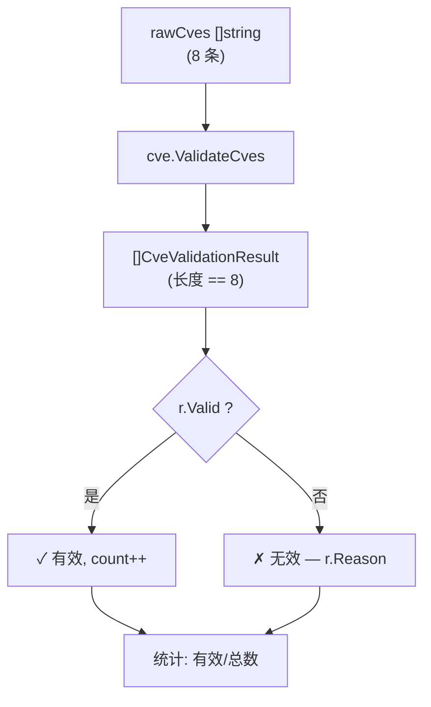

# 示例：批量验证

:::tip 📂 查看源码
[`examples/23_validate_cves/main.go`](https://github.com/scagogogo/cve-skills/blob/main/examples/23_validate_cves/main.go) — 在 GitHub 上查看完整可运行示例。
:::

一次调用验证整批 CVE 编号，并为每一条失败结果拿到独立的原因。

:::tip 🎯 学习目标
- 用 `ValidateCves` 一次性校验多条 CVE，而不是自己循环 `ValidateCve`。
- 读懂 `CveValidationResult` 结构体，据此输出带原因的有效/无效报告。
- 识别批量校验器给出的三类失败：格式错误、年份越界、序列号非正。
:::

## 场景

你在清洗资产盘点系统导出的 CSV。其中"CVE"这一列是多年来运维人员手填的自由文本，长期下来什么都有：几条是真 CVE，几条是小写的，一条是早于 CVE 项目的 1998 记录，一条引用了还没到来的年份，一条序列号位上塞了字母，还有一条带着前后空格。你需要把这列拆成"可放心查询"和"需人工核查"两堆，并且希望被拒行附带一句简短原因，好让运维知道改哪里。`ValidateCves` 一次吃下整个切片，返回一个 `[]CveValidationResult`，其 `Valid` 与 `Reason` 字段恰好给出这份报告。

## 完整代码

```go
package main

import (
	"fmt"

	"github.com/scagogogo/cve-skills"
)

func main() {
	fmt.Println("=== 批量CVE验证 ===")

	rawCves := []string{
		"CVE-2022-1234",
		"cve-2023-5678",
		"CVE-1998-1234",
		"not-a-cve",
		"CVE-2099-9999",
		"CVE-2022-ABCD",
		"CVE-2022-0",
		" CVE-2024-8888 ",
	}

	fmt.Println("验证以下CVE:")
	results := cve.ValidateCves(rawCves)

	validCount := 0
	for _, r := range results {
		if r.Valid {
			fmt.Printf("  ✓ %-25s 有效\n", r.Cve)
			validCount++
		} else {
			fmt.Printf("  ✗ %-25s 无效 — %s\n", r.Cve, r.Reason)
		}
	}

	fmt.Printf("\n统计: %d/%d 有效\n", validCount, len(rawCves))
}
```

## 运行方式

```bash
cd examples/23_validate_cves && go run main.go
```

## 预期输出

输出会随程序运行的年份而变化。当 `currentYear = 2026` 时：

```text
=== 批量CVE验证 ===
验证以下CVE:
  ✓ CVE-2022-1234             有效
  ✓ cve-2023-5678             有效
  ✗ CVE-1998-1234             无效 — year 1998 is before 1999
  ✗ not-a-cve                 无效 — invalid CVE format
  ✗ CVE-2099-9999             无效 — year 2099 is after current year 2026
  ✗ CVE-2022-ABCD             无效 — invalid CVE format
  ✗ CVE-2022-0                无效 — sequence number must be positive
  ✓  CVE-2024-8888            有效

统计: 3/8 有效
```

## 代码讲解

程序先构造一个含八条原始字符串的切片——刻意混入干净、小写、越界、畸形、带空格的条目——然后一次性把整片交给 `cve.ValidateCves`。接着遍历返回的 `[]CveValidationResult`，按 `r.Valid` 分流：有效项打 `✓` 并计数，无效项打 `✗` 并附上 `r.Reason`。末行用 `validCount/len(rawCves)` 汇总。

- ▶️ **批量调用。** `results := cve.ValidateCves(rawCves)` 取代了手写循环去调 `ValidateCve`。返回切片与输入等长，`results[i]` 对应 `rawCves[i]`——既不重排也不丢项。
- 📋 **逐项报告。** 每个 `CveValidationResult` 携带原始 `Cve` 字符串、`Valid` 布尔值，以及 `Reason` 字符串（有效时为空）。`✗` 分支打印 `r.Reason`，让每一条拒绝都有具体原因：格式错误、年份早于 1999、年份晚于当前年份、或序列号非正整数。
- 💡 **原因分类。** 八条输入覆盖了校验器能产出的全部失败模式。`CVE-1998-1234` 触发 `year 1998 is before 1999`。`not-a-cve` 与 `CVE-2022-ABCD` 都通不过格式检查，原因是 `invalid CVE format`。`CVE-2099-9999` 撞上上界，原因是 `year 2099 is after current year 2026`。`CVE-2022-0` 格式与年份都过，但序列号规则失败，原因是 `sequence number must be positive`。两条小写和带空格的条目被接受，因为校验器在检查前会归一化大小写并去除首尾空格。



## 涉及函数

- [ValidateCves](/zh/api/functions/validate-cves) — 本页演示的批量校验函数。
- [ValidateCve](/zh/api/functions/validate-cve) — `ValidateCves` 内部调用的单字符串校验函数。
- [FilterValidCves](/zh/api/functions/filter-valid-cves) — 便捷封装，只返回有效字符串，丢弃原因。

## 扩展练习

- 💡 把 `rawCves` 切片换成从 CSV 文件读取的编号，再写一个只保留被拒行及其 `Reason` 的 CSV。
- 💡 加入一条重复项（如两次 `CVE-2022-1234`），确认 `ValidateCves` 会独立校验两者——去重是调用方的职责，校验器不替你做。
- 💡 把 `ValidateCves` 与"循环 `ValidateCve`"和"单独循环 `IsCve`"各跑一遍，记下哪些失败原因只有完整校验器能给出。
