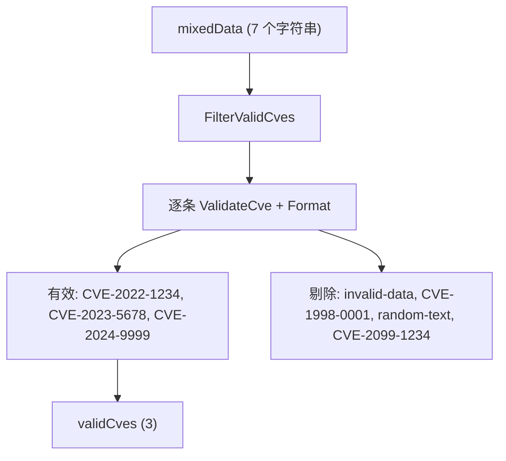

# 示例：过滤有效 CVE

:::tip 📂 查看源码
[`examples/24_filter_valid_cves/main.go`](https://github.com/scagogogo/cve-skills/blob/main/examples/24_filter_valid_cves/main.go) — 在 GitHub 上查看完整可运行示例。
:::

用 `cve.FilterValidCves` 把嘈杂的混合列表收敛为真正的 CVE 标识符。这是在进一步处理前清洗任何用户提交或外部数据源数据的最简一行调用方式。

:::tip 🎯 学习目标
- 掌握 `cve.FilterValidCves` 的函数签名与行为
- 理解格式、年份区间与序列号规则如何协同剔除非法条目
- 对比批量过滤（`FilterValidCves`）与逐条校验（`ValidateCve`）
:::

## 场景

某漏洞接入流水线从工单、表格和外部数据源收到一批原始字符串。这批数据混杂着格式正确的 CVE 编号、纯文本垃圾、超范围年份（1998 太早、2099 属于未来）以及小写标识符。在持久化之前，流水线需要只保留真正合法的 CVE 并把大小写统一规范化。`FilterValidCves` 遍历一次切片，逐条校验，返回一份大小写规范的干净 CVE 列表。

## 完整代码

```go
package main

import (
	"fmt"

	"github.com/scagogogo/cve-skills"
)

func main() {
	fmt.Println("=== 过滤有效CVE ===")

	mixedData := []string{
		"CVE-2022-1234",
		"invalid-data",
		"cve-2023-5678",
		"CVE-1998-0001",
		"CVE-2024-9999",
		"random-text",
		"CVE-2099-1234",
	}

	fmt.Println("混合数据:", mixedData)

	validCves := cve.FilterValidCves(mixedData)
	fmt.Printf("\n有效CVE: %v\n", validCves)
	fmt.Printf("有效数量: %d / %d\n", len(validCves), len(mixedData))

	fmt.Println("\n--- 与 ValidateCve 对比 ---")
	for _, item := range mixedData {
		status := "✗"
		if cve.ValidateCve(item) {
			status = "✓"
		}
		fmt.Printf("  %s %s\n", status, item)
	}
}
```

## 运行方式

```bash
cd examples/24_filter_valid_cves && go run main.go
```

## 预期输出

```text
=== 过滤有效CVE ===
混合数据: [CVE-2022-1234 invalid-data cve-2023-5678 CVE-1998-0001 CVE-2024-9999 random-text CVE-2099-1234]

有效CVE: [CVE-2022-1234 CVE-2023-5678 CVE-2024-9999]
有效数量: 3 / 7

--- 与 ValidateCve 对比 ---
  ✓ CVE-2022-1234
  ✗ invalid-data
  ✓ cve-2023-5678
  ✗ CVE-1998-0001
  ✓ CVE-2024-9999
  ✗ random-text
  ✗ CVE-2099-1234
```

## 代码讲解

示例先构造了一个包含七个字符串的 `mixedData` 切片，刻意覆盖校验器的每条拒绝分支，再进行过滤并逐条打印判定结果。

- 📋 **构造嘈杂输入** —— `mixedData` 混合了合法编号（`CVE-2022-1234`）、纯文本垃圾（`invalid-data`、`random-text`）、小写编号（`cve-2023-5678`）、过早年份（`CVE-1998-0001`，早于 1999 下限）和未来年份（`CVE-2099-1234`，晚于当前年份）。
- ▶️ **一次调用完成过滤** —— `cve.FilterValidCves(mixedData)` 遍历切片，保留每个通过 `ValidateCve` 的条目，并交给 `Format` 规范化，因此 `cve-2023-5678` 回来时已变为 `CVE-2023-5678`。结果连同数量 `3 / 7` 一起打印。
- 💡 **为何被拒** —— `ValidateCve` 要求 `CVE-YYYY-NNNNN` 格式、年份在 `1999` 到当前年份之间、序列号为正整数。`CVE-1998-0001` 未达年份下限，`CVE-2099-1234` 超过年份上限，非 CVE 字符串则格式不合规。
- 🔗 **与 `ValidateCve` 对比** —— 结尾循环对每个原始条目调用 `cve.ValidateCve(item)`，打印 `✓` 或 `✗`，与过滤决策一一对应，可以看到两个函数逐条一致。



## 涉及函数

- [FilterValidCves](/zh/api/functions/filter-valid-cves) —— 本示例使用的函数
- [ValidateCve](/zh/api/functions/validate-cve) —— 对比循环所用的逐条校验函数
- [IsCve](/zh/api/functions/is-cve) —— `ValidateCve` 所依赖的纯格式校验
- [Format](/zh/api/functions/format) —— 对每个保留条目规范化大小写并去空白
- [FilterCvesByYear](/zh/api/functions/filter-cves-by-year) —— 在合法列表上按年份进一步收敛

## 扩展练习

- 🎯 在 `mixedData` 中加入一条重复项（例如 `"cve-2022-1234"`），观察过滤后重复项是否保留。
- 🎯 用 `ValidateCves` 替换 `FilterValidCves`，同时获得每个非法条目的拒绝原因。
- 🎯 把 `FilterValidCves` 与 `SortCves` 串联，返回一份干净且有序、可直接展示的列表。
