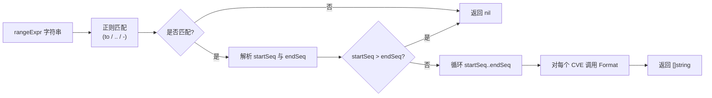

# 示例：范围解析

:::tip 📂 查看源码
[`examples/25_parse_cve_range/main.go`](https://github.com/scagogogo/cve-skills/blob/main/examples/25_parse_cve_range/main.go) — 在 GitHub 上查看完整可运行示例。
:::

使用 `cve.ParseCveRange` 将 CVE 范围表达式展开为它所覆盖的全部 CVE 编号列表。这是把安全公告中写出的范围变成可遍历切片的最简单方式。

:::tip 🎯 学习目标
- 了解 `cve.ParseCveRange` 的函数签名与行为
- 掌握三种受支持的范围写法：`to`、`..` 与 `-`
- 安全处理无效输入（空字符串、单个 CVE、反向范围）
:::

## 场景

某安全运营中心从多个厂商处接入安全公告。各厂商书写 CVE 范围的方式各不相同——有的写成 `CVE-2022-1000 to CVE-2022-1005`，有的用紧凑形式 `CVE-2022-2000..2003`，还有的写成 `CVE-2022-3000-3002`。在团队对这些公告进行扫描、去重或报告之前，每个范围都必须被展开为它所覆盖的显式 CVE 编号列表。`ParseCveRange` 接受上述三种写法中的任意一种，返回规范的 `[]string`，把来源各异的安全公告数据统一为一致的形式。

## 完整代码

```go
package main

import (
	"fmt"

	"github.com/scagogogo/cve-skills"
)

func main() {
	fmt.Println("=== CVE 范围解析 ===")

	fmt.Println("--- 使用 'to' 关键字 ---")
	range1 := "CVE-2022-1000 to CVE-2022-1005"
	result1 := cve.ParseCveRange(range1)
	fmt.Printf("输入: %s\n", range1)
	fmt.Printf("输出: %v\n", result1)

	fmt.Println("\n--- 使用 '..' 双点号 ---")
	range2 := "CVE-2022-2000..2003"
	result2 := cve.ParseCveRange(range2)
	fmt.Printf("输入: %s\n", range2)
	fmt.Printf("输出: %v\n", result2)

	fmt.Println("\n--- 使用 '-' 连字符 ---")
	range3 := "CVE-2022-3000-3002"
	result3 := cve.ParseCveRange(range3)
	fmt.Printf("输入: %s\n", range3)
	fmt.Printf("输出: %v\n", result3)

	fmt.Println("\n--- 无效输入处理 ---")
	fmt.Printf("空字符串: %v\n", cve.ParseCveRange(""))
	fmt.Printf("单CVE格式: %v\n", cve.ParseCveRange("CVE-2022-12345"))
	fmt.Printf("反向范围: %v\n", cve.ParseCveRange("CVE-2022-1005..1000"))

	fmt.Println("\n--- 实际应用: 统计范围内CVE总数 ---")
	securityBulletin := "CVE-2023-5000 to CVE-2023-5999"
	affectedCves := cve.ParseCveRange(securityBulletin)
	fmt.Printf("安全公告: %s\n", securityBulletin)
	fmt.Printf("受影响CVE总数: %d\n", len(affectedCves))
	if len(affectedCves) > 0 {
		fmt.Printf("范围: %s 到 %s\n", affectedCves[0], affectedCves[len(affectedCves)-1])
	}
}
```

## 运行方式

```bash
cd examples/25_parse_cve_range && go run main.go
```

## 预期输出

```text
=== CVE 范围解析 ===
--- 使用 'to' 关键字 ---
输入: CVE-2022-1000 to CVE-2022-1005
输出: [CVE-2022-1000 CVE-2022-1001 CVE-2022-1002 CVE-2022-1003 CVE-2022-1004 CVE-2022-1005]

--- 使用 '..' 双点号 ---
输入: CVE-2022-2000..2003
输出: [CVE-2022-2000 CVE-2022-2001 CVE-2022-2002 CVE-2022-2003]

--- 使用 '-' 连字符 ---
输入: CVE-2022-3000-3002
输出: [CVE-2022-3000 CVE-2022-3001 CVE-2022-3002]

--- 无效输入处理 ---
空字符串: []
单CVE格式: []
反向范围: []

--- 实际应用: 统计范围内CVE总数 ---
安全公告: CVE-2023-5000 to CVE-2023-5999
受影响CVE总数: 1000
范围: CVE-2023-5000 到 CVE-2023-5999
```

## 代码讲解

示例分为五个部分讲解：

- ▶️ **`to` 关键字写法** — `"CVE-2022-1000 to CVE-2022-1005"` 使用完整的 `to CVE-YYYY-NNNNN` 形式。函数返回六个编号，两端均包含在内。
- ▶️ **`..` 双点号写法** — `"CVE-2022-2000..2003"` 在左侧共享年份与起始序列号，右侧只重复尾部的结束序列号。返回四个编号。
- ▶️ **`-` 连字符写法** — `"CVE-2022-3000-3002"` 用连字符分隔起始与结束序列号。返回三个编号。
- 💡 **无效输入处理** — 三种边界情况都返回 `nil`（打印为 `[]`）：空字符串、未表达范围的单个 CVE，以及起始序列号大于结束序列号的反向范围。
- 🔗 **实际应用** — 展开 `"CVE-2023-5000 to CVE-2023-5999"` 后，`len(affectedCves)` 报告总数（1000），首尾元素界定范围。

在内部，`ParseCveRange` 用一条带有三种可选结尾（分别对应 `to`、`..`、`-`）的正则表达式匹配输入，提取起始与结束序列号，拒绝反向范围（`startSeq > endSeq`），然后对每个生成的编号调用 `Format`，确保每个 CVE 都规范化为标准形式。



## 涉及函数

- [ParseCveRange](/zh/api/functions/parse-cve-range) — 将范围表达式解析为 CVE 编号切片
- [Format](/zh/api/functions/format) — 内部调用，用于规范化每个生成的编号

## 扩展练习

- 📋 将 `ParseCveRange` 的输出交给 `FilterValidCves` 过滤掉校验不通过的编号，再报告保留了多少个。
- 📋 将返回的切片转为 `map[string]bool` 查找集合，并用 `IntersectCves` 找出安全公告中同时存在于本地资产数据库里的 CVE。
- 📋 编写一个接受范围表达式的 CLI 参数，每行打印一个 CVE，把输出管道传给下游扫描脚本。
