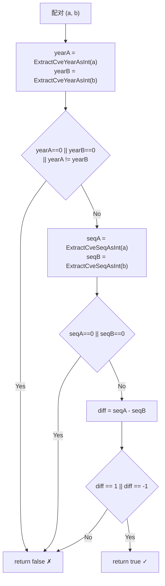

# 示例：连续判断

:::tip 📂 查看源码
[`examples/26_is_cves_consecutive/main.go`](https://github.com/scagogogo/cve-skills/blob/main/examples/26_is_cves_consecutive/main.go) — 在 GitHub 上查看完整可运行示例。
:::

使用 `cve.IsCvesConsecutive` 判断两个 CVE 标识符是否相邻。仅当两个 CVE 同年且序列号相差恰好为 1 时返回 `true`，据此判断一对 CVE 能否合并为单条区间表达式。

:::tip 🎯 学习目标
- 掌握 `cve.IsCvesConsecutive` 的函数签名与相邻判定规则
- 理解同年、序列号跳号、跨年、反向、相同等情形如何被判别
- 用逐对检查扫描已排序的 CVE 列表，找出可合并的相邻标识符
:::

## 场景

漏洞分析师在整理 CVE 清单，希望把成段的相邻标识符合并成紧凑的区间表达式，例如 `CVE-2022-1001->1003`。一对 CVE 只有在同一年、且序列号相差恰好为 1 时才可合并，因此分析师改用 `IsCvesConsecutive`：先提取两侧年份，年份不同直接拒绝；再提取序列号，仅当差值为 `1` 或 `-1` 时返回 `true`。该检查与参数顺序无关，反向输入仍判为连续。示例先依次判定五个代表性配对，再对一组 CVE 列表逐对扫描，找出哪些相邻项可以合并。

## 完整代码

```go
package main

import (
	"fmt"

	"github.com/scagogogo/cve-skills"
)

func main() {
	fmt.Println("=== CVE 连续性判断 ===")

	pairs := []struct {
		a, b string
	}{
		{"CVE-2022-12345", "CVE-2022-12346"},
		{"CVE-2022-12345", "CVE-2022-12347"},
		{"CVE-2022-12345", "CVE-2023-12345"},
		{"CVE-2022-12346", "CVE-2022-12345"},
		{"CVE-2022-12345", "CVE-2022-12345"},
	}

	for _, p := range pairs {
		consecutive := cve.IsCvesConsecutive(p.a, p.b)
		mark := "✗"
		if consecutive {
			mark = "✓"
		}
		fmt.Printf("  %s %s <-> %s: 连续=%v\n", mark, p.a, p.b, consecutive)
	}

	fmt.Println("\n--- 检测可合并列表 ---")
	cveList := []string{
		"CVE-2022-1001", "CVE-2022-1002", "CVE-2022-1003",
		"CVE-2022-2001", "CVE-2022-2003",
	}
	fmt.Println("CVE列表:", cveList)

	for i := 0; i < len(cveList)-1; i++ {
		if cve.IsCvesConsecutive(cveList[i], cveList[i+1]) {
			fmt.Printf("  %s 和 %s 连续\n", cveList[i], cveList[i+1])
		} else {
			fmt.Printf("  %s 和 %s 不连续\n", cveList[i], cveList[i+1])
		}
	}
}
```

## 运行方式

```bash
cd examples/26_is_cves_consecutive && go run main.go
```

## 预期输出

```text
=== CVE 连续性判断 ===
  ✓ CVE-2022-12345 <-> CVE-2022-12346: 连续=true
  ✗ CVE-2022-12345 <-> CVE-2022-12347: 连续=false
  ✗ CVE-2022-12345 <-> CVE-2023-12345: 连续=false
  ✓ CVE-2022-12346 <-> CVE-2022-12345: 连续=true
  ✗ CVE-2022-12345 <-> CVE-2022-12345: 连续=false

--- 检测可合并列表 ---
CVE列表: [CVE-2022-1001 CVE-2022-1002 CVE-2022-1003 CVE-2022-2001 CVE-2022-2003]
  CVE-2022-1001 和 CVE-2022-1002 连续
  CVE-2022-1002 和 CVE-2022-1003 连续
  CVE-2022-1003 和 CVE-2022-2001 不连续
  CVE-2022-2001 和 CVE-2022-2003 不连续
```

## 代码讲解

示例先依次判定五个代表性配对，再对一组 CVE 列表逐对扫描，找出可合并的相邻项。

- 📋 **同年且序列号差 1** —— `CVE-2022-12345` 与 `CVE-2022-12346`：年份相同且序列号相差恰好 1，结果为 `true`，行首标记 `✓`。
- ▶️ **序列号跳号过大** —— `CVE-2022-12345` 与 `CVE-2022-12347`：年份仍相同，但序列号差为 2，超出 `1` / `-1` 窗口，结果为 `false`。
- 💡 **跨年** —— `CVE-2022-12345` 与 `CVE-2023-12345`：年份不同，函数在年份检查处短路返回 `false`，不再比较序列号。
- 🔗 **反向顺序** —— `CVE-2022-12346` 与 `CVE-2022-12345`：交换参数后序列号差变为 `-1`，仍计为连续，验证检查是对称的。
- 🎯 **完全相同** —— `CVE-2022-12345` 与 `CVE-2022-12345`：序列号差为 0，相等不等于相邻，结果为 `false`。
- 🔗 **列表扫描** —— 循环对 `cveList` 逐对判断；`1001->1002`、`1002->1003` 连续，`1003->2001` 因跨年中断，`2001->2003` 因序列号跳号中断。



## 涉及函数

- [IsCvesConsecutive](/zh/api/functions/is-cves-consecutive) —— 本示例使用的函数
- [ExtractCveYearAsInt](/zh/api/functions/extract-cve-year-as-int) —— 提取 CVE 的年份为整数
- [ExtractCveSeqAsInt](/zh/api/functions/extract-cve-seq-as-int) —— 提取 CVE 的序列号为整数
- [ParseCveRange](/zh/api/functions/parse-cve-range) —— 把区间表达式展开为区间内所有 CVE
- [SortCves](/zh/api/functions/sort-cves) —— 先对 CVE 切片排序，让相邻标识符就位后再扫描

## 扩展练习

- 🎯 在逐对扫描前先用 `SortCves` 排序列表，验证相邻标识符已就位，使更多邻居被判为连续。
- 🎯 把非法字符串如 `"not-a-cve"` 作为其中一个操作数传入，观察它如何短路返回 `false` 而不 panic。
- 🎯 收集一段中所有连续配对，用 `ParseCveRange` 把 `CVE-2022-1001->1003` 合并为单条区间表达式。
