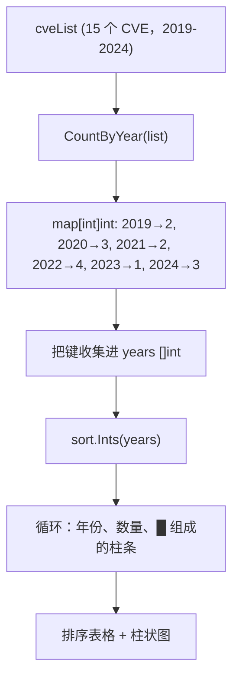

# 示例：按年计数

:::tip 📂 查看源码
[`examples/27_count_by_year/main.go`](https://github.com/scagogogo/cve-skills/blob/main/examples/27_count_by_year/main.go) — 在 GitHub 上查看完整可运行示例。
:::

用 `cve.CountByYear` 按年份统计 CVE，并把分布渲染成一张排序好的表格加 ASCII 柱状图。这是把原始 CVE 列表快速转成逐年趋势视图的最快方式。

:::tip 🎯 学习目标
- 掌握 `cve.CountByYear` 的签名与返回值（`map[int]int`）
- 学会对 map 的键排序以获得确定性的有序输出
- 用简单的柱状图构建一份年份分布趋势报告
:::

## 场景

安全运营中心全年从多台扫描器汇总导出一份原始 CVE 标识符列表。在季度复盘时，他们需要可视化漏洞在年份上的分布——不只是总数，而是一份按年份的拆分，让峰值（例如 2022 年的激增）一眼可见。`CountByYear` 把列表归约为「年份→数量」的 `map[int]int`；对键排序、再按数量画一根柱条，就把这份 map 变成一张可读的趋势报告。

## 完整代码

```go
package main

import (
	"fmt"
	"sort"

	"github.com/scagogogo/cve-skills"
)

func main() {
	fmt.Println("=== 按年份统计CVE ===")

	cveList := []string{
		"CVE-2019-1001", "CVE-2019-1002",
		"CVE-2020-1001", "CVE-2020-1002", "CVE-2020-1003",
		"CVE-2021-1001", "CVE-2021-1002",
		"CVE-2022-1001", "CVE-2022-1002", "CVE-2022-1003", "CVE-2022-1004",
		"CVE-2023-1001",
		"CVE-2024-1001", "CVE-2024-1002", "CVE-2024-1003",
	}

	counts := cve.CountByYear(cveList)

	var years []int
	for y := range counts {
		years = append(years, y)
	}
	sort.Ints(years)

	fmt.Println("年份分布:")
	fmt.Println("年份    | 数量 | 柱状图")
	fmt.Println("--------|------|------")
	for _, year := range years {
		count := counts[year]
		bar := ""
		for i := 0; i < count; i++ {
			bar += "█"
		}
		fmt.Printf("%d    | %4d | %s\n", year, count, bar)
	}

	fmt.Printf("\n总年份跨度: %d 年\n", len(counts))
	fmt.Printf("总计CVE: %d\n", len(cveList))
}
```

## 运行方式

```bash
cd examples/27_count_by_year && go run main.go
```

## 预期输出

```text
=== 按年份统计CVE ===
年份分布:
年份    | 数量 | 柱状图
--------|------|------
2019    |    2 | ██
2020    |    3 | ███
2021    |    2 | ██
2022    |    4 | ████
2023    |    1 | █
2024    |    3 | ███

总年份跨度: 6 年
总计CVE: 15
```

## 代码讲解

示例构造了一个含 15 个 CVE、跨越 2019 至 2024 的 `cveList`，且各年数量故意不均（2022 年最多有 4 个，2023 年最少只有 1 个），这样柱状图能呈现明显的形状。

- 📋 **构造源列表** —— `cveList` 混合了六个年份、密度各异。所有条目都是合法 CVE 标识符，因此每一个都会被计入。
- ▶️ **按年计数** —— `cve.CountByYear(cveList)` 遍历切片，通过 `ExtractCveYearAsInt` 抽取每个年份，返回「年份→数量」的 `map[int]int`。格式不合法的条目（年份不大于 0）会被静默跳过。
- 💡 **对键排序** —— Go 的 map 迭代顺序是随机的，因此先把键收集进 `years` 切片，再用 `sort.Ints` 排序，得到确定性、按时间先后的输出。
- 🔗 **渲染表格与柱状图** —— 对每个排好序的年份，循环读取 `counts[year]`，构造一个长度等于数量、由 `█` 组成的 `bar` 字符串，再用 `fmt.Printf("%d    | %4d | %s\n", year, count, bar)` 打印一行。`%4d` 把数量右对齐到宽度 4。
- 📋 **汇总** —— `len(counts)` 给出年份跨度（不同年份的个数），`len(cveList)` 给出 CVE 总数，最后打印出来作为核对。



## 涉及函数

- [CountByYear](/zh/api/functions/count-by-year) —— 本示例使用的函数
- [ExtractCveYearAsInt](/zh/api/functions/extract-cve-year-as-int) —— 驱动计数的年份抽取函数
- [GroupByYear](/zh/api/functions/group-by-year) —— 按年份分组而非仅计数
- [FilterCvesByYear](/zh/api/functions/filter-cves-by-year) —— 在计数前先把列表收敛到单一年份
- [FilterCvesByYearRange](/zh/api/functions/filter-cves-by-year-range) —— 在计数前先把列表收敛到一个年份区间

## 扩展练习

- 🎯 在 `cveList` 中加入一个格式不合法的字符串（例如 `"CVE-2021-abc"` 或 `"not-a-cve"`），验证它被跳过——CVE 总数保持 15，各年计数不变。
- 🎯 把单字符柱条换成按比例缩放的柱条（例如每 5 个 CVE 一根 `█`），让非常大的列表也能塞进屏幕。
- 🎯 把 `CountByYear` 与 `FilterCvesByYearRange` 组合，只统计 2020–2022 的 CVE，对比年份跨度和总数与全量列表的差异。
