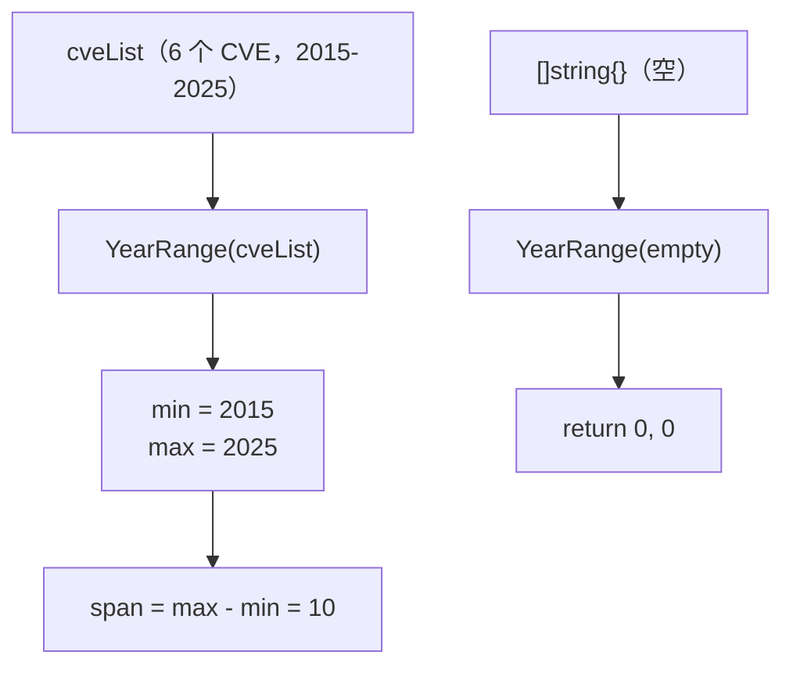

# 示例：年份范围

:::tip 📂 查看源码
[`examples/28_year_range/main.go`](https://github.com/scagogogo/cve-skills/blob/main/examples/28_year_range/main.go) — 在 GitHub 上查看完整可运行示例。
:::

用 `cve.YearRange` 一次性扫描 CVE 列表，拿到最早与最晚年份。这是为报告、仪表盘或数据校验描述数据集时间跨度最快的方式。

:::tip 🎯 学习目标
- 掌握 `cve.YearRange` 的函数签名与行为
- 了解如何从混合 CVE 列表中计算最小与最大年份
- 处理空列表的边界情况，并理解 `0, 0` 这个“无数据”哨兵值
:::

## 场景

安全团队需要为年度报告里的一份 CVE 数据集加上一行说明，例如“CVE 跨越 2015 至 2025”。与其先排序再读首尾，他们直接调用一次 `YearRange`，在 O(n) 时间内同时拿到两个边界。该函数还暴露了空列表的行为，团队能据此让仪表盘对没有合法 CVE 的输入做兜底。

## 完整代码

```go
package main

import (
	"fmt"

	"github.com/scagogogo/cve-skills"
)

func main() {
	fmt.Println("=== CVE 年份范围 ===")

	cveList := []string{
		"CVE-2015-1001",
		"CVE-2018-2001",
		"CVE-2020-3001",
		"CVE-2022-4001",
		"CVE-2024-5001",
		"CVE-2025-6001",
	}

	minYear, maxYear := cve.YearRange(cveList)
	fmt.Println("CVE列表:", cveList)
	fmt.Printf("\n年份范围: %d - %d\n", minYear, maxYear)
	fmt.Printf("时间跨度: %d 年\n", maxYear-minYear)

	fmt.Println("\n--- 边界情况 ---")
	minE, maxE := cve.YearRange([]string{})
	fmt.Printf("空列表: min=%d, max=%d\n", minE, maxE)
}
```

## 运行方式

```bash
cd examples/28_year_range && go run main.go
```

## 预期输出

```text
=== CVE 年份范围 ===
CVE列表: [CVE-2015-1001 CVE-2018-2001 CVE-2020-3001 CVE-2022-4001 CVE-2024-5001 CVE-2025-6001]

年份范围: 2015 - 2025
时间跨度: 10 年

--- 边界情况 ---
空列表: min=0, max=0
```

## 代码讲解

示例先构造了一个 `cveList`，包含 2015 到 2025 的六个 CVE，然后分别走正常路径与空列表路径。

- 📋 **构造源列表** —— `cveList` 故意混合多个年份（2015、2018、2020、2022、2024、2025），让范围有真实边界可发现。`fmt.Println("CVE列表:", cveList)` 以 Go 默认的 `[a b c]` 形式打印整个切片。
- ▶️ **计算范围** —— `minYear, maxYear := cve.YearRange(cveList)` 单次遍历切片，借助 `ExtractCveYearAsInt` 抽取每个年份，并随之收紧 `min`/`max`。对该输入返回 `2015` 与 `2025`。
- 💡 **推导跨度** —— `maxYear-minYear` 由调用方计算，而非函数本身，因此 `YearRange` 保持纯粹的“找边界”职责。这里跨度为 `10` 年。
- 🔗 **边界情况** —— `cve.YearRange([]string{})` 在空切片上短路，返回 `0, 0`，即文档约定的“无数据”哨兵值，调用方据此分支而无需额外的长度判断。



## 涉及函数

- [YearRange](/zh/api/functions/year-range) —— 本示例使用的函数
- [CountByYear](/zh/api/functions/count-by-year) —— 按年份细分计数，而非只取边界
- [ExtractCveYearAsInt](/zh/api/functions/extract-cve-year-as-int) —— 内部使用的年份抽取函数
- [SortCves](/zh/api/functions/sort-cves) —— 在跨度内按时间排序 CVE
- [GetRecentCves](/zh/api/functions/get-recent-cves) —— 按年份取最近的 CVE

## 扩展练习

- 🎯 在 `cveList` 中加入一个非 CVE 字符串（例如 `"not-a-cve"`），验证范围仍为 `2015 - 2025`，因为非法条目会被跳过。
- 🎯 用全非法切片如 `[]string{"garbage", ""}` 替换空切片，确认它仍返回 `0, 0`。
- 🎯 把 `YearRange` 与 `CountByYear` 组合，先取边界，再统计 `min` 到 `max` 之间每年的 CVE 数量。
