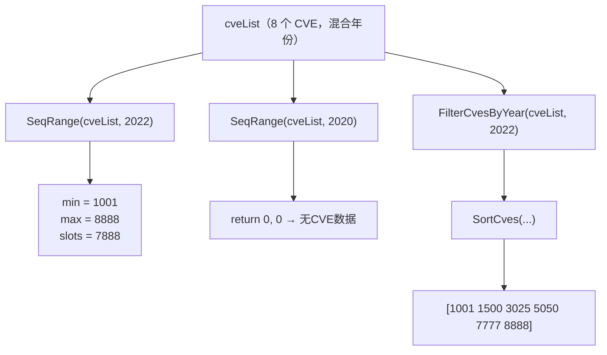

# 示例：序列号范围

:::tip 📂 查看源码
[`examples/29_seq_range/main.go`](https://github.com/scagogogo/cve-skills/blob/main/examples/29_seq_range/main.go) — 在 GitHub 上查看完整可运行示例。
:::

用 `cve.SeqRange` 找出某一年份下 CVE 序列号的最小值与最大值。这是衡量某年 CVE 在数据集中占据的“ID 区间”最快的方式，适合做缺口分析、配额规划与按年健康检查。

:::tip 🎯 学习目标
- 掌握 `cve.SeqRange(cveList, year)` 的函数签名与行为
- 了解如何按年计算序列号的最小/最大值，以及 `0, 0` 哨兵值的含义
- 将 `SeqRange` 与 `FilterCvesByYear`、`SortCves` 组合，得到某一年的聚焦视图
:::

## 场景

漏洞分析师维护一个把多年 CVE 混在一起的 feed。针对 2022 这一段，他想知道“序列号范围有多宽、覆盖了多少个 ID 槽位”——这能粗略反映该年分配得稀疏还是密集。与其手工过滤、排序再读首尾，他对几个目标年份各调用一次 `SeqRange`。没有数据的年份返回 `0, 0`，循环可据此分支而无需额外的长度判断。随后再专门深入 2022：过滤、排序、打印，看清填满该区间的实际 ID。

## 完整代码

```go
package main

import (
	"fmt"

	"github.com/scagogogo/cve-skills"
)

func main() {
	fmt.Println("=== CVE 序列号范围 ===")

	cveList := []string{
		"CVE-2022-1001", "CVE-2022-5050", "CVE-2022-3025",
		"CVE-2022-8888", "CVE-2022-1500", "CVE-2021-9999",
		"CVE-2023-1234", "CVE-2022-7777",
	}

	targetYears := []int{2022, 2021, 2023, 2020}

	for _, year := range targetYears {
		minSeq, maxSeq := cve.SeqRange(cveList, year)
		if minSeq == 0 && maxSeq == 0 {
			fmt.Printf("%d 年: 无CVE数据\n", year)
		} else {
			fmt.Printf("%d 年: 序列号范围 %d - %d (共 %d 个可能位置)\n",
				year, minSeq, maxSeq, maxSeq-minSeq+1)
		}
	}

	fmt.Println("\n--- 列出2022年所有CVE ---")
	cves2022 := cve.FilterCvesByYear(cveList, 2022)
	sorted := cve.SortCves(cves2022)
	fmt.Println(sorted)
}
```

## 运行方式

```bash
cd examples/29_seq_range && go run main.go
```

## 预期输出

```text
=== CVE 序列号范围 ===
2022 年: 序列号范围 1001 - 8888 (共 7888 个可能位置)
2021 年: 序列号范围 9999 - 9999 (共 1 个可能位置)
2023 年: 序列号范围 1234 - 1234 (共 1 个可能位置)
2020 年: 无CVE数据

--- 列出2022年所有CVE ---
[CVE-2022-1001 CVE-2022-1500 CVE-2022-3025 CVE-2022-5050 CVE-2022-7777 CVE-2022-8888]
```

## 代码讲解

示例先构造一个混合 2022、2021、2023 条目的 `cveList`，再探测四个目标年份并深入 2022。

- 📋 **构造源列表** —— `cveList` 含 8 个 CVE。其中 6 个属于 2022（1001、5050、3025、8888、1500、7777），因此 2022 有真实跨度可衡量；2021 与 2023 各贡献一条，2020 故意缺席，用以走“无数据”路径。
- ▶️ **探测每个目标年份** —— `targetYears := []int{2022, 2021, 2023, 2020}` 驱动循环。`minSeq, maxSeq := cve.SeqRange(cveList, year)` 单次遍历切片，只保留 `ExtractCveYearAsInt` 等于 `year` 且 `ExtractCveSeqAsInt` 大于 0 的 CVE，并随之收紧 `min`/`max`。
- 💡 **解读哨兵值** —— 当没有 CVE 匹配该年时，`SeqRange` 返回 `0, 0`。`if minSeq == 0 && maxSeq == 0` 分支打印“无CVE数据”；否则报告范围与覆盖槽位数 `maxSeq-minSeq+1`，该计数由调用方计算。
- 🔗 **深入 2022** —— `cves2022 := cve.FilterCvesByYear(cveList, 2022)` 把列表收窄到这 6 个 2022 ID，`sorted := cve.SortCves(cves2022)` 按序列号升序排序，`fmt.Println(sorted)` 以 Go 默认的 `[a b c]` 形式打印，确认哪些 ID 填满了 1001–8888 这个区间。



## 涉及函数

- [SeqRange](/zh/api/functions/seq-range) —— 本示例使用的函数
- [FilterCvesByYear](/zh/api/functions/filter-cves-by-year) —— 在检视前先把列表收窄到某一年
- [SortCves](/zh/api/functions/sort-cves) —— 在该年内按升序排序 CVE
- [ExtractCveSeqAsInt](/zh/api/functions/extract-cve-seq-as-int) —— 内部使用的序列号抽取函数
- [YearRange](/zh/api/functions/year-range) —— 本函数在年份维度上的对应物

## 扩展练习

- 🎯 加入一个序列号刻意很大的 2022 CVE（例如 `CVE-2022-999999`），确认槽位数相应增长，而 `min` 仍为 1001。
- 🎯 插入一个非法的 2022 条目如 `CVE-2022-0000`（序列号为 0），验证 `SeqRange` 会跳过它，因为 `seq <= 0` 的条目被忽略。
- 🎯 把循环体封装成一个辅助函数，同时返回槽位数与排序后的切片，使每个目标年份一次调用即可得到范围及其填充的 ID。
