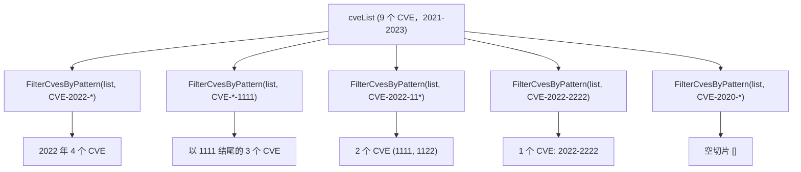

# 示例：通配符筛选

:::tip 📂 查看源码
[`examples/30_filter_by_pattern/main.go`](https://github.com/scagogogo/cve-skills/blob/main/examples/30_filter_by_pattern/main.go) — 在 GitHub 上查看完整可运行示例。
:::

使用 `cve.FilterCvesByPattern` 以通配符模式收敛 CVE 列表。单个 `*` 通配符可匹配年份、序列号或任意前缀，非常适合"2022 年的全部 CVE"或"所有以 1111 结尾的 CVE"这类临时查询。

:::tip 🎯 学习目标
- 掌握 `cve.FilterCvesByPattern` 的函数签名与通配符语义
- 了解 `*` 如何匹配年份段、序列号段与前缀
- 构建面向分诊与调查工作流的按模式 CVE 查询
:::

## 场景

安全运营中心的分析师正在审阅一份包含 2021 到 2023 年共九个 CVE 标识符的表格。在分诊过程中，他们需要多个切片视图：2022 年的全部 CVE、序列号以 `1111` 结尾的全部 CVE、所有以 `CVE-2022-11` 开头的 CVE、一个精确标识符，以及一个完全无匹配的年份。分析师无需手写正则，只需把带单个 `*` 的通配符模式传给 `FilterCvesByPattern`，即可每次拿到匹配的切片。

## 完整代码

```go
package main

import (
	"fmt"

	"github.com/scagogogo/cve-skills"
)

func main() {
	fmt.Println("=== 通配符模式匹配 CVE ===")

	cveList := []string{
		"CVE-2021-1111", "CVE-2021-2222",
		"CVE-2022-1111", "CVE-2022-1122", "CVE-2022-2222", "CVE-2022-3333",
		"CVE-2023-1111", "CVE-2023-2222", "CVE-2023-3333",
	}

	fmt.Printf("CVE列表 (共 %d 个):\n", len(cveList))
	fmt.Println("  ", cveList)

	fmt.Println("\n--- 按年份筛选: CVE-2022-* ---")
	fmt.Println("  ", cve.FilterCvesByPattern(cveList, "CVE-2022-*"))

	fmt.Println("\n--- 按序列号筛选: CVE-*-1111 ---")
	fmt.Println("  ", cve.FilterCvesByPattern(cveList, "CVE-*-1111"))

	fmt.Println("\n--- 前缀匹配: CVE-2022-11* ---")
	fmt.Println("  ", cve.FilterCvesByPattern(cveList, "CVE-2022-11*"))

	fmt.Println("\n--- 精确匹配: CVE-2022-2222 ---")
	fmt.Println("  ", cve.FilterCvesByPattern(cveList, "CVE-2022-2222"))

	fmt.Println("\n--- 无匹配: CVE-2020-* ---")
	fmt.Println("  ", cve.FilterCvesByPattern(cveList, "CVE-2020-*"))
}
```

## 运行方式

```bash
cd examples/30_filter_by_pattern && go run main.go
```

## 预期输出

```text
=== 通配符模式匹配 CVE ===
CVE列表 (共 9 个):
   [CVE-2021-1111 CVE-2021-2222 CVE-2022-1111 CVE-2022-1122 CVE-2022-2222 CVE-2022-3333 CVE-2023-1111 CVE-2023-2222 CVE-2023-3333]

--- 按年份筛选: CVE-2022-* ---
   [CVE-2022-1111 CVE-2022-1122 CVE-2022-2222 CVE-2022-3333]

--- 按序列号筛选: CVE-*-1111 ---
   [CVE-2021-1111 CVE-2022-1111 CVE-2023-1111]

--- 前缀匹配: CVE-2022-11* ---
   [CVE-2022-1111 CVE-2022-1122]

--- 精确匹配: CVE-2022-2222 ---
   [CVE-2022-2222]

--- 无匹配: CVE-2020-* ---
   []
```

## 代码讲解

示例先构造了一个 `cveList`，包含 2021、2022、2023 三年的九个 CVE，再对其执行五次模式查询。

- 📋 **构造源列表** —— `cveList` 按年份分组（2021 两个、2022 四个、2023 三个），并用 `fmt.Printf` 打印总数，方便核对筛选结果。
- ▶️ **年份通配 `CVE-2022-*`** —— `*` 吞掉序列号段，按原顺序返回 2022 年的全部四个 CVE。
- ▶️ **序列号通配 `CVE-*-1111`** —— `*` 位于年份位置，因此匹配三年中所有以 `1111` 结尾的 CVE。
- ▶️ **前缀通配 `CVE-2022-11*`** —— `*` 匹配尾部任意数字，同时返回 `CVE-2022-1111` 与 `CVE-2022-1122`。
- 💡 **精确匹配与无匹配** —— 不含 `*` 的模式（`CVE-2022-2222`）等价于精确匹配，返回单元素切片；`CVE-2020-*` 无任何匹配，返回空切片 `[]`。



## 涉及函数

- [FilterCvesByPattern](/zh/api/functions/filter-cves-by-pattern) —— 本示例使用的函数
- [FilterCvesByYear](/zh/api/functions/filter-cves-by-year) —— 按精确年份筛选而非通配符
- [FilterCvesByYearRange](/zh/api/functions/filter-cves-by-year-range) —— 按年份区间筛选
- [FilterValidCves](/zh/api/functions/filter-valid-cves) —— 只保留合法的 CVE 标识符
- [ExtractCve](/zh/api/functions/extract-cve) —— 从自由文本中提取 CVE 标识符

## 扩展练习

- 🎯 用模式 `CVE-2022-*2` 只匹配 2022 年中序列号以 `2` 结尾的 CVE，并对照源列表验证结果。
- 🎯 在 `cveList` 中加入一个非 CVE 字符串（例如 `"CVE-2022-2222-xxx"`），验证它从所有模式结果中被丢弃。
- 🎯 将 `FilterCvesByPattern` 与 `SortCves` 串联，按降序返回 2022 年的 CVE 子集。
