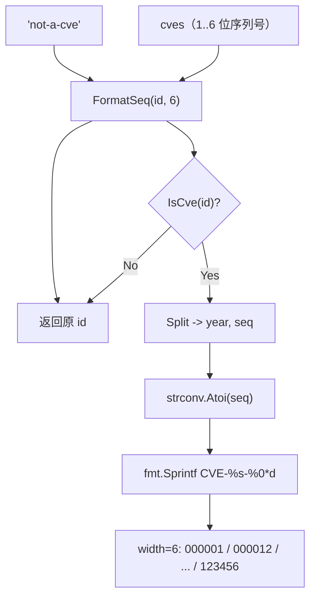

# 示例：序列号定宽

:::tip 📂 查看源码
[`examples/31_format_seq/main.go`](https://github.com/scagogogo/cve-skills/blob/main/examples/31_format_seq/main.go) — 在 GitHub 上查看完整可运行示例。
:::

用 `cve.FormatSeq` 把 CVE 的序列号零填充到固定宽度，把长度不一的标识符如 `CVE-2022-1`、`CVE-2022-123456` 统一成 `CVE-2022-000001`、`CVE-2022-123456` 这样的定宽形式。这是在显示、存储或对齐打印前对 CVE 做标准化的常规手段。

:::tip 🎯 学习目标
- 掌握 `cve.FormatSeq(cve, width)` 的函数签名与行为
- 了解 `%0*d` 如何对短序列补零，同时不截断更长的序列
- 了解无效输入的处理方式（原样返回，不报错）
:::

## 场景

漏洞分析师从多个 feed 汇入 CVE 到同一数据集。有些 feed 输出短序列号（`CVE-2022-1`、`CVE-2022-12`），有些输出全宽形式（`CVE-2022-123456`）。打印表格报告时，ID 列参差不齐难以扫读，而且词法排序不再等于数值排序，因为 `CVE-2022-12` 在词法上排在 `CVE-2022-123456` 之前。在存储与上报前，他用 `FormatSeq(id, 6)` 把每个 ID 统一成 6 位序列号。他还用单个 CVE 在多个宽度下试探以确认填充规则，并传入一个明显非法的字符串以确认它原样返回。

## 完整代码

```go
package main

import (
	"fmt"

	"github.com/scagogogo/cve-skills"
)

func main() {
	fmt.Println("=== CVE 序列号格式化 ===")

	cves := []string{
		"CVE-2022-1",
		"CVE-2022-12",
		"CVE-2022-123",
		"CVE-2022-1234",
		"CVE-2022-12345",
		"CVE-2022-123456",
	}

	fmt.Println("宽度为 6 的格式化效果:")
	fmt.Println("原始            | 格式化后")
	fmt.Println("----------------|---------")
	for _, id := range cves {
		formatted := cve.FormatSeq(id, 6)
		fmt.Printf("%-16s| %s\n", id, formatted)
	}

	fmt.Println("\n--- 不同宽度效果 (CVE-2022-123) ---")
	for _, width := range []int{4, 5, 6, 8} {
		fmt.Printf("  宽度 %d: %s\n", width, cve.FormatSeq("CVE-2022-123", width))
	}

	fmt.Println("\n--- 无效输入 ---")
	fmt.Printf("  'not-a-cve' -> %s\n", cve.FormatSeq("not-a-cve", 6))
}
```

## 运行方式

```bash
cd examples/31_format_seq && go run main.go
```

## 预期输出

```text
=== CVE 序列号格式化 ===
宽度为 6 的格式化效果:
原始            | 格式化后
----------------|---------
CVE-2022-1      | CVE-2022-000001
CVE-2022-12     | CVE-2022-000012
CVE-2022-123    | CVE-2022-000123
CVE-2022-1234   | CVE-2022-001234
CVE-2022-12345  | CVE-2022-012345
CVE-2022-123456 | CVE-2022-123456

--- 不同宽度效果 (CVE-2022-123) ---
  宽度 4: CVE-2022-0123
  宽度 5: CVE-2022-00123
  宽度 6: CVE-2022-000123
  宽度 8: CVE-2022-00000123

--- 无效输入 ---
  'not-a-cve' -> not-a-cve
```

## 代码讲解

示例先构造 6 个序列号从 1 位到 6 位不等的 CVE，再以宽度 6 格式化、用单个 CVE 在 4 个宽度下试探，最后以非法输入收尾。

- 📋 **构造源列表** —— `cves` 含 `CVE-2022-1` 到 `CVE-2022-123456`，覆盖 1 到 6 位全部序列长度。宽度 6 恰好是最长条目的自然长度，因此既能看到补零（更短序列），又能看到不截断规则（6 位条目原样返回）。
- ▶️ **定宽格式化** —— 循环对每个 ID 调用 `formatted := cve.FormatSeq(id, 6)`。函数内部先用 `IsCve` 校验，再用 `Split` 拆出年份与序列号，用 `strconv.Atoi` 解析序列号，最后用 `fmt.Sprintf("CVE-%s-%0*d", year, width, seqInt)` 重组。`%0*d` 会左侧补零直到恰好 `width` 位，但绝不截断更长的序列，所以 `CVE-2022-123456` 原样返回。
- 💡 **多宽度试探** —— `for _, width := range []int{4, 5, 6, 8}` 对 `FormatSeq("CVE-2022-123", width)` 求值。宽度 4 得 `0123`，宽度 5 得 `00123`，宽度 6 得 `000123`，宽度 8 得 `00000123`，确认填充把位数补到 `width`，而年份前缀与 `CVE-` 头保持不变。
- 🔗 **处理无效输入** —— `cve.FormatSeq("not-a-cve", 6)` 在函数顶部的 `IsCve` 校验失败，原样返回字符串。需要严格校验的调用方应事先用 `IsCve` 或 `ValidateCve` 检查，而非依赖格式化后的输出。



## 涉及函数

- [FormatSeq](/zh/api/functions/format-seq) —— 本示例使用的函数
- [Format](/zh/api/functions/format) —— 仅去空白与转大写，不做补零
- [Split](/zh/api/functions/split) —— 把 CVE 拆成年份与序列号，内部使用
- [IsCve](/zh/api/functions/is-cve) —— 决定是否进入补零分支的格式校验
- [ValidateCve](/zh/api/functions/validate-cve) —— 完整校验（格式 + 年份范围 + 正序列号）

## 扩展练习

- 🎯 传入比 `width` 更长的序列，例如 `cve.FormatSeq("CVE-2022-1234567", 4)`，确认 7 位序列原样返回，因为 `%0*d` 绝不截断。
- 🎯 传入小写或带空白的输入如 `" cve-2022-7 "`，验证 `FormatSeq` 仍返回 `CVE-2022-000007`，因为 `Split` 内部会规范化大小写并去除两侧空白。
- 🎯 先用 `FormatSeq(id, 6)` 预规范化一个混合列表，再 `SortCves`，检查在定宽下词法顺序与数值顺序一致。
