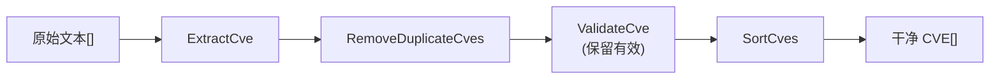

# 使用示例

本节提供了 CVE Utils 在实际场景中的使用示例，帮助您了解如何在真实项目中应用这些功能。

## 示例概览

### 📊 [漏洞报告分析](/zh/examples/vulnerability-analysis)

学习如何从安全公告、漏洞报告和文档中提取、分析 CVE 信息：

- 从文本中提取所有 CVE
- 按年份分析漏洞分布
- 生成统计报告
- 识别漏洞趋势

**适用场景**: 安全团队、漏洞研究、合规审计

### 🗄️ [漏洞库管理](/zh/examples/vulnerability-management)

了解如何管理和维护大型 CVE 数据库：

- 数据导入和清洗
- 去重和验证
- 按条件过滤和分组
- 数据导出和备份

**适用场景**: 安全产品开发、漏洞数据库维护、威胁情报

### ✅ [CVE 验证处理](/zh/examples/cve-validation)

掌握 CVE 验证和处理的最佳实践：

- 用户输入验证
- 批量数据验证
- 错误处理和恢复
- 性能优化技巧

**适用场景**: Web 应用开发、API 开发、数据处理系统

## 快速开始示例

### 基础文本处理

```go
package main

import (
    "fmt"
    "github.com/scagogogo/cve-skills"
)

func main() {
    // 示例文本
    text := `
    安全公告 2024-001

    本次更新修复了以下关键漏洞：
    - CVE-2021-44228 (Log4Shell)
    - CVE-2022-12345 (自定义组件)
    - cve-2023-1234 (第三方库)

    请立即更新到最新版本。
    `

    // 提取所有 CVE
    cves := cve.ExtractCve(text)
    fmt.Printf("发现 %d 个 CVE: %v\n", len(cves), cves)

    // 按年份分组
    grouped := cve.GroupByYear(cves)
    fmt.Println("按年份分组:")
    for year, yearCves := range grouped {
        fmt.Printf("  %s年: %v\n", year, yearCves)
    }
}
```

### 数据清洗流水线

典型的清洗流水线依次执行提取、去重、验证、排序，将原始文本整理为干净的 CVE 集合：



```go
func cleanCveData(rawData []string) []string {
    fmt.Println("=== CVE 数据清洗流水线 ===")

    // 1. 提取所有可能的 CVE
    var allCves []string
    for _, text := range rawData {
        extracted := cve.ExtractCve(text)
        allCves = append(allCves, extracted...)
    }
    fmt.Printf("步骤1 - 提取: %d个 CVE\n", len(allCves))

    // 2. 去重
    unique := cve.RemoveDuplicateCves(allCves)
    fmt.Printf("步骤2 - 去重: %d个 CVE\n", len(unique))

    // 3. 验证
    var valid []string
    for _, cveId := range unique {
        if cve.ValidateCve(cveId) {
            valid = append(valid, cveId)
        }
    }
    fmt.Printf("步骤3 - 验证: %d个有效 CVE\n", len(valid))

    // 4. 排序
    sorted := cve.SortCves(valid)
    fmt.Printf("步骤4 - 排序: 完成\n")

    return sorted
}
```

### 统计分析

```go
func analyzeCveStatistics(cveList []string) {
    fmt.Println("=== CVE 统计分析 ===")

    // 基本统计
    total := len(cveList)
    fmt.Printf("总计: %d个 CVE\n", total)

    // 年份分布
    grouped := cve.GroupByYear(cveList)
    fmt.Printf("涉及年份: %d个\n", len(grouped))

    // 最近趋势
    recent1 := cve.GetRecentCves(cveList, 1)
    recent2 := cve.GetRecentCves(cveList, 2)
    recent3 := cve.GetRecentCves(cveList, 3)

    fmt.Printf("最近1年: %d个\n", len(recent1))
    fmt.Printf("最近2年: %d个\n", len(recent2))
    fmt.Printf("最近3年: %d个\n", len(recent3))

    // 年份详细分布
    fmt.Println("\n年份分布:")
    for year, cves := range grouped {
        percentage := float64(len(cves)) / float64(total) * 100
        fmt.Printf("  %s年: %d个 (%.1f%%)\n", year, len(cves), percentage)
    }
}
```

## 常见使用模式

### 1. 输入验证模式

```go
func validateUserInput(input string) (string, error) {
    // 检查基本格式
    if !cve.IsCve(input) {
        return "", fmt.Errorf("无效的 CVE 格式: %s", input)
    }

    // 格式化
    formatted := cve.Format(input)

    // 全面验证
    if !cve.ValidateCve(formatted) {
        return "", fmt.Errorf("CVE 验证失败: %s", formatted)
    }

    return formatted, nil
}
```

### 2. 批量处理模式

```go
func processBatch(cveList []string) (processed []string, errors []string) {
    for _, cveId := range cveList {
        if validated, err := validateUserInput(cveId); err == nil {
            processed = append(processed, validated)
        } else {
            errors = append(errors, fmt.Sprintf("%s: %v", cveId, err))
        }
    }
    return
}
```

### 3. 条件过滤模式

```go
func filterByConditions(cveList []string, conditions map[string]interface{}) []string {
    result := cveList

    // 按年份过滤
    if year, ok := conditions["year"].(int); ok {
        result = cve.FilterCvesByYear(result, year)
    }

    // 按年份范围过滤
    if startYear, ok := conditions["start_year"].(int); ok {
        if endYear, ok := conditions["end_year"].(int); ok {
            result = cve.FilterCvesByYearRange(result, startYear, endYear)
        }
    }

    // 按最近年份过滤
    if recentYears, ok := conditions["recent_years"].(int); ok {
        result = cve.GetRecentCves(result, recentYears)
    }

    return result
}
```

### 4. 报告生成模式

```go
type CveReport struct {
    TotalCount    int
    YearGroups    map[string][]string
    RecentTrends  map[string]int
    TopYears      []string
}

func generateReport(cveList []string) *CveReport {
    report := &CveReport{
        TotalCount:   len(cveList),
        YearGroups:   cve.GroupByYear(cveList),
        RecentTrends: make(map[string]int),
    }

    // 计算最近几年的趋势
    for i := 1; i <= 5; i++ {
        recent := cve.GetRecentCves(cveList, i)
        report.RecentTrends[fmt.Sprintf("recent_%d", i)] = len(recent)
    }

    // 找出 CVE 最多的年份
    maxCount := 0
    for year, cves := range report.YearGroups {
        if len(cves) > maxCount {
            maxCount = len(cves)
            report.TopYears = []string{year}
        } else if len(cves) == maxCount {
            report.TopYears = append(report.TopYears, year)
        }
    }

    return report
}
```

## 性能优化示例

### 大数据处理

```go
func processLargeDataset(cveList []string) {
    fmt.Printf("处理大型数据集: %d个 CVE\n", len(cveList))

    start := time.Now()

    // 并行验证
    validChan := make(chan string, 100)
    var wg sync.WaitGroup

    // 启动验证 goroutines
    for i := 0; i < 10; i++ {
        wg.Add(1)
        go func() {
            defer wg.Done()
            for cveId := range validChan {
                if cve.ValidateCve(cveId) {
                    // 处理有效的 CVE
                }
            }
        }()
    }

    // 发送数据
    go func() {
        for _, cveId := range cveList {
            validChan <- cveId
        }
        close(validChan)
    }()

    wg.Wait()

    duration := time.Since(start)
    fmt.Printf("处理完成，耗时: %v\n", duration)
}
```

### 内存优化

```go
func memoryEfficientProcessing(cveList []string) {
    // 预分配切片容量
    result := make([]string, 0, len(cveList))

    // 使用 map 进行去重，避免重复分配
    seen := make(map[string]bool, len(cveList))

    for _, cveId := range cveList {
        formatted := cve.Format(cveId)
        if !seen[formatted] && cve.ValidateCve(formatted) {
            seen[formatted] = true
            result = append(result, formatted)
        }
    }

    // 释放 map 内存
    seen = nil

    return result
}
```

## 错误处理示例

### 健壮的错误处理

```go
func robustCveProcessing(input string) (result []string, err error) {
    defer func() {
        if r := recover(); r != nil {
            err = fmt.Errorf("处理过程中发生错误: %v", r)
        }
    }()

    // 检查输入
    if input == "" {
        return nil, fmt.Errorf("输入不能为空")
    }

    // 尝试提取 CVE
    cves := cve.ExtractCve(input)
    if len(cves) == 0 {
        return nil, fmt.Errorf("未找到有效的 CVE")
    }

    // 验证每个 CVE
    var valid []string
    var errors []string

    for _, cveId := range cves {
        if cve.ValidateCve(cveId) {
            valid = append(valid, cveId)
        } else {
            errors = append(errors, cveId)
        }
    }

    if len(valid) == 0 {
        return nil, fmt.Errorf("所有 CVE 都无效: %v", errors)
    }

    if len(errors) > 0 {
        fmt.Printf("警告: 发现 %d 个无效 CVE: %v\n", len(errors), errors)
    }

    return valid, nil
}
```

## 集成示例

### Web API 集成

```go
func handleCveValidation(w http.ResponseWriter, r *http.Request) {
    cveId := r.URL.Query().Get("cve")

    if cveId == "" {
        http.Error(w, "缺少 CVE 参数", http.StatusBadRequest)
        return
    }

    // 验证 CVE
    if !cve.ValidateCve(cveId) {
        http.Error(w, "无效的 CVE 格式", http.StatusBadRequest)
        return
    }

    // 提取信息
    year := cve.ExtractCveYear(cveId)
    seq := cve.ExtractCveSeq(cveId)

    response := map[string]interface{}{
        "valid": true,
        "formatted": cve.Format(cveId),
        "year": year,
        "sequence": seq,
    }

    w.Header().Set("Content-Type", "application/json")
    json.NewEncoder(w).Encode(response)
}
```

### 数据库集成

```go
func saveCvesToDatabase(db *sql.DB, cveList []string) error {
    // 准备批量插入语句
    stmt, err := db.Prepare("INSERT INTO cves (cve_id, year, sequence) VALUES (?, ?, ?)")
    if err != nil {
        return err
    }
    defer stmt.Close()

    // 开始事务
    tx, err := db.Begin()
    if err != nil {
        return err
    }
    defer tx.Rollback()

    // 批量插入
    for _, cveId := range cveList {
        if cve.ValidateCve(cveId) {
            year := cve.ExtractCveYearAsInt(cveId)
            seq := cve.ExtractCveSeqAsInt(cveId)

            _, err := tx.Stmt(stmt).Exec(cve.Format(cveId), year, seq)
            if err != nil {
                return err
            }
        }
    }

    return tx.Commit()
}
```

## 下一步

选择您感兴趣的具体示例深入学习：

- [漏洞报告分析](/zh/examples/vulnerability-analysis) - 学习如何分析安全报告和文档
- [漏洞库管理](/zh/examples/vulnerability-management) - 了解大型数据库的管理技巧
- [CVE 验证处理](/zh/examples/cve-validation) - 掌握验证和错误处理的最佳实践

或者查看 [API 文档](/zh/api/) 了解所有可用函数的详细信息。
